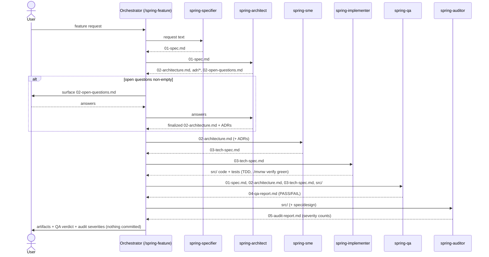

# Pipeline handoff contract

The spring-boot-team pipeline is auditable because each stage communicates through a **named artifact on disk**, not through shared conversation state. Every role reads exactly one (or a small, fixed set of) input artifact and writes exactly one output artifact. Anyone — the next role or a human — can review a stage's output in isolation without re-deriving the whole task (workspace principle #9).

All artifacts live in the **target project** under `docs/pipeline/<feature>/`.

## Artifact contract

| Artifact | Written by | Read by | Purpose |
|---|---|---|---|
| `01-spec.md` | spring-specifier | spring-architect, spring-qa | Scope, actors, `FR-*`, acceptance criteria (Given/When/Then), `NFR-*`, out-of-scope. The contract of *what*. |
| `02-architecture.md` | spring-architect | spring-sme, spring-qa | C4 (context/container/component), HLD/LLD, cross-cutting design, FR/NFR traceability. |
| `adr/ADR-NNNN-<slug>.md` | spring-architect | spring-sme, spring-auditor | One decision each: context, ≥2 options with cited trade-offs, decision, consequences. |
| `02-open-questions.md` | spring-architect | **the user** (via orchestrator) | Architectural questions the architect cannot resolve alone. Pipeline STOPS here until answered. |
| `03-tech-spec.md` | spring-sme | spring-implementer, spring-qa | Entities, repositories, services, controllers, DTOs, validation, config, and the test plan — implementable at low effort. |
| `src/**` (code + tests) | spring-implementer | spring-qa, spring-auditor | Working code, tests written first (TDD). Changelog appended to `03-tech-spec.md`. |
| `04-qa-report.md` | spring-qa | the user, spring-implementer (on FAIL) | PASS/FAIL, test run, acceptance-criteria matrix, design conformance, coverage gaps, violations. |
| `05-audit-report.md` | spring-auditor | the user, spring-implementer/architect (on findings) | Severity-ranked findings with `file:line` + authoritative citation, principle scorecard, blocking issues. |

Each role's agent definition names its input and output and forbids doing the next role's job, so the contract is enforced by the prompts, not just convention.

## Sequence

## How it stays auditable

- **One artifact per stage.** You can open `02-architecture.md` and judge the design without reading the spec conversation; you can open `05-audit-report.md` and see every finding tied to a `file:line` and a cited authority.
- **Minimal context handoffs.** The orchestrator passes each subagent only its input artifact (principle #2). A stage cannot silently depend on hidden context, because it does not receive any.
- **Traceability threads through.** `FR-*`/`NFR-*` ids from `01-spec.md` are carried into the architecture (traceability section), the tech spec, the tests, and the QA matrix — so any requirement can be traced to the component, test, and verdict that cover it.
- **Human checkpoints.** The pipeline stops on `02-open-questions.md` (architecture) and surfaces the QA verdict and audit severities at the end, so a person decides before design is finalized and before the work is considered done.
- **Nothing is committed** by the pipeline (hard rule #1); the artifacts and the diff sit in the working tree for review.
