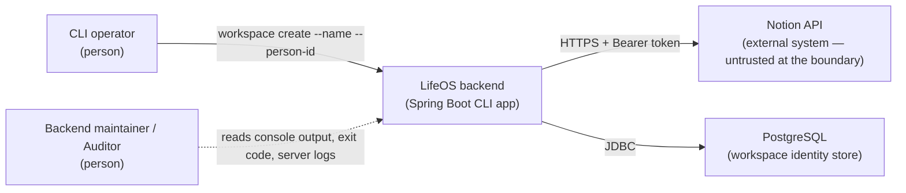
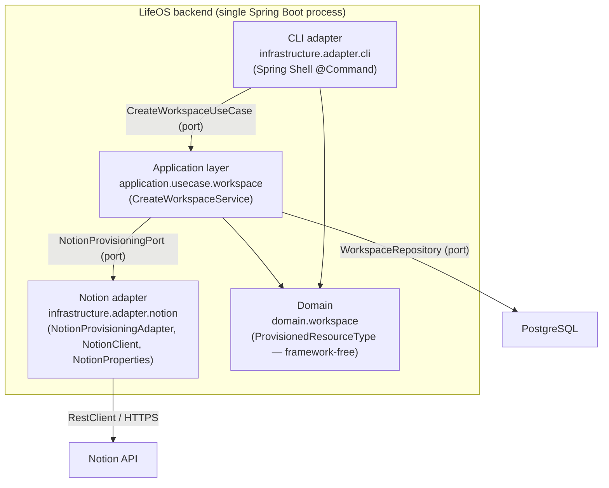
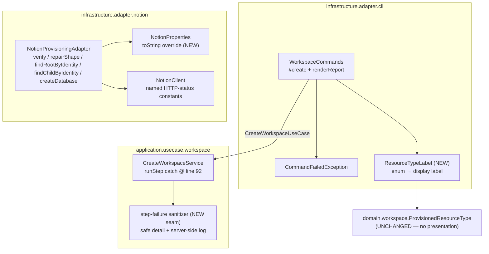
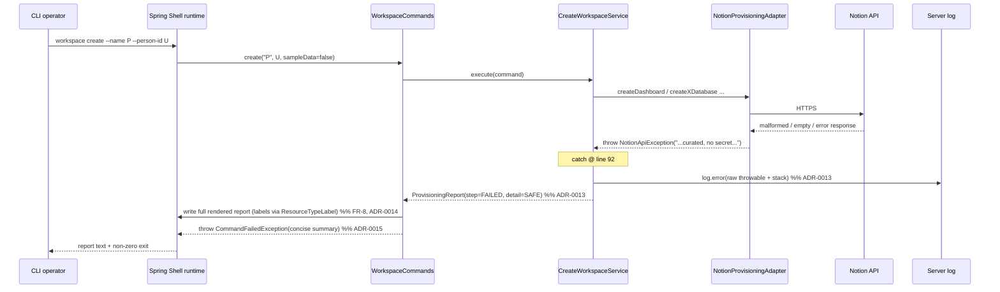

# 02 — Architecture: Audit Remediation (Notion Adapter + CLI Wiring)

Design for `docs/pipeline/audit-remediation/01-spec.md`, incorporating the three **resolved**
stakeholder decisions (see §0). This is a **remediation** design, not greenfield: it is scoped to
the seams that change, the hexagonal layer boundaries those seams must respect, and the test seams
that guard them. No C4 rewrite of the whole system is warranted; the diagrams below show only the
containers/components the in-scope findings touch.

**Ubiquitous language reused (no new terms):** *Provisioning step*, *Provisioning report*,
*Provisioned resource type*, *Data source* (Notion 2025-09-03 model), *Root parent page*.

---

## 0. Resolved stakeholder decisions (design constraints)

| # | Spec open question | Decision (RESOLVED) | Governs |
|---|---|---|---|
| 1 | FR-1 masking format | **Full, non-reversible redaction** — `token` renders as a fixed marker (`****`); reveal nothing, not even last-4. `version`/`rootParentPageId` render as-is. | ADR-0010 |
| 2 | cli-wiring AUD-004 | **In scope.** Add an **application-layer sanitization boundary** at the step-failure mapping (`CreateWorkspaceService.java:92`): log the raw cause server-side, surface a sanitized/safe `detail`. | ADR-0013 |
| 3 | cli-wiring AUD-005 | **In scope.** Add a **CLI-adapter display-label mapping** (`"Tasks"` not `TASKS_DB`); the domain enum stays presentation-free. Co-located with FR-8's `renderReport`. | ADR-0014 |

The scope override for decisions 2 and 3 **supersedes** spec §8's "out of scope" note on those two
items and spec §9's deferral. All other deferrals in spec §7's disposition table stand
(notion AUD-004/AUD-005, retry-design assumptions).

**In-scope set:** FR-1…FR-8 **plus** the AUD-004 sanitization boundary **plus** the AUD-005 label
mapping.

---

## 1. Context (C4 L1)



Nothing in this feature changes the set of actors or external systems. The remediation hardens two
existing trust boundaries: **operator-facing output** (must not leak the token or raw internal
error/enum text) and **the Notion response boundary** (untrusted, may be null/empty/malformed).

---

## 2. Containers (C4 L2)



**Layering rule preserved (CLAUDE.md):** inner layers never depend on outer ones. All three
stakeholder-directed additions land in the correct ring:

- token redaction → **notion adapter** (owns the secret);
- error sanitization → **application layer** (owns "what is internal vs. safe to surface");
- label mapping → **CLI adapter** (owns presentation); the **domain enum gains no presentation
  responsibility**.

---

## 3. Components (C4 L3) — only the components that change



| Component | Responsibility change | FR / decision |
|---|---|---|
| `NotionProperties` | Override `toString()` to fully redact `token`. | FR-1 / ADR-0010 |
| `NotionProvisioningAdapter` | Fail-closed guards on `data_sources`, data-source lookup, and `results()`; bounded pagination; rename shadowing local. | FR-2, FR-5, FR-6 / ADR-0011, ADR-0012 |
| `NotionClient` | Replace `404`/`429`/`529` literals with named constants. | FR-7 |
| `CreateWorkspaceService` | Sanitization boundary at the step-failure catch: log raw, surface safe detail. | AUD-004 / ADR-0013 |
| `WorkspaceCommands` | Concise `CommandFailedException`; report written to output on both paths; labels via `ResourceTypeLabel`. | FR-8, AUD-005 / ADR-0014, ADR-0015 |
| `ResourceTypeLabel` (new, CLI) | Presentation-only enum→label mapping. | AUD-005 / ADR-0014 |
| Test suite | Shell-level integration test; remove/narrow tautological & mislabelled tests. | FR-3, FR-4 / ADR-0016 |

---

## 4. HLD

### 4.1 Module boundaries (who owns each change)
- **Secret handling** is owned by the type that holds the secret (`NotionProperties`), not by every
  caller. Redacting at the source (a single overridden `toString()`) closes the leak for *all*
  present and future interpolation/logging/binding-error paths — a defense-at-the-boundary posture
  (ADR-0010).
- **Untrusted external data** is validated at the adapter boundary (`NotionProvisioningAdapter`)
  before any dereference; violations are normalized to the adapter's own `NotionApiException` and
  never escape as `NPE`/`IndexOutOfBoundsException` (ADR-0011, ADR-0012). This keeps the
  application layer's failure contract (`Exception → FAILED step`) fed only with the adapter's
  curated exception type on Notion-shape failures.
- **Error-detail sanitization** is an *application-layer policy decision* (what is "internal" vs.
  "safe to surface"), so it lives in `CreateWorkspaceService`, not in the CLI (ADR-0013). The CLI
  stays a thin renderer.
- **Presentation labelling** is a *CLI concern*; it lives in the CLI adapter so the domain enum
  remains framework/presentation-free (ADR-0014).

### 4.2 Data flow (failure path — the path that changes most)


### 4.3 Transaction boundaries
Unchanged. `CreateWorkspaceService.execute` is the write use case; the only persistence is
`WorkspaceRepository.findByPersonIdAndName / save` for workspace identity. Adding a logger and a
`safeDetail(...)` mapper introduces no new transactional resource and no new I/O inside the
transaction. NFR-4 (happy-path behavior) is untouched.

### 4.4 Error strategy
- **Adapter → application:** the adapter raises exactly one exception type for Notion-shape and
  Notion-status failures: `NotionApiException` (already the convention). FR-2/FR-5 extend *when* it
  is raised, not the type.
- **Application → CLI:** `CreateWorkspaceService` catches any `Exception` per step, logs it raw, and
  records a **sanitized** `detail` (ADR-0013). The report itself is the success/failure signal.
- **CLI → operator/OS:** on `report.failed()`, `WorkspaceCommands` writes the full rendered report
  to shell output, then throws `CommandFailedException` with a **concise** message; the thrown
  exception drives Spring Shell's non-zero exit (ADR-0015). Spring Shell integrates command-thrown
  exceptions with Spring Boot's exit-code mechanism.¹

---

## 5. LLD (seam-level signatures — not full implementations)

> These are the seams the SME will fill. Signatures are illustrative of the boundary shape; exact
> names/messages are the SME's to finalize. No production code is written here.

### 5.1 `NotionProperties` (FR-1 / ADR-0010)
```java
@ConfigurationProperties(prefix = "notion")
@Validated
public record NotionProperties(@NotBlank String token,
                               @NotBlank String version,
                               @NotBlank String rootParentPageId) {

    private static final String REDACTED = "****";   // fixed, non-reversible

    @Override
    public String toString() {                        // overrides the record's implicit toString
        return "NotionProperties[token=" + REDACTED
             + ", version=" + version
             + ", rootParentPageId=" + rootParentPageId + "]";
    }
}
```
- `token()` still returns the raw value (NotionClient needs it to build the `Bearer` header) — the
  leak surface is the *string representation*, which is what we redact.²
- A Java record may declare an explicit `toString()` that overrides the implicitly derived one.³

### 5.2 `NotionProvisioningAdapter` — fail-closed guards (FR-2, FR-5 / ADR-0011, ADR-0012)
```java
// FR-2: replace `response.dataSources().get(0)` and `dataSource.properties()` bare dereferences.
private static String requirePrimaryDataSourceId(NotionDatabaseResponse db, String ctx) {
    List<NotionDataSourceSummary> ds = db.dataSources();
    if (ds == null || ds.isEmpty() || ds.get(0) == null || ds.get(0).id() == null) {
        throw new NotionApiException("Notion API error: no data source on " + ctx);
    }
    return ds.get(0).id();
}
private static NotionDataSourceResponse requireDataSource(NotionDataSourceResponse ds, String ctx) {
    if (ds == null || ds.properties() == null) {
        throw new NotionApiException("Notion API error: data source unavailable for " + ctx);
    }
    return ds;
}

// FR-5: bound the search / child-listing loops and null-default results().
private static final int MAX_SEARCH_PAGES = 50;   // explicit cap — value is an [ASSUMPTION], see ADR-0012
private static <T> List<T> nullSafe(List<T> results) {
    return results == null ? List.of() : results;
}
// loop guard: track pages; break/throw NotionApiException once MAX_SEARCH_PAGES is exceeded.
```
Applied in `verify` (line 149/152), `repairShape` (line 197/201), `findRootByIdentity` (line
106/111), `findChildByIdentity` (line 168/172).

### 5.3 `NotionProvisioningAdapter#createDatabase` — rename (FR-6)
Rename the local `Map<String,Object> properties` (line 127) to e.g. `propertyConfigs` so it no
longer shadows the `private final NotionProperties properties` field. Behavior-preserving.

### 5.4 `NotionClient` — named status constants (FR-7)
```java
private static final int NOTION_OVERLOADED = 529; // non-standard Notion "overloaded" status
// handleError: status == HttpStatus.TOO_MANY_REQUESTS.value() || status == NOTION_OVERLOADED
// get():      response.getStatusCode().value() == HttpStatus.NOT_FOUND.value()
```
Behavior-preserving substitution; `NotionClientTest` status-mapping tests must pass unmodified
(FR-7 acceptance).⁴

### 5.5 `CreateWorkspaceService` — sanitization boundary (AUD-004 / ADR-0013)
```java
private static final Logger log = LoggerFactory.getLogger(CreateWorkspaceService.class);

private ProvisioningStepResult runStep(Supplier<ProvisioningStepResult> step, ProvisionedResourceType type) {
    try {
        return step.get();
    } catch (Exception e) {
        log.error("Provisioning step {} failed", type, e);          // raw cause, server-side only
        return new ProvisioningStepResult(type, ProvisioningOutcome.FAILED, safeDetail(e, type));
    }
}

// Safe-to-surface classification (ADR-0013): curated application exceptions pass through;
// everything else collapses to a generic, non-leaking detail.
private static String safeDetail(Exception e, ProvisionedResourceType type) {
    if (e instanceof NotionApiException || e instanceof UnsupportedOperationException) {
        return e.getMessage();
    }
    return "internal error during " + type + " provisioning (see server logs)";
}
```
- `NotionApiException` is imported by the application layer only as a *type* for classification; it
  remains thrown by the adapter. (If the SME prefers zero application→adapter type coupling, an
  equivalent allowlist can be expressed via a marker interface on `NotionApiException`; ADR-0013
  records this as the alternative.)
- Result stays non-blank, satisfying `ProvisioningStepResult`'s FAILED-detail invariant.

### 5.6 `WorkspaceCommands` + `ResourceTypeLabel` (FR-8, AUD-005 / ADR-0014, ADR-0015)
```java
// infrastructure.adapter.cli.ResourceTypeLabel (NEW — presentation only)
final class ResourceTypeLabel {
    private ResourceTypeLabel() {}
    static String of(ProvisionedResourceType type) {
        return switch (type) {            // exhaustive switch → compile error if a constant is added
            case DASHBOARD -> "Dashboard";
            case TASKS_DB  -> "Tasks";
            // ... all 14 constants ...
        };
    }
}

// WorkspaceCommands#create — write report on BOTH paths, concise exception on failure
String rendering = renderReport(report);           // renderReport uses ResourceTypeLabel.of(step.type())
writer.write(rendering);                            // full report to shell output (success AND failure)
if (report.failed()) {
    throw new CommandFailedException(conciseFailureSummary(report));  // NOT the full report body
}
return rendering;
// conciseFailureSummary: e.g. "N of M steps failed: Tasks, Journal" — no full multi-line body.
```
- **Report-on-failure seam:** the full report must reach the operator even though the method
  throws. The command writes it to the shell's output writer *before* throwing (obtained via the
  `@Command` method's `CommandContext`/`Terminal` or an injected `PrintWriter`).¹ The SME picks the
  exact injection mechanism; the architectural constraint is *write-then-throw-concise*.
- `CommandFailedException` keeps its `String`-message constructor (no report body).

### 5.7 Package structure (net change)
```
infrastructure/adapter/cli/
  WorkspaceCommands.java            (modified)
  CommandFailedException.java       (unchanged shape)
  ResourceTypeLabel.java            (NEW)
application/usecase/workspace/
  CreateWorkspaceService.java       (modified: logger + safeDetail)
infrastructure/adapter/notion/
  NotionProperties.java             (modified: toString)
  NotionProvisioningAdapter.java    (modified: guards, cap, rename)
  NotionClient.java                 (modified: named constants)
domain/workspace/
  ProvisionedResourceType.java      (UNCHANGED)
```

---

## 6. Cross-cutting concerns

### 6.1 Security model
- **NFR-1 (secret handling):** the token is redacted at its single source of truth
  (`NotionProperties#toString`), covering interpolation, logging, exceptions, and
  `@ConfigurationProperties` binding-validation messages that reference the instance (ADR-0010).
  Aligns with OWASP ASVS V7 (error/logging) and the OWASP Logging Cheat Sheet's rule that secrets
  must never be written to logs.⁵ Note: a `@NotBlank` *field-level* binding error echoes the field
  name, and the only invalid token is blank/empty — never a secret — so field-level messages are
  not a leak vector.
- **AUD-004 (error leakage):** raw downstream `Exception.getMessage()` is no longer surfaced
  verbatim. Generic messages to the operator + full detail server-side matches OWASP ASVS V7.4.1
  and the OWASP Error Handling / Improper Error Handling guidance.⁶

### 6.2 Persistence / fetch strategy
Unchanged. No JPA/entity/fetch changes; the only repository interaction is the pre-existing
workspace lookup/save.

### 6.3 Validation of untrusted input
Notion response fields that may legally be null/absent (`data_sources`, data-source lookup result,
`results()`, `has_more`/`next_cursor`) are validated before dereference and bounded against
malicious/malformed repetition (NFR-2). Returning an empty list for a null collection follows
*Effective Java* Item 54 (return empty collections, not null).⁷

### 6.4 Observability
New: a single `SLF4J` logger in `CreateWorkspaceService` records the raw throwable (message + stack)
at `ERROR` for every failed/blocked step (ADR-0013). This is the *only* place raw downstream detail
survives, and it is server-side. No secret reaches it because the adapter's exceptions are curated
and the token is redacted at the source.

### 6.5 Test discipline (NFR-3)
- **FR-3** adds a `spring-shell-test` integration test that boots the real `@CommandScan`
  composition and drives `workspace create` through `ShellTestClient`, asserting required-option
  enforcement, `--sample-data` default resolution, and non-zero/failure exit on a FAILED report
  (ADR-0016). The `spring-shell-test` dependency is already on the test classpath (`pom.xml`).
- **FR-4** deletes `applicationComposesCliViaCommandScan` (a reflective annotation-presence
  tautology) and the mislabelled `create_defaultsSampleDataToFalseWhenOmitted` (which never
  exercises `@Option` defaulting); the honest bean-registration test may remain, and FR-3 becomes
  the source of truth for parse/default/exit behavior. No test may claim shell-parsed behavior it
  does not drive through the shell.

---

## 7. Traceability

| Requirement | Satisfied by (component) | ADR | Test seam |
|---|---|---|---|
| FR-1 | `NotionProperties#toString` | ADR-0010 | `NotionPropertiesTest`: assert `toString()`/interpolation contains `****`, never the raw token |
| FR-2 | `NotionProvisioningAdapter` guards (`verify`, `repairShape`) | ADR-0011 | `NotionProvisioningAdapter*Test`: empty/absent `data_sources` and null data-source → `NotionApiException`, no NPE |
| FR-3 | New shell integration test on real `@CommandScan` | ADR-0016 | `spring-shell-test` `@ShellTest` + `ShellTestClient` |
| FR-4 | Removal/narrowing of tautological & mislabelled tests | ADR-0016 | suite inspection; replaced by FR-3 |
| FR-5 | `NotionProvisioningAdapter` pagination cap + `nullSafe(results())` | ADR-0012 | repeating `next_cursor` terminates at cap; `results: null` treated as empty |
| FR-6 | `createDatabase` local rename | — (trivial) | compile + existing `NotionProvisioningAdapterDatabaseTest` |
| FR-7 | `NotionClient` named constants | — (trivial) | `NotionClientTest` unchanged behavior |
| FR-8 | `WorkspaceCommands#create` concise exception + report-to-output | ADR-0015 | assert exception message is concise; report still written |
| AUD-004 | `CreateWorkspaceService#runStep` sanitizer + logger | ADR-0013 | non-`NotionApiException` cause → generic detail; raw cause logged |
| AUD-005 | `ResourceTypeLabel` (CLI) | ADR-0014 | rendered report shows `"Tasks"` not `TASKS_DB`; domain enum unchanged |
| NFR-1 | ADR-0010 | ADR-0010 | as FR-1 |
| NFR-2 | ADR-0011, ADR-0012 | those | as FR-2/FR-5 |
| NFR-3 | ADR-0016 | ADR-0016 | as FR-3/FR-4 |
| NFR-4 | happy-path untouched across all changes | all | existing green tests remain green |
| NFR-5 | no-regression | all | full `mvn test` / `mvn verify` |

---

## 8. Deferred (unchanged from spec §7) — do NOT design here
notion AUD-004 (ID-format validation / SSRF defense-in-depth), notion AUD-005 (global
`RestClientCustomizer` scope), retry/backoff redesign, and the `NotionProvisioningPort` ISP
observation remain deferred. This design does not touch them.

---

## References (authoritative)
1. Spring Shell Reference — *Exception Handling* / exit-code integration with Spring Boot
   (docs.spring.io/spring-shell/reference/commands/exception-handling.html) and *Testing*
   (docs.spring.io/spring-shell/reference/testing.html).
2. Spring Framework Reference — `RestClient` default headers
   (docs.spring.io/spring-framework/reference/integration/rest-clients.html).
3. Oracle Java SE / JLS — Records (an explicitly declared `toString()` overrides the implicitly
   derived one): *Java Language Specification*, Records; and docs.oracle.com/en/java/javase/21/.
4. Spring Framework — `org.springframework.http.HttpStatus` (`NOT_FOUND`, `TOO_MANY_REQUESTS`).
5. OWASP Cheat Sheet Series — *Logging Cheat Sheet* (never log secrets); OWASP ASVS v4.0 V7
   (Error Handling and Logging).
6. OWASP ASVS v4.0 V7.4.1 (generic error messages; detail logged server-side); OWASP Cheat Sheet
   Series — *Error Handling*.
7. *Effective Java* (Bloch), Item 54: Return empty collections or arrays, not nulls; Item 12:
   Always override `toString`.
