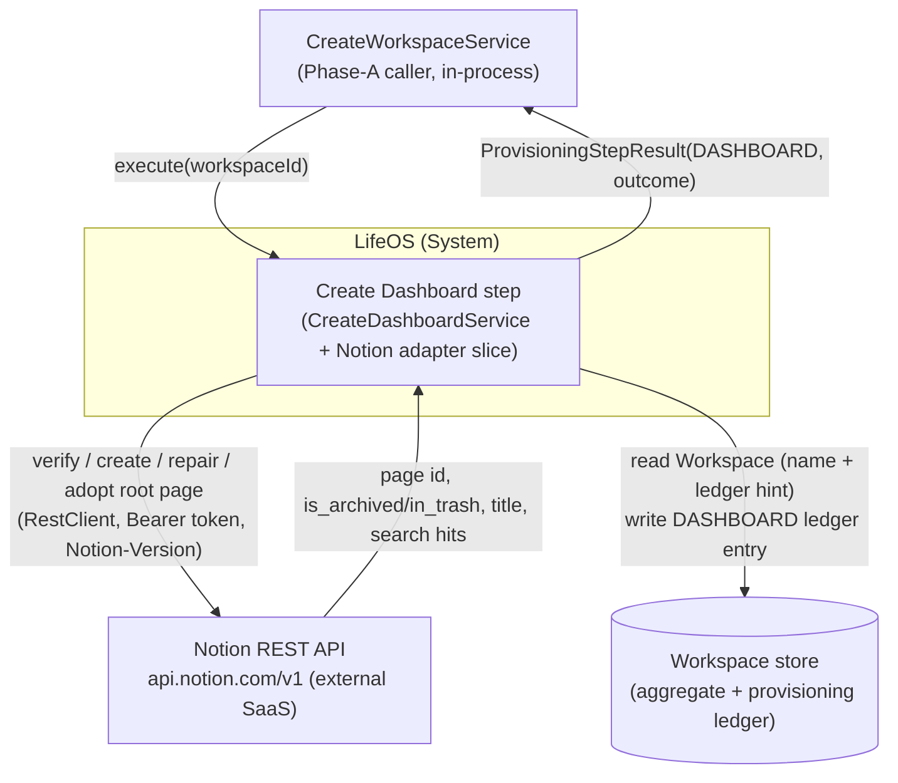
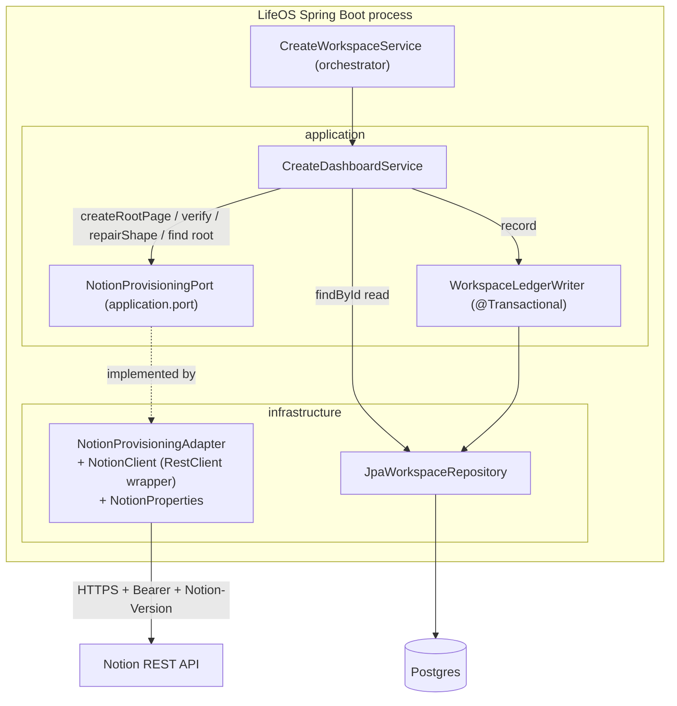
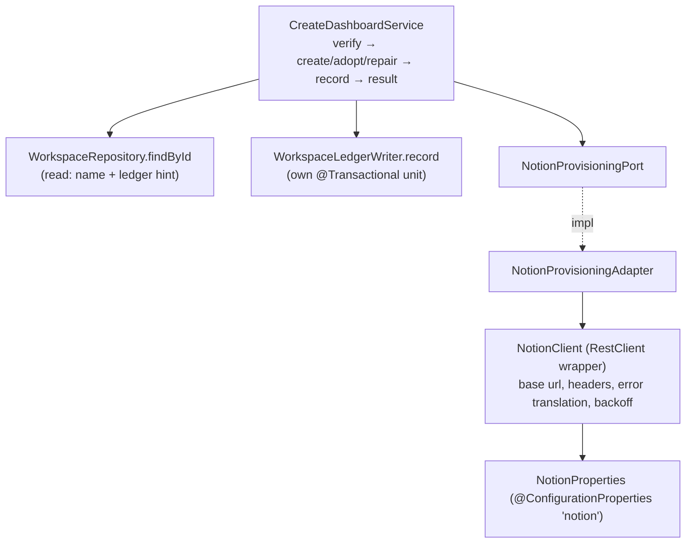
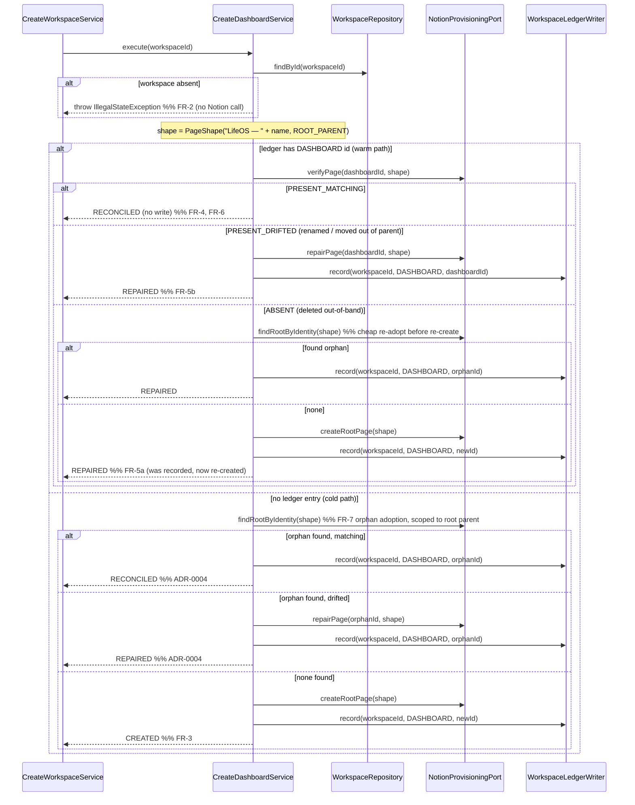

# 02 — Architecture: Create Dashboard (Phase A — root Notion page)

Status: **FINAL — open questions resolved (2026-08-05), ready for SME.** All six open questions have recorded human decisions (`02-open-questions.md`): internal Notion integration under a configured parent page (OQ-1a); orphan adoption by title marker + scoping parent (OQ-2b); Dashboard title includes the workspace name (OQ-3); a dedicated `PageShape`/`ParentConstraint` value type so a moved page is repairable (OQ-4b); an empty titled placeholder page at creation (OQ-5); and a one-shot Phase-A step (OQ-6). Four items are deferred as tracked future features (§11).

Owner (Architect stage): pipeline automation
Input: `docs/pipeline/create-dashboard/01-spec.md`
Grounding: the completed **Create Workspace** design (`docs/pipeline/create-workspace/02-architecture.md`, `adr/ADR-0001..0008`, `03-tech-spec.md`), existing code under `backend/src/main/java/com/lifeos/`, `CLAUDE.md`, and the official Notion API + Spring Framework references cited inline.

> **Scope.** This document designs **one provisioning step only** — `CreateDashboardService` (Phase A) and the slice of `NotionProvisioningAdapter` that it exercises (`createRootPage`, `verify`, `repairShape`, plus root-page adoption). It is the **first real Notion-integration implementation** in the project; every prior step in Create Workspace stops at a stub throwing `UnsupportedOperationException`. It does **not** redesign the orchestrator, the port's overall shape, the seven database steps, or persistence — those are fixed by Create Workspace and treated here as an immutable contract. Where this step's needs exceed the existing `NotionProvisioningPort` shape, that is recorded as a **finding for the SME** (§8) and, where it needs a human, an **open question** (`02-open-questions.md`), never a unilateral port redesign.

## Load-bearing decisions inherited from Create Workspace (not re-litigated)

- **Strict verify-before-trust idempotency** — live Notion is the source of truth; the ledger is a hint (Create Workspace ADR-0002).
- **No transaction across Notion calls; the per-step ledger write is a dedicated `@Transactional` collaborator** — `WorkspaceLedgerWriter.record(workspaceId, type, notionId)` (Create Workspace ADR-0001 + post-audit L1).
- **`NotionProvisioningPort` lives in `application.port`**; the application core depends only on the port interface (Create Workspace ADR-0004).
- **The provisioning ledger is a value-object collection inside the `Workspace` aggregate**; reference is by `UUID` (Create Workspace ADR-0003; `CLAUDE.md`).
- **Single process-level Notion token** for v0 (Create Workspace OQ-7).

## Decisions this branch makes for the first time (each an ADR)

- **ADR-0001** — Notion transport is a Spring `RestClient` against the Notion REST API; **no** Notion Java SDK.
- **ADR-0002** — Root-page identity & verification: `GET /v1/pages/{id}` for the warm (ledger-hint) path; `POST /v1/search` by title for orphan adoption, because a root page has no parent to search under.
- **ADR-0003** — Test without a live Notion: `MockRestServiceServer`-bound adapter contract tests + an in-memory fake `NotionProvisioningPort` for service/wiring tiers; no live token in CI.
- **ADR-0004** — Outcome semantics for orphan adoption: adopted-and-matching → `RECONCILED`, adopted-but-drifted → `REPAIRED`, never `CREATED` (resolves the spec's FR-7 `[ASSUMPTION]`).

---

## 0. Ubiquitous language delta for this step

| Term | Meaning in this step |
|---|---|
| **Dashboard** | The single root Notion **page** for one Workspace, under which every future database is created as a child. Ledger type `DASHBOARD`. |
| **Root page** | Same page, named from the Notion side: it is a page with no LifeOS-managed parent (its Notion parent is either the workspace top level or a designated integration-shared parent — see OQ-1). |
| **Orphan** | A Dashboard page that exists in Notion but has no matching ledger entry (created-but-ledger-write-failed, per FR-7). |
| **Adoption** | Recording an orphan's Notion id into the ledger instead of creating a duplicate. |
| **Deterministic identity** | The rule by which the adapter recognises "this page is *this* Workspace's Dashboard" without a stored id — necessarily heuristic on Notion (duplicate titles are allowed). See ADR-0002 + OQ-2/OQ-3. |

---

## 1. Context (C4 L1)



- **Caller** — only `CreateWorkspaceService`, via `CreateDashboardUseCase.execute(UUID)`; it gates Phase B on this step's non-failure (Create Workspace ADR-0006 `runOrBlock`).
- **Notion REST API** — reached only through `NotionProvisioningPort`; the transport (RestClient) and all Notion JSON stay inside the adapter (ADR-0001, ADR-0004).
- **Store** — the same `Workspace` aggregate + ledger; this step reads the name/ledger and writes exactly one `DASHBOARD` entry.

## 2. Containers (C4 L2)



Dependency direction respects hexagonal layering (`CLAUDE.md`; `spring-boot-conventions`): `CreateDashboardService` depends only on ports/collaborators (`NotionProvisioningPort`, `WorkspaceLedgerWriter`, `WorkspaceRepository`), never on `NotionProvisioningAdapter`. All Notion transport is behind the port.

## 3. Components (C4 L3)



**Responsibilities**

- **`CreateDashboardService`** — owns the verify/create/repair/adopt/record *sequence* for the Dashboard. Pure orchestration over ports; no Notion knowledge, no HTTP. Reads the `Workspace` (name → title intent, ledger → id hint), decides the outcome, writes via `WorkspaceLedgerWriter`, returns `ProvisioningStepResult`. Throws (does not swallow) on any Notion or lookup failure (FR-9/FR-10).
- **`NotionProvisioningAdapter`** — implements the port for the Dashboard resource. Translates the `DASHBOARD` type + `ExpectedShape` into Notion page calls; maps Notion JSON/status codes into `VerificationResult` / ids / exceptions. Only this class knows Notion endpoints.
- **`NotionClient` (new, adapter-internal)** — thin wrapper over a configured `RestClient`: base URL `https://api.notion.com/v1`, default `Authorization: Bearer <token>` and `Notion-Version` headers, response/error decoding, and 429/529 backoff. Not a bean visible to the application layer.
- **`NotionProperties`** — existing `@ConfigurationProperties(prefix = "notion")` record; extended with the pinned API version (§6, ADR-0001).
- **`WorkspaceLedgerWriter`** / **`WorkspaceRepository`** — unchanged collaborators (write / read).

---

## 4. High-level design (HLD)

### 4.1 The step algorithm (verify-before-trust for a root page)


Where `> 1` page matches `findRootByIdentity` (children of the configured root parent with the derived title), the adapter fails loudly (`NotionApiException` → step `FAILED`) rather than adopt an arbitrary page (OQ-2).

Notes:
- **Live Notion is consulted on every path** before any `RECONCILED` is returned (FR-6). The ledger id only chooses which *verification* call runs first, never the outcome by itself.
- **Orphan adoption runs on both the cold path (FR-7) and the ABSENT warm path.** A ledger id that no longer resolves is treated the same as no ledger id: search before re-creating, so an out-of-band *move/rename* that changed nothing but the id still converges to one page rather than spawning a duplicate. This is what makes FR-11 hold across a delete-then-search race.
- **The Notion write happens before the ledger write, and the ledger write is its own transaction** (Create Workspace ADR-0001). If `createRootPage` succeeds but `record` throws, the page is left in place and the *next* run's orphan-adoption path reconciles the ledger to it (FR-10 second clause). No compensating Notion rollback is attempted (Notion is not transactional).

### 4.2 Outcome decision table (resolves FR-7 `[ASSUMPTION]` — ADR-0004)

| Ledger id | Live Notion state | Notion write done | Outcome |
|---|---|---|---|
| absent | no matching child of root parent | `createRootPage` | `CREATED` |
| absent | orphan, title matches, under root parent | none | `RECONCILED` |
| absent | orphan, drifted (renamed / moved) | `repairPage` | `REPAIRED` |
| present | page ok (title + parent) | none | `RECONCILED` |
| present | page drifted (renamed / moved out of parent) | `repairPage` | `REPAIRED` |
| present | page gone, orphan found | none | `REPAIRED` |
| present | page gone, none found | `createRootPage` | `REPAIRED` |
| any | `findRootByIdentity` returns > 1 match | none | `FAILED` (loud, human-resolved) |

`CREATED` is reserved for the one case where this step actually made a new page and had no prior record — matching the spec's "must not be `CREATED` since no new page was made" for adoption. Parent-drift (a page moved out from under the configured root parent) is a repairable `PRESENT_DRIFTED` because `PageShape` carries the parent constraint (OQ-4b).

### 4.3 Error strategy

- Any Notion transport failure (timeout, 5xx, 401/403 auth, unexpected body, exhausted 429/529 backoff) surfaces from the adapter as a `NotionApiException` (unchecked, adapter-owned). `CreateDashboardService` does **not** catch it — it propagates to the orchestrator's `runStep`, which records `FAILED` with the message (Create Workspace ADR-0006). The step never fabricates a `ProvisioningStepResult.FAILED` itself (FR-9).
- Workspace-not-found is an `IllegalStateException` before any Notion call (FR-2), matching `WorkspaceLedgerWriter`'s existing convention.
- The token never appears in an exception message, log line, or `detail` (NFR-6): the adapter constructs messages from status code + Notion error `code`/`message` fields only, never echoing request headers.

### 4.4 Transaction boundary

Unchanged from Create Workspace ADR-0001: the only transactional unit in this step is `WorkspaceLedgerWriter.record(...)`, invoked across the proxied bean boundary. `CreateDashboardService.execute` carries **no** `@Transactional` (a transaction spanning the Notion HTTP call would hold a DB connection across a slow remote call and roll back durable progress on a mid-run failure — Spring Framework Reference, Data Access / Declarative transaction management, docs.spring.io/spring-framework/reference/data-access/transaction/declarative.html). The `findById` read runs in `JpaWorkspaceRepository`'s own `readOnly` transaction.

---

## 5. Low-level design (LLD)

Seam-level only; `[NEW]` = new type, `[EXTEND]` = change to existing code. No signature of `CreateDashboardUseCase` or `NotionProvisioningPort`'s **existing** methods changes.

### 5.1 `CreateDashboardService` [EXTEND] — `application.usecase.workspace`

Currently injects `NotionProvisioningPort` + `WorkspaceLedgerWriter` and throws `UnsupportedOperationException`. It must additionally read the `Workspace` (for the name → title, and the ledger hint), so it injects `WorkspaceRepository` for the read while keeping the write in `WorkspaceLedgerWriter`:

```java
@Service
@RequiredArgsConstructor
public class CreateDashboardService implements CreateDashboardUseCase {
    private final NotionProvisioningPort notion;
    private final WorkspaceRepository workspaceRepository;   // [NEW dependency] read-only: name + ledger hint (FR-2)
    private final WorkspaceLedgerWriter ledger;              // existing: the only transactional write path

    @Override
    public ProvisioningStepResult execute(UUID workspaceId) {
        Workspace workspace = workspaceRepository.findById(workspaceId)
            .orElseThrow(() -> new IllegalStateException("Workspace not found: " + workspaceId)); // FR-2
        PageShape shape = new PageShape(dashboardTitle(workspace), ParentConstraint.ROOT_PARENT);  // §5.4, OQ-4b
        Optional<String> ledgerId = workspace.resource(DASHBOARD).map(ProvisionedResource::notionId);
        // ... algorithm of §4.1, returning ProvisioningStepResult(DASHBOARD, outcome, detail)
    }

    private static String dashboardTitle(Workspace w) { return "LifeOS — " + w.name(); }  // OQ-3, single source of truth
}
```

- The stub `throw new UnsupportedOperationException(...)` is removed **only when** the adapter's `createRootPage`/`verify`/`repairShape`/root-find methods are genuinely implemented (NFR-4 cutover). Until then this class must still fail explicitly; the recommended cutover is: implement the adapter slice + this service together in one Implementer pass, guarded by the tests in §7 (`CLAUDE.md` "no silent no-op").
- No new `ProvisioningOutcome` values are introduced; the four used are `CREATED`/`RECONCILED`/`REPAIRED` plus propagated failure (FR-9).

### 5.2 Port surface for the Dashboard — page-oriented methods (additive; OQ-4b resolved)

The existing `NotionProvisioningPort` is database-oriented: `verify`/`repairShape` take `ExpectedShape` (property schemas), and `findChildByIdentity` requires a **parent** `rootPageId` — structurally wrong for a page whose identity *is* being a child of a specific parent. Per OQ-4(b), the Dashboard uses a **page-oriented** slice of the port that leaves the database methods untouched:

```java
// application.port — additive members; ExpectedShape/verify/repairShape (databases) unchanged
String            createRootPage(PageShape expected);                 // REFINED: was createRootPage(String workspaceName) — Dashboard-only method
VerificationResult verifyPage(String pageId, PageShape expected);     // [ADDITIVE]
void              repairPage(String pageId, PageShape expected);      // [ADDITIVE]
Optional<String>  findRootByIdentity(PageShape expected);            // [ADDITIVE]
```

- `createRootPage`'s **only** parameter refines from `String workspaceName` to `PageShape` so the exact derived title flows from the single source of truth in the service (`dashboardTitle`, §5.1). It is a Dashboard-only method — no database/relation/rollup/formula/sample step calls it — so the blast radius is contained to this branch (finding §8.2). `findChildByIdentity` remains for database children and is **not** used for the Dashboard.
- Rationale for page-specific methods rather than overloading `verify(...ExpectedShape)`: `ExpectedShape.requiredPropertyNames` is meaningless for a page and cannot express a parent constraint (FR-5b). Keeping `ExpectedShape` for databases and `PageShape` for pages is the honest DDD modelling (OQ-4b).
- The identity `findRootByIdentity` matches on is resolved (OQ-2b): the derived title **plus** membership under the configured root parent; multiple matches fail loudly (§4.1/§4.2).

### 5.3 Adapter slice — `NotionProvisioningAdapter` [EXTEND] + `NotionClient` [NEW] — `infrastructure.adapter.notion`

Only the Dashboard-relevant methods become real this pass; every other port method keeps throwing `UnsupportedOperationException` (Create Workspace scope guard). Endpoint mapping (official Notion API reference, developers.notion.com):

| Adapter method | Notion call | Notes |
|---|---|---|
| `createRootPage(shape)` | `POST /v1/pages`, `parent = { page_id: <rootParentPageId> }`, `properties.title = shape.title` | `title` is the only property valid at page creation; internal integrations **must** supply a page/database parent ([Create a page](https://developers.notion.com/reference/post-page)). Parent = the configured root parent (OQ-1a). Returns the new page `id`. |
| `verifyPage(pageId, shape)` | `GET /v1/pages/{pageId}` | `404`/`object_not_found` or `is_archived`/`in_trash == true` → `ABSENT`; `parent.page_id != rootParentPageId` **or** title mismatch → `PRESENT_DRIFTED`; else `PRESENT_MATCHING` ([Retrieve a page](https://developers.notion.com/reference/retrieve-a-page)). |
| `repairPage(pageId, shape)` | `PATCH /v1/pages/{pageId}` (+ `POST /v1/pages/{pageId}/move` if re-parenting) | Rename via `title`; restore a trashed page via `in_trash:false`/`is_archived:false` ([Update page](https://developers.notion.com/reference/patch-page)). A page's parent **cannot** be changed via update; a page moved out of the root parent is re-parented with the dedicated **Move page** endpoint `POST /v1/pages/{pageId}/move` ([Move a page](https://developers.notion.com/reference/move-page)), available since Notion-Version `2025-09-03`. |
| `findRootByIdentity(shape)` [NEW] | `POST /v1/search`, `query = shape.title`, `filter.object = page` | Searches "all parent or child pages … shared with a connection" ([Search](https://developers.notion.com/reference/post-search)); the adapter then filters hits to those whose `parent.page_id == rootParentPageId` **and** whose title equals `shape.title` (OQ-2b). 0 → `empty`, 1 → that id, **> 1 → `NotionApiException`** (fail loudly). |

`NotionClient` (adapter-internal) configures one `RestClient` (ADR-0001):

```java
RestClient.builder()
    .baseUrl("https://api.notion.com/v1")
    .defaultHeader("Authorization", "Bearer " + properties.token())
    .defaultHeader("Notion-Version", properties.version())   // pinned, e.g. "2026-03-11"
    .build();
```

Rate-limit handling (NFR-8): on `429` or `529`, honour the integer `Retry-After` header and retry a bounded number of times, then fail; Notion documents an average of **three requests per second per connection**, `429 rate_limited` with `Retry-After`, and `529 service_overload` handled identically ([Request limits](https://developers.notion.com/reference/request-limits)). A single successful Dashboard run makes at most 2–3 calls (one verify/search + at most one create-or-repair), well within budget (NFR-7).

### 5.4 `PageShape` — the page shape value type (OQ-4b resolved) — `application.port`

A dedicated page-shape value type is introduced so a moved Dashboard is repairable (the database-oriented `ExpectedShape.requiredPropertyNames` is meaningless for a page and cannot express a parent constraint):

```java
public record PageShape(String title, ParentConstraint parent) {
    public PageShape {
        if (title == null || title.isBlank()) throw new IllegalArgumentException("title must not be null or blank");
        if (parent == null) throw new IllegalArgumentException("parent must not be null");
    }
}

public enum ParentConstraint { ROOT_PARENT }   // must be a direct child of the configured LifeOS root parent
```

- `ParentConstraint` is **semantic**, not a Notion id: the application layer says "must be under the root parent"; the adapter resolves `ROOT_PARENT` → the configured `rootParentPageId`. This keeps the concrete Notion id out of the application layer (hexagonal layering, `CLAUDE.md`).
- `PageShape` captures exactly what this step verifies/repairs: **title** (FR-4/FR-5b rename) and **parent** (FR-5b move-out repair). Existence and not-trashed are intrinsic checks in `verifyPage`, not shape fields.
- `dashboardTitle(Workspace)` (§5.1) is the single source of truth for the title marker (`"LifeOS — {name}"`, OQ-3); the same value feeds create, verify, and identity search so they can never diverge.
- The enum has a single value today by design (YAGNI); it is an enum rather than a boolean so a future "must be workspace-root" (the deferred public-connection path §11.3) is an additive value, not a signature change. `ExpectedShape` is unchanged and continues to serve the seven databases.

### 5.5 Package structure (unchanged; package-by-feature — `spring-boot-conventions`)

```
com.lifeos
 ├─ application
 │   ├─ port/                 NotionProvisioningPort [EXTEND: +createRootPage(PageShape)/verifyPage/repairPage/findRootByIdentity],
 │   │                        PageShape [NEW], ParentConstraint [NEW], ExpectedShape/VerificationResult (unchanged, databases)
 │   └─ usecase.workspace/    CreateDashboardService [EXTEND], CreateDashboardUseCase (unchanged), WorkspaceLedgerWriter (unchanged)
 └─ infrastructure.adapter.notion/
        NotionProvisioningAdapter [EXTEND — page slice], NotionClient [NEW], NotionProperties [EXTEND — version + rootParentPageId]
```

---

## 6. Cross-cutting concerns

- **Security / token (NFR-6).** Single process-level token bound via `NotionProperties` (`@ConfigurationProperties("notion")`), sourced from an env var / secret manager, never hardcoded (`spring-boot-conventions` — configuration & secrets). Read only inside `NotionClient`; injected into the `RestClient` default `Authorization` header. Never logged, never placed in `detail` or an exception message.
- **Configuration (OQ-1a).** `NotionProperties` now binds `token`, `version` (pinned Notion API date, e.g. `2026-03-11`), and `rootParentPageId` (the operator-shared parent page under which every Dashboard is created). All three are **required**; the adapter (or a `@PostConstruct`/validation) fails fast at startup if any is blank, so a misconfiguration is a boot error, not a per-run `FAILED` that masquerades as a Notion outage.
- **API version pinning.** `Notion-Version` is required on every request and is pinned in config (`properties.version()`), not hardcoded per call — Notion versions its API by date and unversioned requests are rejected ([Authentication / versioning](https://developers.notion.com/reference/authentication); [Versioning](https://developers.notion.com/reference/versioning)). Pinning makes upgrades a deliberate config change.
- **Idempotency (NFR-1).** Realised by §4.1: every path verifies live Notion; adoption runs before any create on both cold and ABSENT paths; the ledger write is an upsert (`Workspace.record` replaces the `DASHBOARD` entry) so a repaired id overwrites the stale one.
- **Observability (NFR-5).** `CreateDashboardService` logs, per run: `workspaceId`, prior ledger id (or "none"), the `VerificationResult`, the Notion id acted on, and the final outcome — enough to reconstruct a multi-run reconciliation history. No token, no raw Notion response bodies.
- **Testability (NFR-3).** The service is pure port-orchestration → plain Mockito unit tests; the adapter is transport → `MockRestServiceServer` contract tests (ADR-0003). No live Notion in any tier.

---

## 7. Testing strategy (ADR-0003)

Narrowest-sufficient test per tier (`spring-testing`); no live Notion, no token in CI.

- **`CreateDashboardServiceTest` — plain unit (Mockito), the highest-value class.** Mocks `NotionProvisioningPort`, `WorkspaceRepository`, `WorkspaceLedgerWriter`. One test per row of the §4.2 decision table plus the failure paths:
  - `execute_throwsWhenWorkspaceNotFound` — `findById` empty → `IllegalStateException`, **no** port interaction (FR-2).
  - `execute_createsWhenNoLedgerAndNoOrphan` → `createRootPage` called once, `record(DASHBOARD,newId)`, outcome `CREATED` (FR-3).
  - `execute_reconcilesWhenLedgerPresentAndMatching` → `verify` → `PRESENT_MATCHING`, **no** write call, **no** `record`, outcome `RECONCILED` (FR-4/FR-6).
  - `execute_repairsWhenLedgerPresentAndDrifted` → `verify` → `PRESENT_DRIFTED` → `repairShape` + `record`, `REPAIRED` (FR-5b).
  - `execute_repairsWhenLedgerPresentButPageDeleted_reCreates` → `verify` `ABSENT`, `findRootByIdentity` empty → `createRootPage`, `REPAIRED` (FR-5a).
  - `execute_repairsWhenLedgerPresentButPageDeleted_readopts` → `verify` `ABSENT`, `findRootByIdentity` present → `record`, no create, `REPAIRED`.
  - `execute_adoptsOrphanWhenNoLedgerAndMatching` → cold path, `findRootByIdentity` present+matching → `record`, no create, `RECONCILED` (FR-7 + ADR-0004).
  - `execute_adoptsAndRepairsOrphanWhenDrifted` → `REPAIRED` (ADR-0004).
  - `execute_propagatesNotionFailureWithoutWritingLedger` → port throws `NotionApiException` → exception propagates, `record` **never** called (FR-9/FR-10). Assert with `verifyNoInteractions(ledger)`.
  - `execute_neverInvokesDatabaseOrRelationPortMethods` → `verifyNoInteractions` on `createDatabase`/`ensureRelation`/… (FR-12).
- **`NotionProvisioningAdapterTest` — adapter contract, `MockRestServiceServer` bound to the adapter's `RestClient.Builder`.** `MockRestServiceServer` supports `RestClient` (Spring Framework Reference — Client-side REST test support, docs.spring.io/spring-framework/reference/testing/spring-mvc-test-client.html). Cases assert **request** shape (correct path/verb, `Authorization: Bearer …`, `Notion-Version` header, request JSON) and **response** decoding:
  - `createRootPage_postsPageAndReturnsId` — `POST /v1/pages`, response id parsed.
  - `verify_returnsAbsentOn404` / `verify_returnsAbsentWhenInTrash` / `verify_returnsDriftedOnTitleMismatch` / `verify_returnsMatching`.
  - `repairShape_patchesTitle` / `repairShape_restoresTrashedPage`.
  - `findRootByIdentity_postsSearchAndFiltersByTitle` / `_returnsEmptyWhenNoHit` / `_handlesDuplicateTitleHitsPerOQ3`.
  - `client_retriesOn429ThenSucceeds` / `client_failsAfterBoundedRetries` — honour `Retry-After`; assert bounded attempts.
  - `client_neverLeaksTokenInException` — a `401` body is surfaced without the `Authorization` header value.
  - The token/version come from a test `NotionProperties`; no network egress.
- **`CreateDashboardServiceIT` — optional `@SpringBootTest` wiring** with `NotionProvisioningPort` supplied by an **in-memory fake** (`@TestConfiguration`) that models create/verify/adopt in a `Map`, plus Testcontainers Postgres for the real ledger write. Proves controller/orchestrator → service → `WorkspaceLedgerWriter` → JPA is wired and that a re-run converges to one `DASHBOARD` row (FR-11) — with **zero** Notion calls. WireMock is available (Docker/Podman + Testcontainers present) but is **not** needed: `MockRestServiceServer` covers the transport contract more cheaply, and the fake port covers wiring; reserve WireMock for later multi-step end-to-end Notion simulation.

---

## 8. Findings for the SME (must be addressed in the tech spec)

1. **`NotionProvisioningPort` gains page-oriented members** (§5.2): additive `verifyPage(String, PageShape)`, `repairPage(String, PageShape)`, `findRootByIdentity(PageShape)`. `findChildByIdentity` stays for database children and is not used for the Dashboard. The identity predicate is resolved (OQ-2b): derived title + membership under the configured root parent; `> 1` match → fail loudly.
2. **`createRootPage` parameter refines from `String workspaceName` to `PageShape`** — a Dashboard-only method (no database/relation/rollup/formula/sample caller), so contained to this branch. This flows the single-source-of-truth title into creation (§5.1).
3. **New value types `PageShape(String title, ParentConstraint parent)` and enum `ParentConstraint { ROOT_PARENT }`** in `application.port`; `ExpectedShape` unchanged (databases).
4. **`CreateDashboardService` gains a `WorkspaceRepository` read dependency** (name + ledger hint); the write stays exclusively in `WorkspaceLedgerWriter` (Create Workspace L1). Constructor becomes 3-arg.
5. **`NotionProperties` gains `version` (pinned, e.g. `"2026-03-11"`) and `rootParentPageId` (required)**; update `application.yml`. Fail-fast at startup if any of token/version/rootParentPageId is blank.
6. **`NotionApiException`** (adapter-owned, unchecked) is the single exception for all Notion failures — including ambiguous adoption (multiple matches) — and must never carry the token. `CreateDashboardService` does not catch it.
7. **Adapter is implemented as a page slice** — only `createRootPage`/`verifyPage`/`repairPage`/`findRootByIdentity` become real, using `POST/GET/PATCH /v1/pages`, `POST /v1/pages/{id}/move`, and `POST /v1/search`; the database/relation/rollup/formula/sample methods keep throwing `UnsupportedOperationException`. The NFR-4 cutover (removing the service stub throw) happens in the same pass as the adapter slice, gated by §7 tests.

---

## 9. Traceability (FR/NFR → component)

| Req | Satisfied by |
|---|---|
| FR-1 | `CreateDashboardUseCase.execute(UUID)` unchanged; §5.1 |
| FR-2 | `WorkspaceRepository.findById` → `IllegalStateException` before any Notion call; §5.1, test `execute_throwsWhenWorkspaceNotFound` |
| FR-3 | Cold path → `createRootPage`; `record`; `CREATED` (§4.1/§4.2) |
| FR-4 | Warm path `verify` `PRESENT_MATCHING` → `RECONCILED`, no write (§4.1) |
| FR-5a | Warm path `ABSENT` → adopt-or-`createRootPage` → `REPAIRED` |
| FR-5b | Warm path `PRESENT_DRIFTED` → `repairShape` → `REPAIRED` |
| FR-6 | `verify` (or `findRootByIdentity`) called on every path before `RECONCILED`; §4.1 |
| FR-7 | `findRootByIdentity` cold-path adoption; ADR-0002/0004; §5.2 |
| FR-8 | `WorkspaceLedgerWriter.record(workspaceId, DASHBOARD, id)` — its own tx (§4.4) |
| FR-9 | Returns `ProvisioningStepResult(DASHBOARD, …)`; failures propagate for orchestrator to map (§4.3) |
| FR-10 | Notion-before-ledger ordering + own-tx write + next-run adoption (§4.1 notes); test `execute_propagatesNotionFailureWithoutWritingLedger` |
| FR-11 | Adoption-before-create on both cold & ABSENT paths; upsert `record`; IT convergence test (§7) |
| FR-12 | Only page methods invoked; `verifyNoInteractions` on db/relation methods (§7) |
| NFR-1 | Strict per-path verification (§4.1; ADR-0002) |
| NFR-2 | Notion-before-ledger + no rollback; next-run reconcile (§4.1) |
| NFR-3 | Mockito service tests + `MockRestServiceServer` adapter tests + fake-port IT (§7; ADR-0003) |
| NFR-4 | Stub throw removed only at adapter cutover, gated by tests (§5.1, §8.6) |
| NFR-5 | Structured per-run logging (§6) |
| NFR-6 | Token in `NotionProperties`, header-only, never logged (§6; ADR-0001/0003) |
| NFR-7 | ≤ ~3 Notion calls per run (§5.3) |
| NFR-8 | 429/529 `Retry-After` bounded backoff in `NotionClient` (§5.3; ADR-0001) |

---

## 10. Definition-of-done status

Every FR/NFR is traceable (§9). Every first-time decision has an ADR. **All six open questions are resolved and baked into this design** (`02-open-questions.md`): OQ-1a internal integration under a configured parent, OQ-2b title + parent-scoped adoption (fail loudly on >1), OQ-3 workspace-name in the title, OQ-4b dedicated `PageShape`/`ParentConstraint`, OQ-5 empty titled placeholder, OQ-6 one-shot Phase A. Four items are deferred as tracked future features (§11). This design is ready for the SME.

## 11. Tracked future features (out of v0 scope)

1. **Dashboard body content / navigation links to databases (from OQ-5).** v0 creates an empty titled placeholder. A later feature adds page body blocks / links (separate Notion block-append calls — [Create a page](https://developers.notion.com/reference/post-page) accepts only `title` at create time).
2. **Child-database link maintenance on the Dashboard once Phase B exists (from OQ-6).** Keeping the Dashboard's "links to the seven databases" current is owned by a later phase, not this one-shot step. It would enrich the page's expected shape after databases exist — likely an additive extension to `PageShape` / a new step.
3. **Personal-access-token / public-connection support for true workspace-root pages + OAuth (the non-chosen OQ-1(b)).** Would let a Dashboard be a genuine workspace-level page (`parent.workspace = true`) instead of a child of a configured parent, and pairs with the deferred Create Workspace REST authn/OAuth work. `ParentConstraint` is an enum precisely so a `WORKSPACE_ROOT` value can be added additively.
4. **Richer orphan-adoption identity via a dedicated marker property (OQ-2 option c / OQ-3).** If title + parent scoping ever proves insufficient (e.g. persistent title collisions under the same parent), add a hidden/managed marker property on the Dashboard page and match on it instead of the title.
