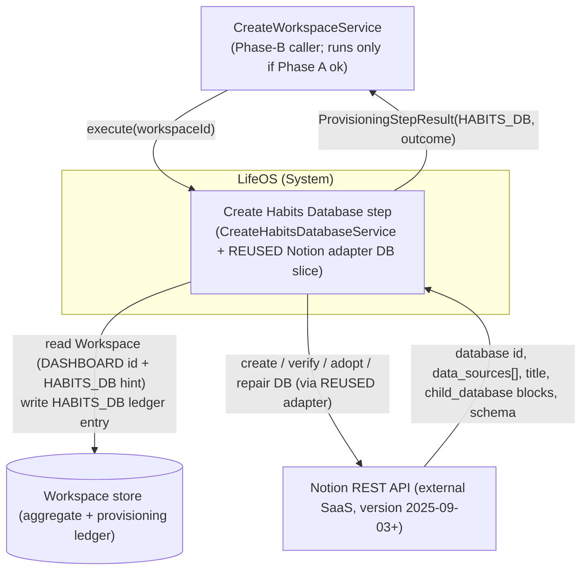
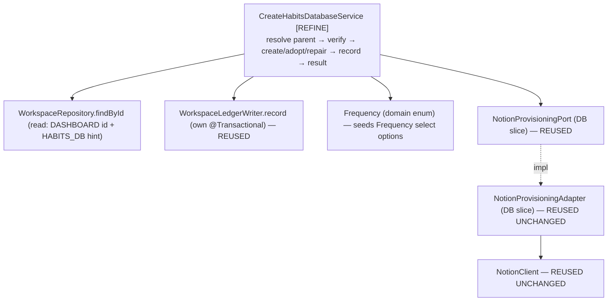
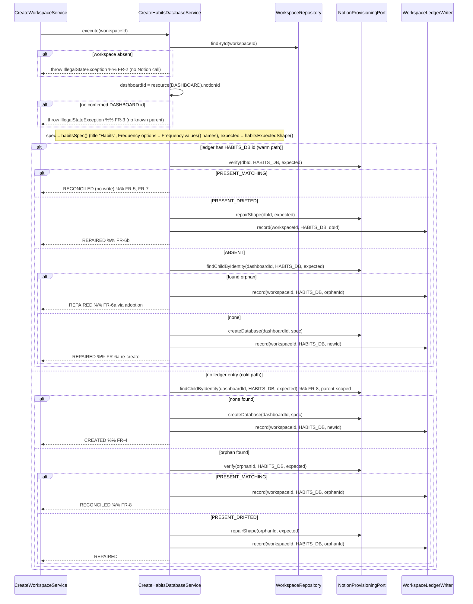

# 02 — Architecture: Create Habits Database (Phase B — fourth child database)

Status: **FINAL — no open questions (see `02-open-questions.md`), ready for SME.**

Owner (Architect stage): pipeline automation
Input: `docs/pipeline/create-habits-database/01-spec.md`
Grounding: the completed **Create Tasks Database** design (`../create-tasks-database/02-architecture.md`, `adr/ADR-0009`) — the step Habits mirrors most closely (a single `select` sourced from a closed enum) — and the **Create Projects Database** design it derives from (`../create-projects-database/02-architecture.md`, `adr/ADR-0005..0008`) plus its **shipped code** (`CreateProjectsDatabaseService`/`CreateTasksDatabaseService`, the `NotionProvisioningAdapter` DB slice, `NotionClient`, the typed `DatabaseSpec`/`ExpectedShape`/`PropertyDefinition`/`NotionPropertyType`, `WorkspaceLedgerWriter`). Existing `domain/habit/{Habit,Frequency}.java`, `CLAUDE.md`.

> **Scope.** This document designs the **small delta** to provision the **Habits** database (ledger type `HABITS_DB`) as a sibling of the already-shipped Projects/Tasks/Knowledge steps. It is a pattern-application pass, **not** a new design. The whole idempotent verify → create/adopt/repair → ledger machinery — the adapter DB slice, the typed schema value types, the port, the transaction boundary, the outcome table — is **reused unchanged**. The only novelty is a Habits-specific `DatabaseSpec`/`ExpectedShape`. This is **shorter than the Tasks architecture**: the Habits schema is exactly **two** properties (Name + Frequency — one fewer than Tasks), and no new decision arises — even the `select`-option-label question is already settled by ADR-0009. This document does not restate what ADR-0005..0008 / ADR-0009 already settled.

## Reused UNCHANGED (do NOT touch — for SME/Implementer)

Everything below is already implemented, proven by the Projects/Tasks/Knowledge steps, and requires **zero** modification for Habits:

| Reused artifact | Status | Reference |
|---|---|---|
| `NotionProvisioningAdapter` DB slice — `createDatabase` / `verify` / `findChildByIdentity` / `repairShape` | Shipped, generic over `ProvisionedResourceType` + `DatabaseSpec`/`ExpectedShape` | ADR-0005, ADR-0008; Tasks §"Reused UNCHANGED" |
| `NotionClient` (transport: Bearer, `Notion-Version` pin, `429`/`529` `Retry-After` clamp, token never logged) | Shipped, unchanged | Create Dashboard ADR-0001 |
| `NotionProvisioningPort` (application.port) — DB-slice method signatures | Shipped, unchanged | Projects §5.2 |
| `DatabaseSpec` / `ExpectedShape` / `PropertyDefinition` / `NotionPropertyType {TITLE, RICH_TEXT, SELECT, DATE}` | Shipped, typed, sufficient as-is (only `TITLE` + `SELECT` used here) | ADR-0007 |
| `WorkspaceLedgerWriter.record(workspaceId, type, notionId)` (its own `@Transactional`) | Shipped, unchanged | Create Workspace ADR-0001 |
| `WorkspaceRepository.findById`, `Workspace.resource(type)`, `ProvisioningStepResult`, `ProvisioningOutcome`, `VerificationResult` | Shipped, unchanged | — |
| `ProvisionedResourceType.HABITS_DB` | Already defined | `domain/workspace/ProvisionedResourceType.java` l.5 |
| `domain/habit/{Habit,Frequency}` | Complete; **no domain change** (like Tasks, unlike Projects/OQ-A) | spec §7 |

**No adapter change, no port change, no domain change.** The adapter is generic; passing it a `HABITS_DB` type with a Habits `DatabaseSpec`/`ExpectedShape` is all that is required. If the Implementer finds any of the above insufficient, that is an Architect-level finding (`findings.yml`, `raised_by: spring-sme`/`spring-implementer`, `suspected_layer: architecture`) — not a redesign to improvise.

## Decisions reused (not re-litigated)

- **ADR-0005** — Notion data-source model (`POST /v1/databases` with `initial_data_source.properties`; ledger stores the database id, adapter dereferences to the data source). → `../create-projects-database/adr/ADR-0005-notion-database-datasource-model.md`
- **ADR-0006** — a closed-enum status/category is a `select` (fully API-manageable under strict idempotency), **options seeded from the domain enum**, verify is **name-only**. Applied here to `Frequency`. → `../create-projects-database/adr/ADR-0006-property-type-mapping-status-as-select.md`
- **ADR-0007** — typed `DatabaseSpec`/`ExpectedShape`/`PropertyDefinition`/`NotionPropertyType`. → `../create-projects-database/adr/ADR-0007-typed-database-schema-value-type.md`
- **ADR-0008** — database identity (parent-page child enumeration, `> 1` match ⇒ `FAILED`), name-only verify, non-destructive add-only repair. → `../create-projects-database/adr/ADR-0008-database-identity-verification-nondestructive-repair.md`
- **ADR-0009** — an enum-backed `select` whose enum has **no** `displayName()` seeds its option labels **verbatim from `Enum.name()`**, with no domain change. **Governs the Frequency label-casing question directly** (`Frequency`, like `TaskStatus`, has no label method): labels are `"DAILY"`/`"WEEKLY"`/`"MONTHLY"`. Immaterial to correctness (verify is name-only, ADR-0008). → `../create-tasks-database/adr/ADR-0009-taskstatus-select-option-labels.md`
- Inherited from Create Workspace/Dashboard: verify-before-trust idempotency; no transaction across Notion calls (ledger write is the sole `@Transactional` unit); outcome semantics (`CREATED` only on first-time create with no prior record; `REPAIRED` ⇔ a Notion write happened, `RECONCILED` ⇔ none).

## New decision this branch makes

**None.** No ADR is authored for the Habits step. The one question a reader might raise — Frequency `select` label casing — is already answered by **ADR-0009** and applied verbatim. `ADR-0011` was reserved for a genuinely new decision; none arose.

---

## 0. Ubiquitous-language delta

| Term | Meaning in this step |
|---|---|
| **Habits database** | The single Notion database (ledger type `HABITS_DB`) created as a child of the workspace's Dashboard page, holding the schema that represents the `Habit` aggregate. |
| **`Frequency`** | Existing closed domain enum `{DAILY, WEEKLY, MONTHLY}` (`domain/habit/Frequency.java`) — the single source of truth for the `Frequency` select options (ADR-0006; labels per ADR-0009). |

*Orphan*, *Adoption*, *Drift*, *Data source* carry the exact meanings fixed by the Projects/Tasks design; not restated.

## 1. Context (C4 L1)

Identical shape to Tasks, with `TASKS_DB` → `HABITS_DB`.



Habits runs **independently of** Projects/Tasks/Knowledge — sibling Phase-B steps, no ordering dependency (spec §2). It reads only the `DASHBOARD` id (its parent) + any `HABITS_DB` hint, and writes exactly one `HABITS_DB` entry (NFR-7 failure isolation).

## 2. Components (C4 L3)

Structurally identical to Tasks §2; the only bean that changes is `CreateHabitsDatabaseService`, which gains a `WorkspaceRepository` read dependency and depends on `Frequency` (in place of `TaskStatus`).



- **`CreateHabitsDatabaseService` [REFINE]** — the only new logic. A verbatim mirror of `CreateTasksDatabaseService`: same warm/cold path, same outcome mapping, `TASKS_DB` → `HABITS_DB`, title `"Habits"`, and a `habitsSpec()`/`habitsExpectedShape()` that authors the §3 schema (two properties) with `Frequency` options from `Frequency.values()` (ADR-0009).
- Every other component is reused unchanged (see table above).

## 3. High-level design — the step algorithm

**Reuses the Create Tasks Database algorithm verbatim** (`../create-tasks-database/02-architecture.md` §3) with `TASKS_DB → HABITS_DB`, `dashboardId` as parent, title `"Habits"`. Reproduced here for the SME because the *behavior* is the deliverable:



Where `findChildByIdentity` returns **> 1** matching child database, the adapter throws (→ step `FAILED`) — FR-9, ADR-0008. Notion write precedes the ledger write; the ledger write is its own transaction; a crash between them is reconciled by the next run's FR-8 adoption (FR-12, NFR-2). The service never sees the data-source concept (ADR-0005).

### Outcome decision table

Reused **verbatim** from Tasks §3 / Projects §4.2 (which reuse Create Dashboard ADR-0004), substituting `HABITS_DB`. `CREATED` only on first-time create with no prior ledger record; adoption is never `CREATED`; `REPAIRED` ⇔ Notion mutated this run, `RECONCILED` ⇔ not; `> 1` identity match ⇒ `FAILED`. Not restated here.

### Error strategy & transaction boundary

Unchanged from Tasks §3 / Projects §4.3–§4.4. Workspace-not-found (FR-2) and missing-Dashboard (FR-3) throw `IllegalStateException` **before any Notion call**. Notion transport failures surface as the adapter's `NotionApiException` and propagate uncaught to the orchestrator's `runStep`, which maps them to `FAILED` (FR-11) — the step never fabricates a `FAILED` result. `execute` carries **no** `@Transactional`; the sole transactional unit is `WorkspaceLedgerWriter.record`. Token never appears in logs/`detail`/exceptions (NFR-6; enforced by the reused `NotionClient`).

---

## 4. Low-level design (the entire delta)

`[REFINE]` = the one class that changes. **No new port/adapter/domain/value types.** The `CreateHabitsDatabaseUseCase.execute(UUID)` signature is unchanged.

### 4.1 `CreateHabitsDatabaseService` [REFINE] — `application.usecase.habit`

Currently injects `NotionProvisioningPort` + `WorkspaceLedgerWriter` and throws `UnsupportedOperationException` (`CreateHabitsDatabaseService.java` l.20). It must:

1. **Gain a `WorkspaceRepository` read dependency** — constructor becomes 3-arg, mirroring `CreateTasksDatabaseService` (read: `DASHBOARD` id → parent; `HABITS_DB` id → warm-path hint). Write stays in `WorkspaceLedgerWriter`.
2. **Implement the §3 algorithm** by mirroring `CreateTasksDatabaseService`'s `executeWarmPath` / `executeColdPath` exactly, with `TASKS_DB → HABITS_DB`.
3. **Author the fixed Habits schema** in a `habitsSpec()` / `habitsExpectedShape()` pair — the one place novel to this step (two properties: Name + Frequency).

Seam-level shape (mirror of the shipped Tasks service; not full code):

```java
@Slf4j @Service @RequiredArgsConstructor
public class CreateHabitsDatabaseService implements CreateHabitsDatabaseUseCase {
    private static final String TITLE = "Habits";                // fixed identity marker (spec FR-4)

    private final NotionProvisioningPort notion;
    private final WorkspaceRepository workspaceRepository;        // [NEW dependency] read-only
    private final WorkspaceLedgerWriter ledger;                  // existing: sole transactional write

    @Override public ProvisioningStepResult execute(UUID workspaceId) {
        Workspace ws = workspaceRepository.findById(workspaceId)
            .orElseThrow(() -> new IllegalStateException("Workspace not found: " + workspaceId));      // FR-2
        String dashboardId = ws.resource(DASHBOARD).map(ProvisionedResource::notionId)
            .orElseThrow(() -> new IllegalStateException("No confirmed Dashboard for workspace " + workspaceId)); // FR-3
        DatabaseSpec spec      = habitsSpec();                    // §4.2 schema; HABITS_DB; title "Habits"
        ExpectedShape expected = habitsExpectedShape();
        Optional<String> ledgerId = ws.resource(HABITS_DB).map(ProvisionedResource::notionId);
        // warm path if ledgerId present, else cold path — identical branching to CreateTasksDatabaseService
    }

    static DatabaseSpec habitsSpec() {
        List<String> frequencyOptions = Arrays.stream(Frequency.values()).map(Enum::name).toList();  // ADR-0009: name() verbatim
        return new DatabaseSpec(TITLE, List.of(
            PropertyDefinition.of("Name", NotionPropertyType.TITLE),
            new PropertyDefinition("Frequency", NotionPropertyType.SELECT, frequencyOptions)));
    }
    static ExpectedShape habitsExpectedShape() { return new ExpectedShape(TITLE, habitsSpec().properties()); }
}
```

- The stub `throw new UnsupportedOperationException(...)` is removed **only** as this real implementation lands (NFR-4; `CLAUDE.md` "no silent no-op"). The adapter is already real, so no adapter-cutover gating is needed.
- Outcome values used: `CREATED` / `RECONCILED` / `REPAIRED` + propagated failure (FR-11). No new `ProvisioningOutcome`.

### 4.2 Habits §3 schema (title + required properties)

Grounded in the complete `Habit` aggregate (`domain/habit/Habit.java`); every field already exists (spec §7 — **no domain change**). Property types follow ADR-0006's mapping exactly. **Exactly two properties** — one fewer than Tasks.

| §3 property | Field grounding | `NotionPropertyType` | Notion config |
|---|---|---|---|
| **Name** (db title property) | `Habit.name` (`Habit.java` l.12, non-blank via `create`) | `TITLE` | `{ "type": "title", "title": {} }` |
| **Frequency** | `Habit.frequency` / `Frequency` (l.13) | `SELECT` | `{ "type": "select", "select": { "options": [ {"name":"DAILY"}, {"name":"WEEKLY"}, {"name":"MONTHLY"} ] } }` — seeded from `Frequency.values()`, labels per **ADR-0009** |

- **The title property is named `"Name"`** (matching `Habit.name`), as Projects used `"Name"` and Tasks used `"Title"` — each database names its title property after its aggregate's own field.
- **`verify` compares property *names* only** (ADR-0008): a user adding/renaming Frequency options or extra columns never triggers repair; the enum-seeded options apply at **creation** only. So ADR-0009's label choice can never cause spurious drift (spec §7 `[ASSUMPTION]` closed).
- **Excluded** (spec §8, FR-14): **no Description and no date property** — `Habit` has neither field (hard boundary, not by analogy to Tasks); the `Habit.areaId → Areas` relation (deferred to Phase C — Create Relations; requires the Areas database to exist); and any rollup/formula/row. `Habit.workspaceId` is expressed structurally (child of the Dashboard), not as a column.

### 4.3 Package structure

```
com.lifeos
 ├─ domain.habit/              Habit, Frequency            (UNCHANGED — no domain change)
 ├─ application
 │   ├─ port/                  NotionProvisioningPort, DatabaseSpec, ExpectedShape,
 │   │                         PropertyDefinition, NotionPropertyType   (ALL UNCHANGED — reused)
 │   └─ usecase.habit/         CreateHabitsDatabaseService  [REFINE — the only code change],
 │                             CreateHabitsDatabaseUseCase  (UNCHANGED)
 └─ infrastructure.adapter.notion/   NotionProvisioningAdapter, NotionClient  (UNCHANGED — reused)
```

---

## 5. Cross-cutting concerns

All inherited from the Projects/Tasks design and reused unchanged; only the Habits-specific notes:

- **Idempotency (NFR-1/FR-13).** Realised by §3 (identical to Tasks): live verify on every path; child-enumeration adoption before any create on both cold and ABSENT paths; upsert `record` (`Workspace.record` replaces the `HABITS_DB` entry). Parent-scoped child enumeration is immediately consistent, so a create-then-crash converges on the next run (ADR-0008).
- **Failure isolation (NFR-7).** The step reads only `DASHBOARD` and writes only `HABITS_DB`; no shared mutable state; a Habits failure leaves Projects/Tasks/Knowledge (and vice versa) free to run (orchestrator `phaseBOk` aggregation). It never reads or writes any other `*_DB` entry (FR-14).
- **Security / token (NFR-6).** Reuses the single process-level token via `NotionClient`; no new secret or scope. Token never logged or placed in `detail`.
- **Observability (NFR-5).** Log per run: `workspaceId`, `dashboardId`, prior `HABITS_DB` ledger id (or "none"), the `VerificationResult`, the database id acted on, the final outcome — matching the Tasks service's `log.info` lines. No token, no raw Notion bodies.
- **Validation.** `DatabaseSpec`/`ExpectedShape`/`PropertyDefinition` validate in their (existing) compact constructors — `DatabaseSpec` enforces exactly one `TITLE` property, `PropertyDefinition` enforces options only on `SELECT`. `Habit`/`Frequency` validate in the domain factory. Malformed schema fails at construction, not mid-Notion-call.
- **Testability (NFR-3).** `CreateHabitsDatabaseServiceTest` — plain Mockito over `NotionProvisioningPort` + `WorkspaceRepository` + `WorkspaceLedgerWriter`, one test per outcome-table row plus FR-2/FR-3 preconditions and `propagatesNotionFailureWithoutWritingLedger` (FR-12) / `neverInvokesRelationRollupFormulaOrSample` (FR-14). Assert `habitsSpec()` carries exactly the two §4.2 properties (Name=TITLE, Frequency=SELECT) and Frequency options = `Frequency.values()` names (ADR-0009, FR-15). **No new adapter tests** — the adapter is unchanged and already covered by `NotionProvisioningAdapterDatabaseTest`. Reuses ADR-0003 tiers.

---

## 6. Traceability (FR/NFR → component)

| Req | Satisfied by |
|---|---|
| FR-1 | `CreateHabitsDatabaseUseCase.execute(UUID)` unchanged; §4.1 |
| FR-2 | `WorkspaceRepository.findById` → `IllegalStateException` before any Notion call; §4.1 |
| FR-3 | `resource(DASHBOARD)` empty → `IllegalStateException`; §4.1 |
| FR-4 | Cold path `findChildByIdentity` empty → `createDatabase("Habits")` → `record(HABITS_DB)` → `CREATED`; §3 |
| FR-5 | Warm `verify` `PRESENT_MATCHING` → `RECONCILED`, no write; §3 |
| FR-6a | Warm `ABSENT` → adopt-or-`createDatabase` → `REPAIRED`; §3 |
| FR-6b | Warm `PRESENT_DRIFTED` → `repairShape` (add-only, non-destructive) → `REPAIRED`; ADR-0008 |
| FR-7 | `verify`/`findChildByIdentity` before any `RECONCILED`; §3, ADR-0008 |
| FR-8 | Cold `findChildByIdentity` (parent-scoped) → adopt; ADR-0008 |
| FR-9 | `> 1` match → `NotionApiException` → `FAILED`; ADR-0008 |
| FR-10 | `WorkspaceLedgerWriter.record(workspaceId, HABITS_DB, id)` — own tx (reused) |
| FR-11 | Returns `ProvisioningStepResult(HABITS_DB, …)`; failures propagate; §3 error strategy |
| FR-12 | Notion-before-ledger + own-tx write + next-run adoption; test `propagatesNotionFailureWithoutWritingLedger` |
| FR-13 | Adoption-before-create on cold & ABSENT paths; upsert `record`; index-consistent enumeration |
| FR-14 | Only the four DB methods invoked; relation/rollup/formula/sample untouched; schema has exactly two properties, no relation/Description/date property; §4.2 |
| FR-15 | Frequency `SELECT` options = `Frequency.values()` names, one per constant; `habitsSpec()` §4.1/§4.2; ADR-0009 |
| §3 schema + domain backing | `habitsSpec()`/`habitsExpectedShape()` (§4.1/§4.2); `Habit`/`Frequency` unchanged (spec §7); ADR-0006, ADR-0009 |
| NFR-1 | Strict per-path live verification; §3 (inherited ADR-0008) |
| NFR-2 | Notion-before-ledger + no rollback; next-run reconcile; §3 |
| NFR-3 | Mockito service tests; adapter reused/already covered; §5 |
| NFR-4 | Stub `UnsupportedOperationException` removed only as the real impl lands; §4.1 |
| NFR-5 | Structured per-run logging; §5 |
| NFR-6 | Token in `NotionClient` header only, never logged; §5 (reused) |
| NFR-7 | No shared mutable state; only `HABITS_DB` written; §5 |
| NFR-8 | Upsert `record` → exactly one `HABITS_DB` entry (`Workspace.record` semantics) |
| NFR-9 | Bounded call count per run (reused adapter; Projects §5.4) |
| NFR-10 | `429`/`529` `Retry-After` clamp in reused `NotionClient` |

---

## 7. Definition-of-done status

Every FR/NFR is traceable (§6). The step reuses ADR-0005..0008 and ADR-0009 unchanged (by reference, not duplication) and makes **no** new decision. No domain change is required (spec §7). No open questions remain (`02-open-questions.md`). Ready for the SME.

## 8. Findings for the SME

1. **`CreateHabitsDatabaseService` gains a `WorkspaceRepository` read dependency** — constructor becomes 3-arg, mirroring `CreateTasksDatabaseService`. Read: `DASHBOARD` id (parent) + `HABITS_DB` hint; write stays in `WorkspaceLedgerWriter`.
2. **Implement the §3 algorithm as a verbatim mirror of `CreateTasksDatabaseService`** (`executeWarmPath`/`executeColdPath`), substituting `TASKS_DB → HABITS_DB` and using `habitsSpec()`/`habitsExpectedShape()` with title constant `"Habits"`.
3. **Author `habitsSpec()`** with the §4.2 schema — **exactly two** properties: `"Name"` (`TITLE`, matches `Habit.name`) and `"Frequency"` (`SELECT`, options from `Frequency.values()` mapped via `Enum::name`, **ADR-0009** — no `Frequency` change). **Do not** add a Description or any date property (hard boundary; `Habit` has neither field — spec §8).
4. **Remove the stub `UnsupportedOperationException`** only as the real implementation lands (NFR-4). No adapter cutover to coordinate — the adapter DB slice is already real.
5. **No changes to** the port, the typed schema value types, the adapter, `NotionClient`, or `domain/habit/`. If any is found insufficient, raise an Architect-level finding (`findings.yml`, `raised_by: spring-sme`, `suspected_layer: architecture`) — do not redesign silently.
6. **Tests:** `CreateHabitsDatabaseServiceTest` (Mockito, one per outcome-table row + FR-2/FR-3 + FR-12 + FR-14), asserting the two `habitsSpec()` properties and `Frequency`-name options (FR-15). No new adapter tests (unchanged, already covered).
