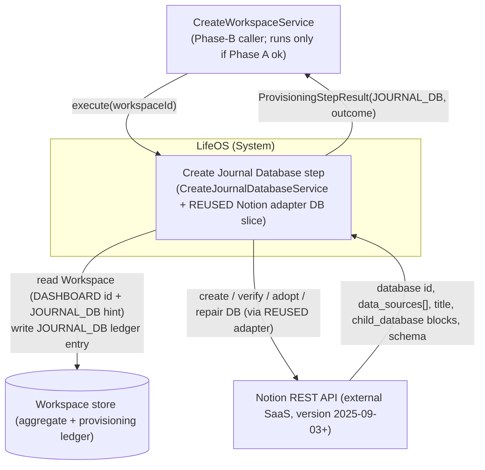
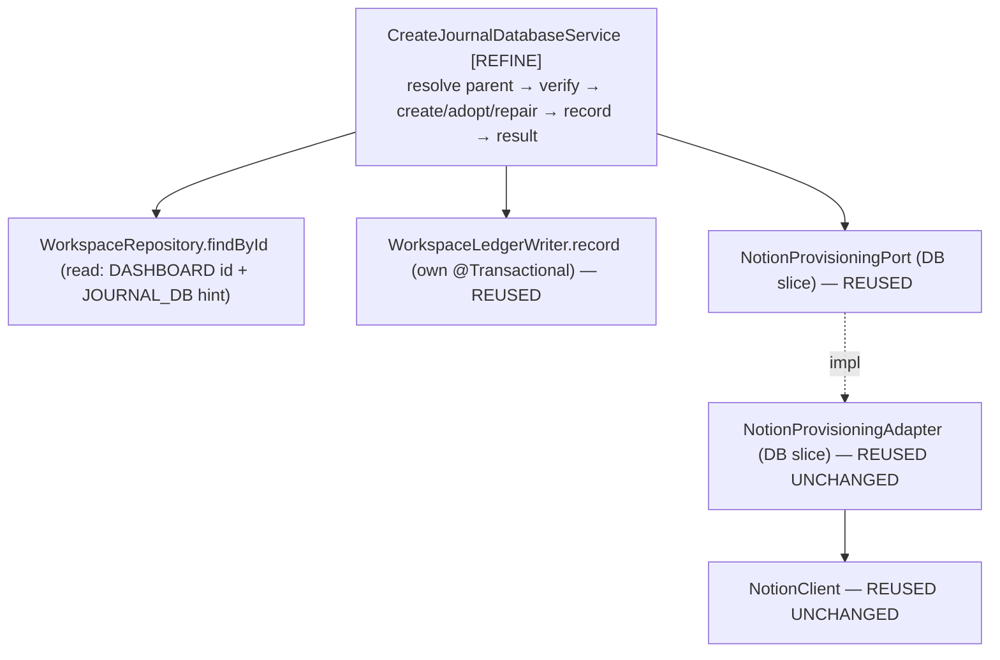

# 02 — Architecture: Create Journal Database (Phase B — fifth child database)

Status: **FINAL — open question resolved by stakeholder decision (2026-08-06; see `02-open-questions.md` and ADR-0012), ready for SME.** OQ-A resolved as **option (c): extend `JournalEntry` with a new nullable `title` field** (domain change, in-scope this feature) — overriding the Architect's initial option-(a) resolution, mirroring the Projects OQ-A precedent.

Owner (Architect stage): pipeline automation
Input: `docs/pipeline/create-journal-database/01-spec.md`
Grounding: the completed **Create Projects Database** design (`../create-projects-database/02-architecture.md`, `adr/ADR-0005..0008`) — the pattern this step mirrors, **including its OQ-A domain change** (`../create-projects-database/02-architecture.md` §5.6, §8.9) — its **shipped code** (`CreateProjectsDatabaseService`, the `NotionProvisioningAdapter` DB slice, `NotionClient`, the typed `DatabaseSpec`/`ExpectedShape`/`PropertyDefinition`/`NotionPropertyType`, `WorkspaceLedgerWriter`), and the completed **Create Tasks Database** delta (`../create-tasks-database/02-architecture.md`, `adr/ADR-0009`) whose service shape this step copies almost verbatim. Existing `domain/journal/JournalEntry.java`, `CLAUDE.md`, and the official Notion API references cited in ADR-0012.

> **Scope.** This document designs the **small delta** to provision the **Journal** database (ledger type `JOURNAL_DB`) as a sibling of the already-shipped Projects/Tasks/Knowledge/Habits steps, **plus a bounded `JournalEntry` domain change** now in-scope per the stakeholder's OQ-A decision (§4.2b): `JournalEntry` gains a nullable `title` field that backs the Notion title property. It is a pattern-application pass, **not** a new design. The whole idempotent verify → create/adopt/repair → ledger machinery — the adapter DB slice, the typed schema value types, the port, the transaction boundary, the outcome table — is **reused unchanged**; the novelty is a Journal-specific `DatabaseSpec`/`ExpectedShape`, the one schema decision in **ADR-0012** (the domain-backed title property + the `timestamp` → Notion `date` mapping), and the `JournalEntry.title` field it introduces. This is deliberately much shorter than the Projects architecture: it does not restate what ADR-0005..0008 already settled.

## Reused UNCHANGED (do NOT touch — for SME/Implementer)

Everything below is already implemented, proven by the four prior database steps, and requires **zero** modification for Journal:

| Reused artifact | Status | Reference |
|---|---|---|
| `NotionProvisioningAdapter` DB slice — `createDatabase` / `verify` / `findChildByIdentity` / `repairShape` | Shipped, generic over `ProvisionedResourceType` + `DatabaseSpec`/`ExpectedShape` | ADR-0005, ADR-0008; Projects §5.4 |
| `NotionClient` (transport: Bearer, `Notion-Version` pin ≥ `2025-09-03`, `429`/`529` `Retry-After` clamp, token never logged) | Shipped, unchanged | Create Dashboard ADR-0001 |
| `NotionProvisioningPort` (application.port) — DB-slice method signatures | Shipped, unchanged | Projects §5.2 |
| `DatabaseSpec` / `ExpectedShape` / `PropertyDefinition` / `NotionPropertyType {TITLE, RICH_TEXT, SELECT, DATE}` | Shipped, typed, sufficient as-is (Journal uses only TITLE/RICH_TEXT/DATE) | ADR-0007 |
| `WorkspaceLedgerWriter.record(workspaceId, type, notionId)` (its own `@Transactional`) | Shipped, unchanged | Create Workspace ADR-0001 |
| `WorkspaceRepository.findById`, `Workspace.resource(type)`, `ProvisioningStepResult`, `ProvisioningOutcome`, `VerificationResult` | Shipped, unchanged | — |
| `ProvisionedResourceType.JOURNAL_DB` | Already defined | `domain/workspace/ProvisionedResourceType.java` l.5 |

**No adapter change, no port change, no typed-value-type change.** The adapter is generic; passing it a `JOURNAL_DB` type with a Journal `DatabaseSpec`/`ExpectedShape` is all the *provisioning* path requires. The **one** production change beyond the service is a bounded `JournalEntry` domain extension (`title` field, §4.2b), landing in-scope per the stakeholder's OQ-A decision (ADR-0012) — analogous to the Projects branch's `ProjectStatus`/`dueDate` change. If the Implementer finds any *reused* artifact insufficient, that is an Architect-level finding (`findings.yml`, `raised_by: spring-sme`, `suspected_layer: architecture`) — not a redesign to improvise.

## Decisions reused (not re-litigated)

- **ADR-0005** — Notion data-source model (`POST /v1/databases` with `initial_data_source.properties`; ledger stores the database id, adapter dereferences to the data source). → `../create-projects-database/adr/ADR-0005-notion-database-datasource-model.md`
- **ADR-0007** — typed `DatabaseSpec`/`ExpectedShape`/`PropertyDefinition`/`NotionPropertyType`. → `../create-projects-database/adr/ADR-0007-typed-database-schema-value-type.md`
- **ADR-0008** — database identity (parent-page child enumeration, `> 1` match ⇒ `FAILED`), name-only verify, non-destructive add-only repair. → `../create-projects-database/adr/ADR-0008-database-identity-verification-nondestructive-repair.md`
- **ADR-0009** — precedent that a domain enum with no label method is handled without a domain change. Not directly exercised (Journal has **no** `select` property), referenced only for the no-domain-change-for-labels discipline. → `../create-tasks-database/adr/ADR-0009-taskstatus-select-option-labels.md`
- **ADR-0006** (Status-as-`select`) is **not applicable** here — `JournalEntry` carries no closed-set/enum field, so the Journal schema has no `select` property (spec §3).
- Inherited from Create Workspace/Dashboard: verify-before-trust idempotency; no transaction across Notion calls (ledger write is the sole `@Transactional` unit); outcome semantics (`CREATED` only on first-time create with no prior record; `REPAIRED` ⇔ a Notion write happened, `RECONCILED` ⇔ none). Self-validating immutable domain via static factory, reference-by-UUID (`CLAUDE.md`) — the `JournalEntry` change in §4.2b obeys this.

## New decision this branch makes

- **ADR-0012** — resolves spec §9 OQ-A. Initially resolved by the Architect as option (a); **the stakeholder chose option (c)** (2026-08-06, overriding — as on Projects OQ-A): add a new **nullable** `String title` field to `JournalEntry` and back the Notion **`Title`** property with it. `title` is optional because a journal entry's essence is `content` + `timestamp` and a title is an optional headline (mirrors nullable `Project.dueDate`; `content` stays non-blank). The ADR also records the `JournalEntry.timestamp` (`LocalDateTime`) → Notion **`date`** mapping, confirmed from the Notion docs (a `date` value carries an ISO 8601 date "with an optional time", so no truncation). → `adr/ADR-0012-journal-title-property-and-date-mapping.md`

---

## 0. Ubiquitous-language delta

| Term | Meaning in this step |
|---|---|
| **Journal database** | The single Notion database (ledger type `JOURNAL_DB`) created as a child of the workspace's Dashboard page, holding the schema that represents the `JournalEntry` aggregate. |
| **Database title marker** | The fixed constant **`"Journal"`** used for create/verify/parent-scoped identity lookup — distinct from the title-*property* name (`"Title"`); the two independent concerns happen to share the word "title" (spec §7). |
| **`Title` (title property)** | The single `TITLE`-typed property, backed by the new domain field `JournalEntry.title` (nullable). Satisfies Notion's one-title-property requirement; this schema-only step writes no per-row value (ADR-0012; FR-15). |
| **`JournalEntry.title`** | New nullable domain field (§4.2b) added per the stakeholder's OQ-A decision — the source of truth for the Notion `Title` column when a future population step runs. |

*Orphan*, *Adoption*, *Drift*, *Data source* carry the exact meanings fixed by the Projects design; not restated.

## 1. Context (C4 L1)

Identical shape to Projects/Tasks, with the resource type set to `JOURNAL_DB`.



Journal runs **independently of** the sibling Phase-B steps — no ordering dependency (spec §2; `CreateWorkspaceService.java` l.54–61). It reads only the `DASHBOARD` id (its parent) + any `JOURNAL_DB` hint, and writes exactly one `JOURNAL_DB` entry (NFR-7 failure isolation). The `JournalEntry` domain change (§4.2b) is not exercised at runtime by this step (no rows written), exactly as the Projects domain change was not.

## 2. Components (C4 L3)

Structurally identical to Projects §3 / Tasks §2; the only bean that changes is `CreateJournalDatabaseService`. Unlike Projects/Tasks it depends on **no domain enum** (Journal has no `select` column), so its dependency set is just the three ports/collaborators.



- **`CreateJournalDatabaseService` [REFINE]** — the only new *service* logic. A verbatim mirror of `CreateTasksDatabaseService`: same warm/cold path, same outcome mapping, `TASKS_DB` → `JOURNAL_DB`, title marker `"Journal"`, and a `journalSpec()`/`journalExpectedShape()` that authors the §4.2 schema (`Title`/`Content`/`Date`). No `select` property, so no domain-enum dependency.
- **`JournalEntry` [DOMAIN]** — extended with a nullable `title` field (§4.2b); not exercised at runtime by this step but in-scope for this feature (source of truth for the `Title` column).
- Every other component is reused unchanged (see the Reused-UNCHANGED table).

## 3. High-level design — the step algorithm

**Reuses the Create Projects/Tasks Database algorithm verbatim** (`../create-tasks-database/02-architecture.md` §3) with `TASKS_DB → JOURNAL_DB`, `dashboardId` as parent, title marker `"Journal"`. Reproduced here for the SME because the *behavior* is the deliverable:

```mermaid
sequenceDiagram
    participant Orc as CreateWorkspaceService
    participant Svc as CreateJournalDatabaseService
    participant Repo as WorkspaceRepository
    participant Notion as NotionProvisioningPort
    participant Writer as WorkspaceLedgerWriter

    Orc->>Svc: execute(workspaceId)
    Svc->>Repo: findById(workspaceId)
    alt workspace absent
        Svc-->>Orc: throw IllegalStateException   %% FR-2 (no Notion call)
    end
    Svc->>Svc: dashboardId = resource(DASHBOARD).notionId
    alt no confirmed DASHBOARD id
        Svc-->>Orc: throw IllegalStateException   %% FR-3 (no known parent)
    end
    Note over Svc: spec = journalSpec() (title marker "Journal"; Title/Content/Date), expected = journalExpectedShape()

    alt ledger has JOURNAL_DB id (warm path)
        Svc->>Notion: verify(dbId, JOURNAL_DB, expected)
        alt PRESENT_MATCHING
            Svc-->>Orc: RECONCILED (no write)       %% FR-5, FR-7
        else PRESENT_DRIFTED
            Svc->>Notion: repairShape(dbId, expected)
            Svc->>Writer: record(workspaceId, JOURNAL_DB, dbId)
            Svc-->>Orc: REPAIRED                     %% FR-6b
        else ABSENT
            Svc->>Notion: findChildByIdentity(dashboardId, JOURNAL_DB, expected)
            alt found orphan
                Svc->>Writer: record(workspaceId, JOURNAL_DB, orphanId)
                Svc-->>Orc: REPAIRED                 %% FR-6a via adoption
            else none
                Svc->>Notion: createDatabase(dashboardId, spec)
                Svc->>Writer: record(workspaceId, JOURNAL_DB, newId)
                Svc-->>Orc: REPAIRED                 %% FR-6a re-create
            end
        end
    else no ledger entry (cold path)
        Svc->>Notion: findChildByIdentity(dashboardId, JOURNAL_DB, expected)  %% FR-8, parent-scoped
        alt none found
            Svc->>Notion: createDatabase(dashboardId, spec)
            Svc->>Writer: record(workspaceId, JOURNAL_DB, newId)
            Svc-->>Orc: CREATED                      %% FR-4
        else orphan found
            Svc->>Notion: verify(orphanId, JOURNAL_DB, expected)
            alt PRESENT_MATCHING
                Svc->>Writer: record(workspaceId, JOURNAL_DB, orphanId)
                Svc-->>Orc: RECONCILED               %% FR-8
            else PRESENT_DRIFTED
                Svc->>Notion: repairShape(orphanId, expected)
                Svc->>Writer: record(workspaceId, JOURNAL_DB, orphanId)
                Svc-->>Orc: REPAIRED
            end
        end
    end
```

Where `findChildByIdentity` returns **> 1** matching child database, the adapter throws (→ step `FAILED`) — FR-9, ADR-0008. Notion write precedes the ledger write; the ledger write is its own transaction; a crash between them is reconciled by the next run's FR-8 adoption (FR-12, NFR-2). The service never sees the data-source concept (ADR-0005).

### Outcome decision table

Reused **verbatim** from Projects §4.2 / Tasks (which reuse Create Dashboard ADR-0004), substituting `JOURNAL_DB`. `CREATED` only on first-time create with no prior ledger record; adoption is never `CREATED`; `REPAIRED` ⇔ Notion mutated this run, `RECONCILED` ⇔ not; `> 1` identity match ⇒ `FAILED`. Not restated here.

### Error strategy & transaction boundary

Unchanged from Projects §4.3/§4.4 / Tasks. Workspace-not-found (FR-2) and missing-Dashboard (FR-3) throw `IllegalStateException` **before any Notion call**. Notion transport failures surface as the adapter's `NotionApiException` and propagate uncaught to the orchestrator's `runStep`, which maps them to `FAILED` (FR-11) — the step never fabricates a `FAILED` result. `execute` carries **no** `@Transactional`; the sole transactional unit is `WorkspaceLedgerWriter.record`. The `JournalEntry` domain change (§4.2b) adds no new transactional path. Token never appears in logs/`detail`/exceptions (NFR-6; enforced by the reused `NotionClient`).

---

## 4. Low-level design (the delta)

`[REFINE]` = the service that changes. `[DOMAIN]` = the OQ-A domain change (§4.2b). **No new port/adapter/typed-value types.** The `CreateJournalDatabaseUseCase.execute(UUID)` signature is unchanged.

### 4.1 `CreateJournalDatabaseService` [REFINE] — `application.usecase.journal`

Currently injects `NotionProvisioningPort` + `WorkspaceLedgerWriter` and throws `UnsupportedOperationException` (`CreateJournalDatabaseService.java` l.20). It must:

1. **Gain a `WorkspaceRepository` read dependency** — constructor becomes 3-arg, mirroring `CreateTasksDatabaseService` (read: `DASHBOARD` id → parent; `JOURNAL_DB` id → warm-path hint). Write stays in `WorkspaceLedgerWriter`.
2. **Implement the §3 algorithm** by mirroring `CreateTasksDatabaseService`'s `executeWarmPath` / `executeColdPath` exactly, with `TASKS_DB → JOURNAL_DB`.
3. **Author the fixed Journal schema** in a `journalSpec()` / `journalExpectedShape()` pair — the one place novel to the service. Simpler than Tasks/Projects: three properties, **no `select`**, so no domain-enum dependency and no `PropertyDefinition.options`.

Seam-level shape (mirror of the shipped Tasks service; not full code):

```java
@Slf4j @Service @RequiredArgsConstructor
public class CreateJournalDatabaseService implements CreateJournalDatabaseUseCase {
    private static final String TITLE = "Journal";               // fixed database identity marker (spec FR-4)

    private final NotionProvisioningPort notion;
    private final WorkspaceRepository workspaceRepository;        // [NEW dependency] read-only
    private final WorkspaceLedgerWriter ledger;                  // existing: sole transactional write

    @Override public ProvisioningStepResult execute(UUID workspaceId) {
        Workspace ws = workspaceRepository.findById(workspaceId)
            .orElseThrow(() -> new IllegalStateException("Workspace not found: " + workspaceId));       // FR-2
        String dashboardId = ws.resource(DASHBOARD).map(ProvisionedResource::notionId)
            .orElseThrow(() -> new IllegalStateException("No confirmed Dashboard for workspace " + workspaceId)); // FR-3
        DatabaseSpec spec       = journalSpec();                  // §4.2 schema; JOURNAL_DB; title marker "Journal"
        ExpectedShape expected  = journalExpectedShape();
        Optional<String> ledgerId = ws.resource(JOURNAL_DB).map(ProvisionedResource::notionId);
        // warm path if ledgerId present, else cold path — identical branching to CreateTasksDatabaseService
    }

    static DatabaseSpec journalSpec() {
        return new DatabaseSpec(TITLE, List.of(
            PropertyDefinition.of("Title",   NotionPropertyType.TITLE),      // ADR-0012: backed by JournalEntry.title (nullable)
            PropertyDefinition.of("Content", NotionPropertyType.RICH_TEXT),  // JournalEntry.content
            PropertyDefinition.of("Date",    NotionPropertyType.DATE)));     // JournalEntry.timestamp (LocalDateTime → date, ADR-0012)
    }
    static ExpectedShape journalExpectedShape() { return new ExpectedShape(TITLE, journalSpec().properties()); }
}
```

- The stub `throw new UnsupportedOperationException(...)` is removed **only** as this real implementation lands (NFR-4; `CLAUDE.md` "no silent no-op"). The adapter is already real, so no adapter-cutover gating is needed.
- Outcome values used: `CREATED` / `RECONCILED` / `REPAIRED` + propagated failure (FR-11). No new `ProvisioningOutcome`.
- The three-property schema satisfies `DatabaseSpec`'s "exactly one TITLE" invariant (`Title`).

### 4.2 Journal §3 schema (title property + required properties)

Grounded in the `JournalEntry` aggregate (`domain/journal/JournalEntry.java`) — including the **new** `title` field (§4.2b). Property types follow ADR-0012.

| §3 property | Field grounding | `NotionPropertyType` | Notion config |
|---|---|---|---|
| **Title** (db title property) | `JournalEntry.title` — **new nullable field** (§4.2b; ADR-0012, stakeholder OQ-A option c) | `TITLE` | `{ "type": "title", "title": {} }` |
| **Content** | `JournalEntry.content` (`JournalEntry.java` l.13, non-blank via `create`) | `RICH_TEXT` | `{ "type": "rich_text", "rich_text": {} }` |
| **Date** | `JournalEntry.timestamp` `LocalDateTime` (l.14) | `DATE` | `{ "type": "date", "date": {} }` — carries the datetime; Notion `date` values take an ISO 8601 date "with an optional time" (ADR-0012) |

- **The database title *marker* is `"Journal"`** (identity, used for create/verify/parent-scoped lookup); the title *property* is named **`"Title"`** (the single `TITLE`-typed column, backed by `JournalEntry.title`, consistent with `Task.title`'s `"Title"` column). Distinct concerns (spec §7; ADR-0012).
- **`verify` compares property *names* only** (ADR-0008): a user renaming or leaving the `Title` column empty, or adding extra columns, never triggers repair. The nullable title is harmless to idempotency.
- **No `select` property** — unlike Projects (`Status`) / Tasks (`Status`), `JournalEntry` has no closed-set/enum field, so ADR-0006/ADR-0009 do not apply.
- **Excluded** (spec §8, FR-14): the `JournalEntry.personId → People` relation (deferred to Phase C — Create Relations; requires both databases to exist), and any rollup/formula/row. `JournalEntry.workspaceId` is expressed structurally (child of the Dashboard), not as a column.

### 4.2b Domain change — `JournalEntry` gains a nullable `title` [DOMAIN] — `domain/journal` (OQ-A, stakeholder option c)

Per the human decision on OQ-A (2026-08-06; ADR-0012), `JournalEntry` is extended now so the Notion `Title` column has a backing domain source of truth — symmetric with `Project.name`/`Task.title`. The change obeys `CLAUDE.md`: no primitive obsession (a plain optional headline string, not a mis-modeled value), self-validating via the static factory, immutable (`@Value`), reference-by-UUID preserved. It mirrors the Projects OQ-A domain change (`../create-projects-database/02-architecture.md` §5.6).

Current shape (`JournalEntry.java`): `@Value @Builder`; fields `id, content, timestamp, workspaceId, personId`; `create(content, timestamp, workspaceId, personId)` validates `content` non-blank + `workspaceId` non-null and defaults `timestamp` to `LocalDateTime.now()`.

**Delta:**

```java
@Value
@Builder
public class JournalEntry {
    UUID id;
    String title;          // [NEW] nullable — optional headline (ADR-0012); may be absent for a free-form entry
    String content;
    LocalDateTime timestamp;
    UUID workspaceId;
    UUID personId;

    public static JournalEntry create(String title,               // [NEW] leading param — the entry's headline
                                      String content,
                                      LocalDateTime timestamp,
                                      UUID workspaceId,
                                      UUID personId) {
        if (content == null || content.isBlank()) {               // unchanged invariant
            throw new IllegalArgumentException("JournalEntry content must not be null or blank");
        }
        if (workspaceId == null) {                                // unchanged invariant
            throw new IllegalArgumentException("JournalEntry workspaceId must not be null");
        }
        return JournalEntry.builder()
                .id(UUID.randomUUID())
                .title(title)                                     // [NEW] nullable passthrough — NO validation (optional)
                .content(content)
                .timestamp(timestamp != null ? timestamp : LocalDateTime.now())
                .workspaceId(workspaceId)
                .personId(personId)
                .build();
    }
}
```

- **Field:** add `String title` (place it **after `id`**, so the field order reads headline → body → moment; a natural document order).
- **Invariant (nullable):** `title` is **not** validated — it is an optional headline (ADR-0012: essence is `content` + `timestamp`; mirrors nullable `Project.dueDate`). `content` non-blank and `workspaceId` non-null are **unchanged**. The application layer still never mints an invalid `JournalEntry`.
- **Factory signature:** `create(...)` gains a **leading** `title` parameter (chosen position: title is the entry's headline, so it reads first — analogous to `Project.create(name, description, …)` where the title-like field leads). Callers pass `null` to omit a title.
- **Reconstitution seam:** the field flows through the existing all-args `@Builder` automatically, so repository reconstitution of already-valid state (when persistence is added) carries `title` without re-running create-time logic — consistent with `CLAUDE.md`'s "all-args builder reserved for reconstitution". No `JournalEntry.reconstitute(...)` exists today; if one is later added it must accept `title`.
- **`@Value` immutability and UUID references preserved.** No object-graph references introduced.

**Caller ripple (searched `JournalEntry.create(` / `JournalEntry.builder(`):**
- The **only** existing reference is the factory's own `JournalEntry.builder()` chain inside `create(...)` (`JournalEntry.java` l.28) — updated above to add `.title(title)`.
- **No other production call site** exists (grep across `backend/src/main`). No `JournalEntry` persistence adapter, mapper, or use case constructs it today.
- **No existing tests** reference it (the project has no tests yet — `CLAUDE.md`). The Implementer **adds** `JournalEntryTest` covering: `create_defaultsTimestampToNowWhenNull`, `create_keepsProvidedTimestamp`, `create_allowsNullTitle`, `create_keepsProvidedTitle`, `create_rejectsBlankContent`, `create_rejectsNullWorkspaceId`, `create_generatesId`, `create_isImmutable`.
- Any **future** call site (a "Populate Journal" step, sample-data seeding) passes `title` or `null`; this is a compile-time-visible signature change, not a silent behavioural one.

### 4.3 Package structure

```
com.lifeos
 ├─ domain.journal/            JournalEntry  [DOMAIN: +String title (nullable); create(...) gains leading title param]
 ├─ application
 │   ├─ port/                  NotionProvisioningPort, DatabaseSpec, ExpectedShape,
 │   │                         PropertyDefinition, NotionPropertyType   (ALL UNCHANGED — reused)
 │   └─ usecase.journal/       CreateJournalDatabaseService  [REFINE — the service change],
 │                             CreateJournalDatabaseUseCase  (UNCHANGED)
 └─ infrastructure.adapter.notion/   NotionProvisioningAdapter, NotionClient  (UNCHANGED — reused)
```

---

## 5. Cross-cutting concerns

All inherited from the Projects/Tasks design and reused unchanged; only the Journal-specific notes:

- **Idempotency (NFR-1/FR-13).** Realised by §3 (identical to Tasks): live verify on every path; child-enumeration adoption before any create on both cold and ABSENT paths; upsert `record` (`Workspace.record` replaces the `JOURNAL_DB` entry). Parent-scoped child enumeration is immediately consistent, so a create-then-crash converges on the next run (ADR-0008). The nullable `title` never affects idempotency (name-only verify; no rows written).
- **Failure isolation (NFR-7).** The step reads only `DASHBOARD` and writes only `JOURNAL_DB`; no shared mutable state; a Journal failure leaves the sibling Phase-B steps free to run (orchestrator `phaseBOk` aggregation). It never reads or writes any other `*_DB` entry (FR-14).
- **Security / token (NFR-6).** Reuses the single process-level token via `NotionClient`; no new secret or scope. Token never logged or placed in `detail`.
- **Observability (NFR-5).** Log per run: `workspaceId`, `dashboardId`, prior `JOURNAL_DB` ledger id (or "none"), the `VerificationResult`, the database id acted on, the final outcome — matching the Tasks service's `log.info` lines. No token, no raw Notion bodies.
- **Validation.** `DatabaseSpec`/`ExpectedShape`/`PropertyDefinition` validate in their (existing) compact constructors; the three-property `journalSpec()` satisfies the "exactly one TITLE" invariant. `JournalEntry` validates `content`/`workspaceId` in its factory (`title` intentionally unvalidated — §4.2b). Malformed schema or domain state fails at construction, not mid-Notion-call.
- **Testability (NFR-3).** `CreateJournalDatabaseServiceTest` — plain Mockito over `NotionProvisioningPort` + `WorkspaceRepository` + `WorkspaceLedgerWriter`, one test per outcome-table row plus FR-2/FR-3 preconditions and `propagatesNotionFailureWithoutWritingLedger` (FR-12) / `neverInvokesRelationRollupFormulaOrSample` (FR-14). Assert `journalSpec()` carries exactly the three §4.2 properties (`Title`/TITLE, `Content`/RICH_TEXT, `Date`/DATE) and **no `select`/relation** property. Plus `JournalEntryTest` (§4.2b) for the domain change. **No new adapter tests** — the adapter is unchanged and already covered by `NotionProvisioningAdapterDatabaseTest`. Reuses ADR-0003 tiers.

---

## 6. Traceability (FR/NFR → component)

| Req | Satisfied by |
|---|---|
| FR-1 | `CreateJournalDatabaseUseCase.execute(UUID)` unchanged; §4.1 |
| FR-2 | `WorkspaceRepository.findById` → `IllegalStateException` before any Notion call; §4.1 |
| FR-3 | `resource(DASHBOARD)` empty → `IllegalStateException`; §4.1 |
| FR-4 | Cold path `findChildByIdentity` empty → `createDatabase("Journal")` → `record(JOURNAL_DB)` → `CREATED`; §3 |
| FR-5 | Warm `verify` `PRESENT_MATCHING` → `RECONCILED`, no write; §3 |
| FR-6a | Warm `ABSENT` → adopt-or-`createDatabase` → `REPAIRED`; §3 |
| FR-6b | Warm `PRESENT_DRIFTED` → `repairShape` (add-only, non-destructive) → `REPAIRED`; ADR-0008 |
| FR-7 | `verify`/`findChildByIdentity` before any `RECONCILED`; §3, ADR-0008 |
| FR-8 | Cold `findChildByIdentity` (parent-scoped) → adopt; ADR-0008 |
| FR-9 | `> 1` match → `NotionApiException` → `FAILED`; ADR-0008 |
| FR-10 | `WorkspaceLedgerWriter.record(workspaceId, JOURNAL_DB, id)` — own tx (reused) |
| FR-11 | Returns `ProvisioningStepResult(JOURNAL_DB, …)`; failures propagate; §3 error strategy |
| FR-12 | Notion-before-ledger + own-tx write + next-run adoption; test `propagatesNotionFailureWithoutWritingLedger` |
| FR-13 | Adoption-before-create on cold & ABSENT paths; upsert `record`; index-consistent enumeration |
| FR-14 | Only the four DB methods invoked; relation/rollup/formula/sample untouched; schema has no relation property; §4.2 |
| FR-15 | Schema-only; no row written; the `Title` column is populated by no value this step; §4.1, ADR-0012 |
| §3 schema (Title/Content/Date) + domain backing (OQ-A) | `journalSpec()`/`journalExpectedShape()` (§4.1/§4.2); **new `JournalEntry.title`** field §4.2b; `content`/`timestamp` unchanged; **ADR-0012** (title property option c + `date` mapping); tests `JournalEntryTest` (§4.2b) |
| NFR-1 | Strict per-path live verification; §3 (inherited ADR-0008) |
| NFR-2 | Notion-before-ledger + no rollback; next-run reconcile; §3 |
| NFR-3 | Mockito service tests + `JournalEntryTest` domain tests; adapter reused/already covered; §5 |
| NFR-4 | Stub `UnsupportedOperationException` removed only as the real impl lands; §4.1 |
| NFR-5 | Structured per-run logging; §5 |
| NFR-6 | Token in `NotionClient` header only, never logged; §5 (reused) |
| NFR-7 | No shared mutable state; only `JOURNAL_DB` written; §5 |
| NFR-8 | Upsert `record` → exactly one `JOURNAL_DB` entry (`Workspace.record` semantics) |
| NFR-9 | Bounded call count per run (reused adapter; Projects §5.4) |
| NFR-10 | `429`/`529` `Retry-After` clamp in reused `NotionClient` |

---

## 7. Definition-of-done status

Every FR/NFR is traceable (§6). The step reuses ADR-0005..0008 (and ADR-0009's no-domain-change-for-labels discipline) unchanged, by reference not duplication, and makes exactly **one** new decision, recorded as **ADR-0012**: the mandatory title property resolved by **stakeholder decision (2026-08-06) as option (c)** — a new **nullable** `JournalEntry.title` field backing the Notion `Title` column — plus the `LocalDateTime` → Notion `date` mapping. That domain change is **in-scope for this feature** (§4.2b, §8.2), landing in the same Implementer pass and unit-tested, exactly as the Projects OQ-A change did. No open questions remain (`02-open-questions.md` = RESOLVED). Ready for the SME.

## 8. Findings for the SME

1. **`CreateJournalDatabaseService` gains a `WorkspaceRepository` read dependency** — constructor becomes 3-arg, mirroring `CreateTasksDatabaseService`. Read: `DASHBOARD` id (parent) + `JOURNAL_DB` hint; write stays in `WorkspaceLedgerWriter`. Implement the §3 algorithm as a verbatim mirror of `CreateTasksDatabaseService` (`executeWarmPath`/`executeColdPath`), substituting `TASKS_DB → JOURNAL_DB`, title marker constant `"Journal"`.
2. **[DOMAIN — OQ-A, stakeholder option c] Extend `JournalEntry`** (§4.2b): add a **nullable** `String title` field (placed after `id`); `create(...)` gains a **leading** `title` parameter (nullable, unvalidated); thread `title` through the all-args builder (reconstitution seam); keep `content` non-blank + `workspaceId` non-null invariants; preserve `@Value` immutability and UUID references. This lands **with this feature** in the same Implementer pass, unit-tested (`JournalEntryTest`). Caller ripple is nil beyond the factory's own builder (grep: no other production call site; no existing tests). Do **not** add title validation — it is intentionally optional (ADR-0012).
3. **Author `journalSpec()`** with the §4.2 schema: `PropertyDefinition.of("Title", TITLE)`, `PropertyDefinition.of("Content", RICH_TEXT)`, `PropertyDefinition.of("Date", DATE)` — **no `select`**, so no domain-enum dependency and no `PropertyDefinition.options` (ADR-0012). The title property is named `"Title"` (backed by `JournalEntry.title`).
4. **Remove the stub `UnsupportedOperationException`** only as the real implementation lands (NFR-4). No adapter cutover to coordinate — the adapter DB slice is already real.
5. **No changes to** the port, the typed schema value types, the adapter, or `NotionClient`. The only production changes are `CreateJournalDatabaseService` (§4.1) and `JournalEntry` (§4.2b). If any *reused* artifact is found insufficient, raise an Architect-level finding (`findings.yml`, `raised_by: spring-sme`, `suspected_layer: architecture`) — do not redesign silently.
6. **Tests:** `CreateJournalDatabaseServiceTest` (Mockito, one per outcome-table row + FR-2/FR-3 + FR-12 + FR-14), asserting `journalSpec()` carries exactly the three §4.2 properties (one `TITLE` named `Title`, one `RICH_TEXT` `Content`, one `DATE` `Date`) and no `select`/relation property; plus `JournalEntryTest` for the domain change (§4.2b). No new adapter tests (unchanged, already covered).

## 9. Tracked follow-up (out of this step's scope)

- **Mandatory-title invariant** — if a non-blank `title` is ever wanted, add a `create(...)` validation; a small additive change (ADR-0012). Non-blocking; not done here.
