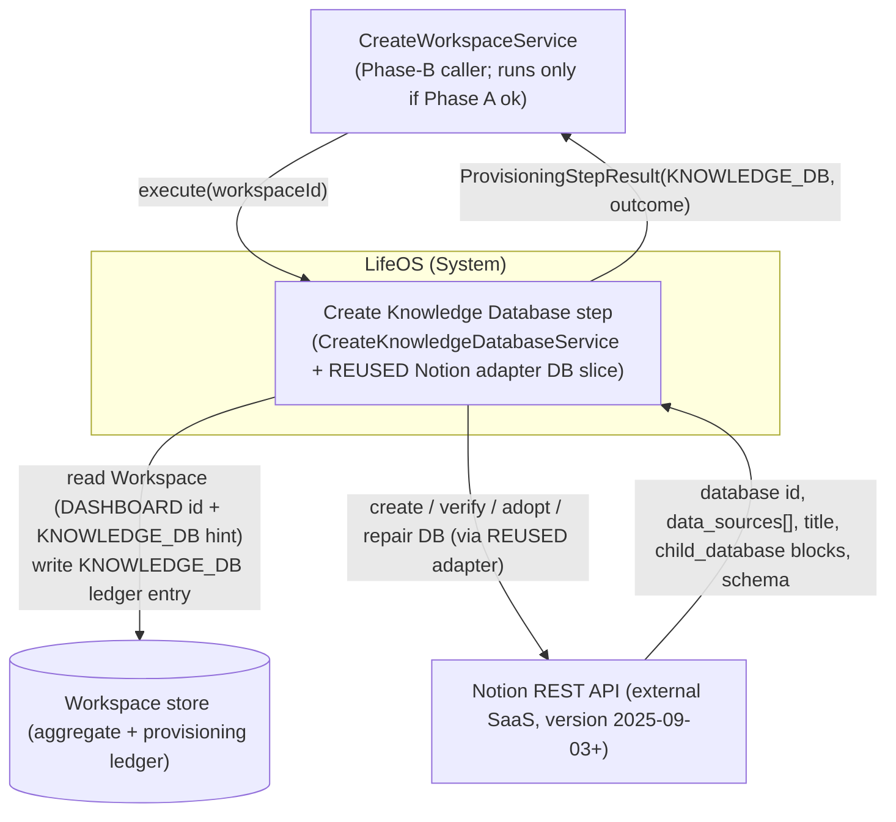
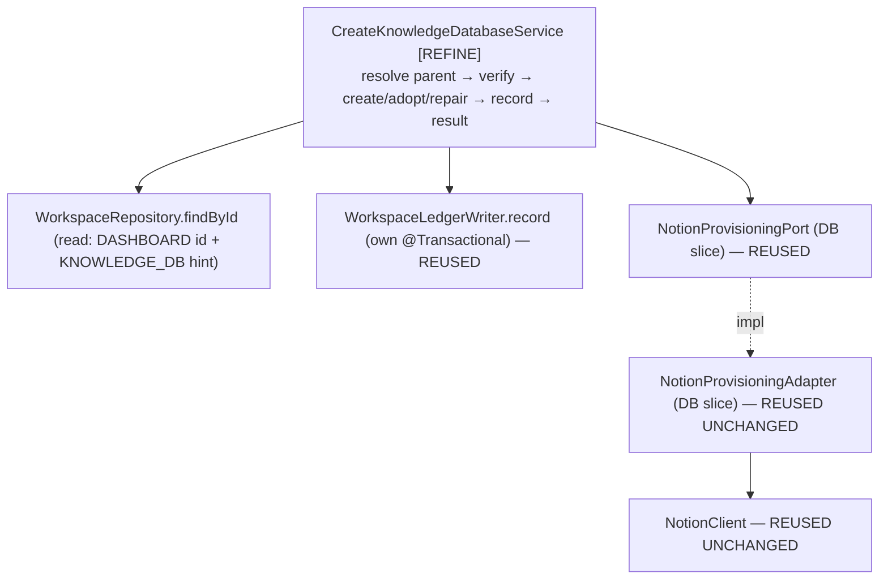
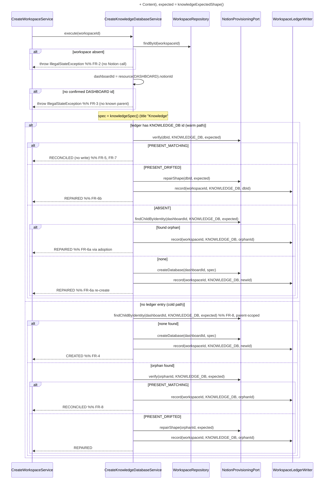

# 02 — Architecture: Create Knowledge Database (Phase B — third child database)

Status: **FINAL — no open questions (see `02-open-questions.md`), ready for SME.**

Owner (Architect stage): pipeline automation
Input: `docs/pipeline/create-knowledge-database/01-spec.md`
Grounding: the completed **Create Projects Database** design (`../create-projects-database/02-architecture.md`, `adr/ADR-0005..0008`) — which fixed this pattern — and **Create Tasks Database** (`../create-tasks-database/02-architecture.md`, `adr/ADR-0009`), the immediately preceding sibling this step mirrors most closely; their **shipped code** (`CreateTasksDatabaseService`, the generic `NotionProvisioningAdapter` DB slice, `NotionClient`, the typed `DatabaseSpec`/`ExpectedShape`/`PropertyDefinition`/`NotionPropertyType`, `WorkspaceLedgerWriter`). Existing `domain/knowledge/Knowledge.java`, `CLAUDE.md`, and the official Notion API references cited in ADR-0010.

> **Scope.** This document designs the **small delta** to provision the **Knowledge** database (ledger type `KNOWLEDGE_DB`) as a sibling of the shipped Projects and Tasks steps. It is a pattern-application pass, **not** a new design — arguably the lowest-novelty of the three, because Knowledge's schema is a strict subset of Tasks's (**Title + Content** only; no `select`, no `date`). The entire idempotent verify → create/adopt/repair → ledger machinery — the adapter DB slice, the typed schema value types, the port, the transaction boundary, the outcome table — is **reused unchanged**. The only novelty is a Knowledge-specific `DatabaseSpec`/`ExpectedShape` and the one representation decision in **ADR-0010** (Content = `rich_text` property). This is deliberately shorter than the Tasks architecture; it does not restate what ADR-0005..0009 already settled.

## Reused UNCHANGED (do NOT touch — for SME/Implementer)

Everything below is already implemented, proven by the Projects and Tasks steps, and requires **zero** modification for Knowledge. The Implementer touches exactly one class: `CreateKnowledgeDatabaseService`.

| Reused artifact | Status | Reference |
|---|---|---|
| `NotionProvisioningAdapter` DB slice — `createDatabase` / `verify` / `findChildByIdentity` / `repairShape` | Shipped, generic over `ProvisionedResourceType` + `DatabaseSpec`/`ExpectedShape` | ADR-0005, ADR-0008; Projects §5.4 |
| `NotionClient` (transport: Bearer, `Notion-Version` pin, `429`/`529` `Retry-After` clamp, token never logged) | Shipped, unchanged | Create Dashboard ADR-0001 |
| `NotionProvisioningPort` (`application.port`) — DB-slice method signatures | Shipped, unchanged | Projects §5.2 |
| `DatabaseSpec` / `ExpectedShape` / `PropertyDefinition` / `NotionPropertyType {TITLE, RICH_TEXT, SELECT, DATE}` | Shipped, typed, sufficient as-is (Knowledge uses only `TITLE` + `RICH_TEXT`) | ADR-0007 |
| `WorkspaceLedgerWriter.record(workspaceId, type, notionId)` (its own `@Transactional`) | Shipped, unchanged | Create Workspace ADR-0001 |
| `WorkspaceRepository.findById`, `Workspace.resource(type)`, `ProvisionedResource`, `ProvisioningStepResult`, `ProvisioningOutcome`, `VerificationResult` | Shipped, unchanged | — |
| `ProvisionedResourceType.KNOWLEDGE_DB` | Already defined | `domain/workspace/ProvisionedResourceType.java` l.5 |
| `domain/knowledge/Knowledge` | Complete; carries `title` + `content` — **no domain change** (like Tasks, unlike Projects/OQ-A) | spec §7 |
| `domain/knowledge/KnowledgeDiscoveryService` | Unrelated existing domain service — **not read, invoked, or modified** | spec §8 |

**No adapter change, no port change, no domain change, no value-type change.** The adapter is generic; passing it a `KNOWLEDGE_DB` type with a Knowledge `DatabaseSpec`/`ExpectedShape` is all that is required. If the Implementer finds any of the above insufficient, that is an Architect-level finding (`findings.yml`, `raised_by: spring-sme`/`spring-implementer`, `suspected_layer: architecture`) — **not** a redesign to improvise.

## Decisions reused (not re-litigated)

- **ADR-0005** — Notion data-source model (`POST /v1/databases` with `initial_data_source.properties`; ledger stores the database id, adapter dereferences to the data source). → `../create-projects-database/adr/ADR-0005-notion-database-datasource-model.md`
- **ADR-0006** — property-type mapping; verify is **name-only**. Knowledge invokes **no** `select`/`status` branch of this ADR (it has no enum field), so the one contentious part of ADR-0006 does not apply here. → `../create-projects-database/adr/ADR-0006-property-type-mapping-status-as-select.md`
- **ADR-0007** — typed `DatabaseSpec`/`ExpectedShape`/`PropertyDefinition`/`NotionPropertyType`. → `../create-projects-database/adr/ADR-0007-typed-database-schema-value-type.md`
- **ADR-0008** — database identity (parent-page child enumeration, `> 1` match ⇒ `FAILED`), name-only verify, non-destructive add-only repair. → `../create-projects-database/adr/ADR-0008-database-identity-verification-nondestructive-repair.md`
- **ADR-0009** — (Tasks) domain-enum → select-option label sourcing. **Not applicable** to Knowledge (no enum/select field) but cited for completeness. → `../create-tasks-database/adr/ADR-0009-taskstatus-select-option-labels.md`
- Inherited from Create Workspace/Dashboard: verify-before-trust idempotency; no transaction across Notion calls (the ledger write is the sole `@Transactional` unit); outcome semantics (`CREATED` only on first-time create with no prior record; `REPAIRED` ⇔ a Notion write happened, `RECONCILED` ⇔ none).

## New decision this branch makes

- **ADR-0010** — `Knowledge.content` is represented as a Notion **`rich_text` property named "Content"** (exactly like `Description` on Projects/Tasks), **not** the Notion page body. The documented 2000-char-per-`rich_text`-object limit is inert for this schema-only step (no rows written); any long-form write strategy is deferred to Phase F. → `adr/ADR-0010-content-rich-text-property-not-page-body.md`

---

## 0. Ubiquitous-language delta

| Term | Meaning in this step |
|---|---|
| **Knowledge database** | The single Notion database (ledger type `KNOWLEDGE_DB`) created as a child of the workspace's Dashboard page, holding the schema that represents the `Knowledge` aggregate (Second Brain / Zettelkasten notes). |
| **Content** | The Knowledge database's `rich_text` column backing `Knowledge.content` (ADR-0010). |

*Orphan*, *Adoption*, *Drift*, *Data source* carry the exact meanings fixed by the Projects design; not restated.

## 1. Context (C4 L1)

Identical shape to Projects/Tasks, with the ledger type `→ KNOWLEDGE_DB` and title `"Knowledge"`.



Knowledge runs **independently of** Projects and Tasks — sibling Phase-B steps, no ordering dependency (spec §2). It reads only the `DASHBOARD` id (its parent) + any `KNOWLEDGE_DB` hint, and writes exactly one `KNOWLEDGE_DB` entry (NFR-7 failure isolation).

## 2. Components (C4 L3)

Structurally identical to Projects §3 / Tasks §2; the only bean that changes is `CreateKnowledgeDatabaseService`. Note it is **even leaner than the Tasks service** — it depends on **no domain enum** (Knowledge has no `select` field), so it holds only the three collaborators below.



- **`CreateKnowledgeDatabaseService` [REFINE]** — the only new logic. A verbatim mirror of `CreateTasksDatabaseService`: same warm/cold path, same outcome mapping, `TASKS_DB → KNOWLEDGE_DB`, title `"Knowledge"`, and a `knowledgeSpec()`/`knowledgeExpectedShape()` authoring the §3 two-property schema. **No `TaskStatus`-equivalent dependency** (no enum field).
- Every other component is reused unchanged (see table above).

## 3. High-level design — the step algorithm

**Reuses the Create Tasks Database algorithm verbatim** (`../create-tasks-database/02-architecture.md` §3, itself the Projects algorithm) with `TASKS_DB → KNOWLEDGE_DB`, `dashboardId` as parent, title `"Knowledge"`. Reproduced here for the SME because the *behavior* is the deliverable:



Where `findChildByIdentity` returns **> 1** matching child database, the adapter throws (→ step `FAILED`) — FR-9, ADR-0008. Notion write precedes the ledger write; the ledger write is its own transaction; a crash between them is reconciled by the next run's FR-8 adoption (FR-12, NFR-2). The service never sees the data-source concept (ADR-0005).

### Outcome decision table

Reused **verbatim** from Projects §4.2 / Tasks (which reuse Create Dashboard ADR-0004), substituting `KNOWLEDGE_DB`. `CREATED` only on first-time create with no prior ledger record; adoption is never `CREATED`; `REPAIRED` ⇔ Notion mutated this run, `RECONCILED` ⇔ not; `> 1` identity match ⇒ `FAILED`. Not restated here.

### Error strategy & transaction boundary

Unchanged from Projects §4.3/§4.4 and Tasks. Workspace-not-found (FR-2) and missing-Dashboard (FR-3) throw `IllegalStateException` **before any Notion call**. Notion transport failures surface as the adapter's `NotionApiException` and propagate uncaught to the orchestrator's `runStep`, which maps them to `FAILED` (FR-11) — the step never fabricates a `FAILED` result. `execute` carries **no** `@Transactional`; the sole transactional unit is `WorkspaceLedgerWriter.record`. Token never appears in logs/`detail`/exceptions (NFR-6; enforced by the reused `NotionClient`).

---

## 4. Low-level design (the entire delta)

`[REFINE]` = the one class that changes. **No new port/adapter/domain/value types.** The `CreateKnowledgeDatabaseUseCase.execute(UUID)` signature is unchanged.

### 4.1 `CreateKnowledgeDatabaseService` [REFINE] — `application.usecase.knowledge`

Currently injects `NotionProvisioningPort` + `WorkspaceLedgerWriter` and throws `UnsupportedOperationException` (`CreateKnowledgeDatabaseService.java` l.20). It must:

1. **Gain a `WorkspaceRepository` read dependency** — constructor becomes 3-arg, mirroring `CreateTasksDatabaseService` (read: `DASHBOARD` id → parent; `KNOWLEDGE_DB` id → warm-path hint). Write stays in `WorkspaceLedgerWriter`.
2. **Implement the §3 algorithm** by mirroring `CreateTasksDatabaseService`'s `executeWarmPath` / `executeColdPath` **exactly**, substituting `TASKS_DB → KNOWLEDGE_DB`.
3. **Author the fixed Knowledge schema** in a `knowledgeSpec()` / `knowledgeExpectedShape()` pair — the one place novel to this step. Simpler than `tasksSpec()`: no enum stream, no `select`/`date` — just two `PropertyDefinition.of(...)` entries.

Seam-level shape (mirror of the shipped Tasks service; not full code):

```java
@Slf4j @Service @RequiredArgsConstructor
public class CreateKnowledgeDatabaseService implements CreateKnowledgeDatabaseUseCase {
    private static final String TITLE = "Knowledge";             // fixed identity marker (spec FR-4)

    private final NotionProvisioningPort notion;
    private final WorkspaceRepository workspaceRepository;        // [NEW dependency] read-only
    private final WorkspaceLedgerWriter ledger;                  // existing: sole transactional write

    @Override public ProvisioningStepResult execute(UUID workspaceId) {
        Workspace ws = workspaceRepository.findById(workspaceId)
            .orElseThrow(() -> new IllegalStateException("Workspace not found: " + workspaceId));      // FR-2
        String dashboardId = ws.resource(DASHBOARD).map(ProvisionedResource::notionId)
            .orElseThrow(() -> new IllegalStateException("No confirmed Dashboard for workspace " + workspaceId)); // FR-3
        DatabaseSpec spec       = knowledgeSpec();                // §3 schema; KNOWLEDGE_DB; title "Knowledge"
        ExpectedShape expected  = knowledgeExpectedShape();
        Optional<String> ledgerId = ws.resource(KNOWLEDGE_DB).map(ProvisionedResource::notionId);
        // warm path if ledgerId present, else cold path — identical branching to CreateTasksDatabaseService
    }

    static DatabaseSpec knowledgeSpec() {
        return new DatabaseSpec(TITLE, List.of(
            PropertyDefinition.of("Title", NotionPropertyType.TITLE),      // Knowledge.title
            PropertyDefinition.of("Content", NotionPropertyType.RICH_TEXT))); // Knowledge.content — ADR-0010
    }
    static ExpectedShape knowledgeExpectedShape() { return new ExpectedShape(TITLE, knowledgeSpec().properties()); }
}
```

- The stub `throw new UnsupportedOperationException(...)` is removed **only** as this real implementation lands (NFR-4; `CLAUDE.md` "no silent no-op"). The adapter is already real, so no adapter-cutover gating is needed.
- Outcome values used: `CREATED` / `RECONCILED` / `REPAIRED` + propagated failure (FR-11). No new `ProvisioningOutcome`.

### 4.2 Knowledge §3 schema (title + required properties)

Grounded in the complete `Knowledge` aggregate (`domain/knowledge/Knowledge.java`); every field already exists (spec §7 — **no domain change**). The leanest schema of the three databases to date.

| §3 property | Field grounding | `NotionPropertyType` | Notion config |
|---|---|---|---|
| **Title** (db title property) | `Knowledge.title` (`Knowledge.java` l.12, non-blank via `create`) | `TITLE` | `{ "type": "title", "title": {} }` |
| **Content** | `Knowledge.content` (l.13) | `RICH_TEXT` | `{ "type": "rich_text", "rich_text": {} }` — ADR-0010 |

- **Title property name is `"Title"`** (matching `Knowledge.title`), consistent with Tasks (`"Title"`); Projects used `"Name"` (matching `Project.name`). No structural difference; both are the single `TITLE`-typed property.
- **No `select`/`date`/enum property** — so **no ADR-0006 type-mapping decision and no ADR-0009 label decision apply here.** `Knowledge` has no lifecycle enum or deadline; this is the whole reason the step is the lowest-novelty of the three.
- **`verify` compares property *names* only** (ADR-0008): a user adding extra columns never triggers repair.
- **Excluded** (spec §8, FR-14): the `Knowledge.areaId → Areas` relation (deferred to Phase C — Create Relations; requires an Areas database to exist first — none is planned by any Phase-B step, per OQ-B precedent), and any rollup/formula/row. `Knowledge.workspaceId` is expressed structurally (child of the Dashboard), not as a column.

### 4.3 Package structure

```
com.lifeos
 ├─ domain.knowledge/          Knowledge, KnowledgeDiscoveryService   (UNCHANGED — no domain change)
 ├─ application
 │   ├─ port/                  NotionProvisioningPort, DatabaseSpec, ExpectedShape,
 │   │                         PropertyDefinition, NotionPropertyType   (ALL UNCHANGED — reused)
 │   └─ usecase.knowledge/     CreateKnowledgeDatabaseService  [REFINE — the only code change],
 │                             CreateKnowledgeDatabaseUseCase  (UNCHANGED)
 └─ infrastructure.adapter.notion/   NotionProvisioningAdapter, NotionClient  (UNCHANGED — reused)
```

---

## 5. Cross-cutting concerns

All inherited from the Projects/Tasks design and reused unchanged; only the Knowledge-specific notes:

- **Idempotency (NFR-1/FR-13).** Realised by §3 (identical to Tasks): live verify on every path; child-enumeration adoption before any create on both cold and ABSENT paths; upsert `record` (`Workspace.record` replaces the `KNOWLEDGE_DB` entry). Parent-scoped child enumeration is immediately consistent, so a create-then-crash converges on the next run (ADR-0008).
- **Failure isolation (NFR-7).** The step reads only `DASHBOARD` and writes only `KNOWLEDGE_DB`; no shared mutable state; a Knowledge failure leaves Projects/Tasks (and vice versa) free to run (orchestrator `phaseBOk` aggregation). It never reads or writes any other `*_DB` entry (FR-14).
- **Security / token (NFR-6).** Reuses the single process-level token via `NotionClient`; no new secret or scope. Token never logged or placed in `detail`.
- **Observability (NFR-5).** Log per run: `workspaceId`, `dashboardId`, prior `KNOWLEDGE_DB` ledger id (or "none"), the `VerificationResult`, the database id acted on, the final outcome — matching the Tasks service's `log.info` lines. No token, no raw Notion bodies.
- **Validation.** `DatabaseSpec`/`ExpectedShape`/`PropertyDefinition` validate in their (existing) compact constructors; `Knowledge` validates in its domain factory. Malformed schema fails at construction, not mid-Notion-call.
- **Testability (NFR-3).** `CreateKnowledgeDatabaseServiceTest` — plain Mockito over `NotionProvisioningPort` + `WorkspaceRepository` + `WorkspaceLedgerWriter`, one test per outcome-table row plus FR-2/FR-3 preconditions and `propagatesNotionFailureWithoutWritingLedger` (FR-12) / `neverInvokesRelationRollupFormulaOrSample` (FR-14). Assert `knowledgeSpec()` carries exactly the two §3 properties (`Title`=`TITLE`, `Content`=`RICH_TEXT`). **No new adapter tests** — the adapter is unchanged and already covered by `NotionProvisioningAdapterDatabaseTest`. Reuses ADR-0003 tiers.

---

## 6. Traceability (FR/NFR → component)

| Req | Satisfied by |
|---|---|
| FR-1 | `CreateKnowledgeDatabaseUseCase.execute(UUID)` unchanged; §4.1 |
| FR-2 | `WorkspaceRepository.findById` → `IllegalStateException` before any Notion call; §4.1 |
| FR-3 | `resource(DASHBOARD)` empty → `IllegalStateException`; §4.1 |
| FR-4 | Cold path `findChildByIdentity` empty → `createDatabase("Knowledge")` → `record(KNOWLEDGE_DB)` → `CREATED`; §3 |
| FR-5 | Warm `verify` `PRESENT_MATCHING` → `RECONCILED`, no write; §3 |
| FR-6a | Warm `ABSENT` → adopt-or-`createDatabase` → `REPAIRED`; §3 |
| FR-6b | Warm `PRESENT_DRIFTED` → `repairShape` (add-only, non-destructive) → `REPAIRED`; ADR-0008 |
| FR-7 | `verify`/`findChildByIdentity` before any `RECONCILED`; §3, ADR-0008 |
| FR-8 | Cold `findChildByIdentity` (parent-scoped) → adopt; ADR-0008 |
| FR-9 | `> 1` match → `NotionApiException` → `FAILED`; ADR-0008 |
| FR-10 | `WorkspaceLedgerWriter.record(workspaceId, KNOWLEDGE_DB, id)` — own tx (reused) |
| FR-11 | Returns `ProvisioningStepResult(KNOWLEDGE_DB, …)`; failures propagate; §3 error strategy |
| FR-12 | Notion-before-ledger + own-tx write + next-run adoption; test `propagatesNotionFailureWithoutWritingLedger` |
| FR-13 | Adoption-before-create on cold & ABSENT paths; upsert `record`; index-consistent enumeration |
| FR-14 | Only the four DB methods invoked; relation/rollup/formula/sample untouched; schema has no relation property; §4.2 |
| §3 schema + domain backing | `knowledgeSpec()`/`knowledgeExpectedShape()` (§4.1/§4.2); `Knowledge` unchanged (spec §7); Content = `rich_text` per **ADR-0010** |
| NFR-1 | Strict per-path live verification; §3 (inherited ADR-0008) |
| NFR-2 | Notion-before-ledger + no rollback; next-run reconcile; §3 |
| NFR-3 | Mockito service tests; adapter reused/already covered; §5 |
| NFR-4 | Stub `UnsupportedOperationException` removed only as the real impl lands; §4.1 |
| NFR-5 | Structured per-run logging; §5 |
| NFR-6 | Token in `NotionClient` header only, never logged; §5 (reused) |
| NFR-7 | No shared mutable state; only `KNOWLEDGE_DB` written; §5 |
| NFR-8 | Upsert `record` → exactly one `KNOWLEDGE_DB` entry (`Workspace.record` semantics) |
| NFR-9 | Bounded call count per run (reused adapter; Projects §5.4) |
| NFR-10 | `429`/`529` `Retry-After` clamp in reused `NotionClient` |

---

## 7. Definition-of-done status

Every FR/NFR is traceable (§6). The step reuses ADR-0005..0009 unchanged (by reference, not duplication) and makes exactly **one** new decision, recorded as **ADR-0010** (Content = `rich_text` property, not page body). No domain change is required (spec §7). No open questions remain (`02-open-questions.md`). Ready for the SME.

## 8. Findings for the SME

1. **`CreateKnowledgeDatabaseService` gains a `WorkspaceRepository` read dependency** — constructor becomes 3-arg, mirroring `CreateTasksDatabaseService`. Read: `DASHBOARD` id (parent) + `KNOWLEDGE_DB` hint; write stays in `WorkspaceLedgerWriter`.
2. **Implement the §3 algorithm as a verbatim mirror of `CreateTasksDatabaseService`** (`executeWarmPath`/`executeColdPath`), substituting `TASKS_DB → KNOWLEDGE_DB` and using `knowledgeSpec()`/`knowledgeExpectedShape()` with title constant `"Knowledge"`.
3. **Author `knowledgeSpec()`** with the §4.2 schema: two `PropertyDefinition.of(...)` entries — `Title`=`TITLE`, `Content`=`RICH_TEXT` (**ADR-0010**). **No enum stream, no `select`/`date`** (simpler than `tasksSpec()`). Title property named `"Title"` (matches `Knowledge.title`).
4. **Remove the stub `UnsupportedOperationException`** only as the real implementation lands (NFR-4). No adapter cutover to coordinate — the adapter DB slice is already real.
5. **No changes to** the port, the typed schema value types, the adapter, `NotionClient`, `domain/knowledge/` (including the unrelated `KnowledgeDiscoveryService`). If any is found insufficient, raise an Architect-level finding (`findings.yml`, `raised_by: spring-sme`, `suspected_layer: architecture`) — do not redesign silently.
6. **Tests:** `CreateKnowledgeDatabaseServiceTest` (Mockito, one per outcome-table row + FR-2/FR-3 + FR-12 + FR-14), asserting `knowledgeSpec()` carries exactly the two §3 properties. No new adapter tests (unchanged, already covered).
</content>
