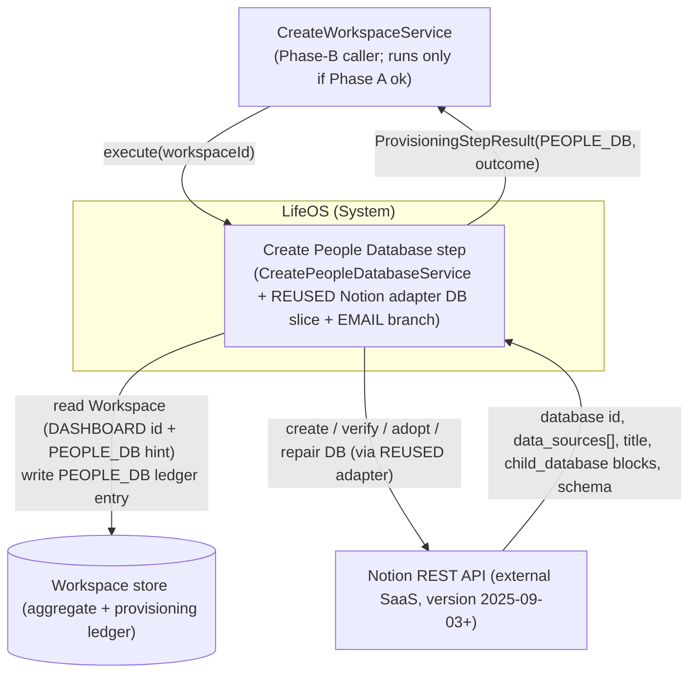
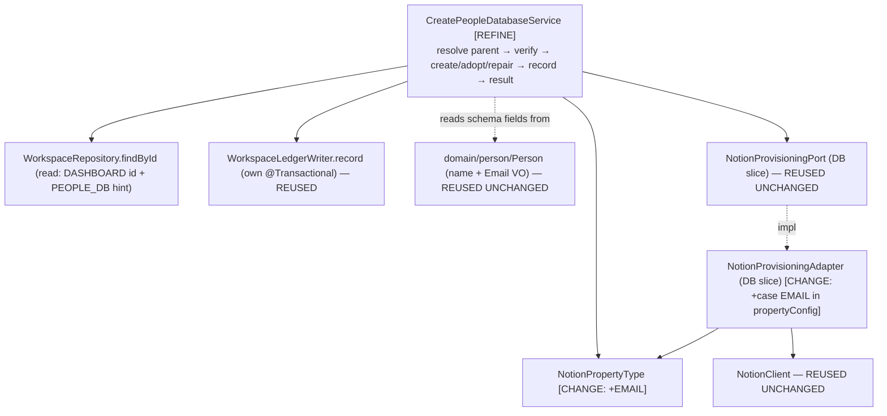

# 02 — Architecture: Create People Database (Phase B — child database, with a bounded port+adapter extension)

Status: **FINAL — no open questions (see `02-open-questions.md`), ready for SME.**

Owner (Architect stage): pipeline automation
Input: `docs/pipeline/create-people-database/01-spec.md`
Grounding: the shipped **Create Resources Database** design (`../create-resources-database/02-architecture.md`, `adr/ADR-0013`) — the immediately-preceding sibling that added a first-class Notion property type, which this step mirrors exactly for `email` — and the **Create Tasks / Projects** designs it inherits from (`../create-tasks-database/adr/ADR-0009`, `../create-projects-database/adr/ADR-0005..0008`). Plus the **shipped code**: `CreateResourcesDatabaseService` as the closest reference service, the `NotionProvisioningAdapter` DB slice (its `propertyConfig` switch now carrying TITLE/RICH_TEXT/SELECT/DATE/URL), `NotionClient`, the typed `DatabaseSpec`/`ExpectedShape`/`PropertyDefinition`/`NotionPropertyType`, `WorkspaceLedgerWriter`. Existing `domain/person/{Person,Email}.java`, `CLAUDE.md`.

> **Scope.** This document designs the **small delta** to provision the **People** database (ledger type `PEOPLE_DB`) as a sibling of the already-shipped Projects/Tasks/Knowledge/Habits/Journal/Resources steps, mirroring `CreateResourcesDatabaseService`. This is the **seventh and final** Phase-B child database (spec §1); once it lands, all seven database steps referenced by `CreateWorkspaceService` are implemented. The whole idempotent verify → create/adopt/repair → ledger machinery (adapter DB slice, typed schema value types, port method signatures, transaction boundary, outcome table) is **reused unchanged**. Like the Resources pass, this step carries **one bounded, in-scope port+adapter extension**: a new `NotionPropertyType.EMAIL` member and the matching `case EMAIL` branch in the adapter's `propertyConfig`, so the People schema can declare a first-class Notion `email` column for `Person.email`. This is the same shape of extension previously done for `URL` (ADR-0013) and `DATE`; it is recorded in **ADR-0014**. This document does not restate what ADR-0005..0009/0013 already settled.

## Reused UNCHANGED (do NOT touch — for SME/Implementer)

Everything below is already implemented, proven by the Projects/Tasks/Resources steps, and requires **zero** modification for People:

| Reused artifact | Status | Reference |
|---|---|---|
| **Identity/verify/repair algorithm** — parent-page child enumeration, name-only `verify`, non-destructive add-only `repairShape`, `> 1` match ⇒ `FAILED` | Shipped, unchanged | ADR-0008 |
| `NotionProvisioningAdapter` DB slice control flow — `createDatabase` / `verify` / `findChildByIdentity` / `repairShape` | Shipped, generic over `ProvisionedResourceType` + `DatabaseSpec`/`ExpectedShape` | ADR-0005, ADR-0008; `NotionProvisioningAdapter.java` l.124–209 |
| `NotionClient` (transport: Bearer, `Notion-Version` pin `2025-09-03`, `429`/`529` `Retry-After` clamp, token never logged) | Shipped, unchanged | Create Dashboard ADR-0001 |
| `NotionProvisioningPort` (application.port) — DB-slice method signatures | Shipped, unchanged | Projects §5.2 |
| `DatabaseSpec` / `ExpectedShape` / `PropertyDefinition` record types (their compact-constructor invariants) | Shipped, typed, sufficient as-is — **no invariant weakened** by adding an EMAIL member (ADR-0014 §Consequences) | ADR-0007 |
| `WorkspaceLedgerWriter.record(workspaceId, type, notionId)` (its own `@Transactional`) | Shipped, unchanged | Create Workspace ADR-0001 |
| `WorkspaceRepository.findById`, `Workspace.resource(type)`, `ProvisioningStepResult`, `ProvisioningOutcome`, `VerificationResult` | Shipped, unchanged | — |
| `ProvisionedResourceType.PEOPLE_DB` | Already defined | `domain/workspace/ProvisionedResourceType.java` l.5 |
| `domain/person/Person` (`name` + `Email` VO already present) | Complete; **no domain change** | spec §7; `Person.java` l.13–14, `Email.java` |
| The `TITLE` / `RICH_TEXT` / `SELECT` / `DATE` / `URL` branches of `propertyConfig` and every existing caller (Projects/Tasks/Knowledge/Habits/Journal/Resources) | Shipped, unchanged — additive-only enum growth (NFR-5) | `NotionProvisioningAdapter.java` l.262–271 |

## CHANGED this branch (the entire delta — for SME/Implementer)

Exactly three artifacts change; nothing else. The change set is deliberately narrow and identical in shape to the Resources (`URL`) pass.

| Changed artifact | Change | Grounding |
|---|---|---|
| `application/port/NotionPropertyType` | Add an `EMAIL` member: `{TITLE, RICH_TEXT, SELECT, DATE, URL, EMAIL}` | spec FR-4; **ADR-0014** |
| `infrastructure/adapter/notion/NotionProvisioningAdapter.propertyConfig` | Add `case EMAIL -> Map.of("type", "email", "email", Map.of())` to the `switch` (emits `{"type":"email","email":{}}`) — applies on both `createDatabase` (l.126–137) and `repairShape` add-missing (l.199–208) because both call the same `propertyConfig` helper | spec FR-5, AC-13; **ADR-0014** |
| `application/usecase/person/CreatePeopleDatabaseService` | Replace the stub `UnsupportedOperationException` (l.20) with the real §4 algorithm (verbatim mirror of `CreateResourcesDatabaseService`), and author `peopleSpec()`/`peopleExpectedShape()` (title `"People"`; `Name`←`Person.name`, `Email`←`Person.email`) | spec FR-1..FR-13; §5 below |

**The adapter switch is exhaustive over the enum**, so adding `EMAIL` forces the new `case` at compile time — the Implementer cannot forget the branch (a `switch` over an enum with no `default` fails to compile if a constant is unhandled — *JLS §14.11.2*). No new port method, no new value type, no domain change.

## Decisions reused (not re-litigated)

- **ADR-0005** — Notion data-source model (`POST /v1/databases` with `initial_data_source.properties`; ledger stores the database id, adapter dereferences to the data source). → `../create-projects-database/adr/ADR-0005-notion-database-datasource-model.md`
- **ADR-0007** — typed `DatabaseSpec`/`ExpectedShape`/`PropertyDefinition`/`NotionPropertyType`. → `../create-projects-database/adr/ADR-0007-typed-database-schema-value-type.md`
- **ADR-0008** — database identity (parent-page child enumeration, `> 1` match ⇒ `FAILED`), **name-only verify**, non-destructive add-only repair. → `../create-projects-database/adr/ADR-0008-database-identity-verification-nondestructive-repair.md`
- **ADR-0013** — the `url` first-class property-type extension (`NotionPropertyType.URL` + adapter `case URL`); ADR-0014 is the identical move for `email`. → `../create-resources-database/adr/ADR-0013-url-property-type.md`
- Inherited from Create Workspace/Dashboard: verify-before-trust idempotency; no transaction across Notion calls (ledger write is the sole `@Transactional` unit); outcome semantics (`CREATED` only on first-time create with no prior record; `REPAIRED` ⇔ a Notion write happened, `RECONCILED` ⇔ none).

## New decision this branch makes

- **ADR-0014** — `Person.email` → Notion **`email`** property type (config `{"type":"email","email":{}}`), rejecting `rich_text`. Adds `NotionPropertyType.EMAIL` + the adapter `case EMAIL`. Follows the `URL`/`DATE` precedent for introducing a first-class primitive Notion type rather than approximating it with `rich_text`/`select` (ADR-0013; ADR-0006/ADR-0012). → `adr/ADR-0014-email-property-type.md`

---

## 0. Ubiquitous-language delta

| Term | Meaning in this step |
|---|---|
| **People database** | The single Notion database (ledger type `PEOPLE_DB`) created as a child of the workspace's Dashboard page, holding the two-property schema that represents the `Person` aggregate. |
| **Email property** | The Notion `email`-typed column named `"Email"`, sourced from `Person.email` (nullable `Email` VO). A first-class Notion property type distinct from `rich_text` (ADR-0014). |

*Orphan*, *Adoption*, *Drift*, *Data source* carry the exact meanings fixed by the Projects design; not restated.

## 1. Context (C4 L1)

Identical shape to Resources, with `RESOURCES_DB` → `PEOPLE_DB`.



People runs **independently of** the other Phase-B database steps — no ordering dependency (spec §2, FR-12). It reads only the `DASHBOARD` id (its parent) + any `PEOPLE_DB` hint, and writes exactly one `PEOPLE_DB` entry (failure isolation, NFR-1). As the seventh step it contributes the final input to `phaseBOk` (spec AC-14).

## 2. Containers (C4 L2)

Unchanged from every prior Phase-B step: a single Spring Boot application (`com.lifeos`) with the domain/application/infrastructure layers; the Notion REST API as the sole external system; the workspace store (aggregate + provisioning ledger). This step introduces **no new container, datastore, or external dependency** — the `email` property is carried on the same Notion API and the same `NotionClient` transport. Not restated further.

## 3. Components (C4 L3)

Structurally identical to Resources §3; the beans that change are `CreatePeopleDatabaseService` (real algorithm + People schema), the reused `NotionProvisioningAdapter` (one new `case`), and the `NotionPropertyType` port enum (one new member).



- **`CreatePeopleDatabaseService` [REFINE]** — the primary new logic. A verbatim mirror of `CreateResourcesDatabaseService`: same warm/cold path, same outcome mapping, `RESOURCES_DB` → `PEOPLE_DB`, title `"People"`, and a `peopleSpec()`/`peopleExpectedShape()` that authors the §5.4 two-property schema. **Gains a `WorkspaceRepository` read dependency** — the current stub injects only `NotionProvisioningPort` + `WorkspaceLedgerWriter` (`CreatePeopleDatabaseService.java` l.15–16); the constructor becomes 3-arg, mirroring the shipped Resources/Tasks service.
- **`NotionPropertyType` [CHANGE]** — gains `EMAIL` (additive; existing members unmoved).
- **`NotionProvisioningAdapter.propertyConfig` [CHANGE]** — gains `case EMAIL` emitting `{"type":"email","email":{}}`; every other adapter method and branch is untouched.
- Every other component is reused unchanged (see tables above).

## 4. High-level design — the step algorithm

**Reuses the Create Resources Database algorithm verbatim** (`../create-resources-database/02-architecture.md` §4, itself the Tasks/Projects algorithm) with `RESOURCES_DB → PEOPLE_DB`, `dashboardId` as parent, title `"People"`. The `EMAIL` property does **not** alter control flow — it is data inside `spec`/`expected`, consumed only by the reused adapter. Reproduced here for the SME because the *behavior* is the deliverable:

```mermaid
sequenceDiagram
    participant Orc as CreateWorkspaceService
    participant Svc as CreatePeopleDatabaseService
    participant Repo as WorkspaceRepository
    participant Notion as NotionProvisioningPort
    participant Writer as WorkspaceLedgerWriter

    Orc->>Svc: execute(workspaceId)
    Svc->>Repo: findById(workspaceId)
    alt workspace absent
        Svc-->>Orc: throw IllegalStateException   %% FR-10 (no Notion call)
    end
    Svc->>Svc: dashboardId = resource(DASHBOARD).notionId
    alt no confirmed DASHBOARD id
        Svc-->>Orc: throw IllegalStateException   %% FR-9 (no known parent)
    end
    Note over Svc: spec = peopleSpec() (title "People"; Name + Email), expected = peopleExpectedShape()

    alt ledger has PEOPLE_DB id (warm path)
        Svc->>Notion: verify(dbId, PEOPLE_DB, expected)
        alt PRESENT_MATCHING
            Svc-->>Orc: RECONCILED (no write)        %% FR-7
        else PRESENT_DRIFTED
            Svc->>Notion: repairShape(dbId, expected)  %% add-missing Email/Name via email/title config
            Svc->>Writer: record(workspaceId, PEOPLE_DB, dbId)
            Svc-->>Orc: REPAIRED                       %% FR-7
        else ABSENT
            Svc->>Notion: findChildByIdentity(dashboardId, PEOPLE_DB, expected)
            alt found orphan
                Svc->>Writer: record(workspaceId, PEOPLE_DB, orphanId)
                Svc-->>Orc: REPAIRED                   %% FR-6/FR-7 via adoption
            else none
                Svc->>Notion: createDatabase(dashboardId, spec)
                Svc->>Writer: record(workspaceId, PEOPLE_DB, newId)
                Svc-->>Orc: REPAIRED                   %% FR-7 re-create
            end
        end
    else no ledger entry (cold path)
        Svc->>Notion: findChildByIdentity(dashboardId, PEOPLE_DB, expected)  %% FR-6, parent-scoped
        alt none found
            Svc->>Notion: createDatabase(dashboardId, spec)
            Svc->>Writer: record(workspaceId, PEOPLE_DB, newId)
            Svc-->>Orc: CREATED                        %% FR-1
        else orphan found
            Svc->>Notion: verify(orphanId, PEOPLE_DB, expected)
            alt PRESENT_MATCHING
                Svc->>Writer: record(workspaceId, PEOPLE_DB, orphanId)
                Svc-->>Orc: RECONCILED                 %% FR-6
            else PRESENT_DRIFTED
                Svc->>Notion: repairShape(orphanId, expected)
                Svc->>Writer: record(workspaceId, PEOPLE_DB, orphanId)
                Svc-->>Orc: REPAIRED
            end
        end
    end
```

Where `findChildByIdentity` returns **> 1** matching child database, the adapter throws (→ step `FAILED`) — FR-11, ADR-0008. Notion write precedes the ledger write; the ledger write is its own transaction; a crash between them is reconciled by the next run's cold-path adoption (NFR-1). The service never sees the data-source concept (ADR-0005).

### Outcome decision table

Reused **verbatim** from Resources §4 / Tasks §3 / Projects §4.2 (which reuses Create Dashboard ADR-0004), substituting `PEOPLE_DB`. `CREATED` only on first-time create with no prior ledger record; adoption is never `CREATED`; `REPAIRED` ⇔ Notion mutated this run, `RECONCILED` ⇔ not; `> 1` identity match ⇒ `FAILED`. Not restated here.

### Error strategy & transaction boundary

Unchanged from Resources §4. Workspace-not-found (FR-10) and missing-Dashboard (FR-9) throw `IllegalStateException` **before any Notion call**. Notion transport failures surface as the adapter's `NotionApiException` and propagate uncaught to the orchestrator's `runStep`, which maps them to `FAILED` (FR-13) — the step never fabricates a `FAILED` result, and `detail` never carries the token (NFR-2, AC-12). `execute` carries **no** `@Transactional`; the sole transactional unit is `WorkspaceLedgerWriter.record`. When the Dashboard step failed/was blocked, `CreateWorkspaceService.runOrBlock` records `BLOCKED` and does not invoke this step (spec AC-11) — no change to that wiring is in scope (FR-12).

---

## 5. Low-level design (the entire delta)

`[REFINE]` / `[CHANGE]` mark the three touched artifacts. **No new port method, no new value type, no domain change.** The `CreatePeopleDatabaseUseCase.execute(UUID)` signature is unchanged and already wired into `CreateWorkspaceService` (spec FR-12).

### 5.1 `NotionPropertyType` [CHANGE] — `application.port`

```java
public enum NotionPropertyType { TITLE, RICH_TEXT, SELECT, DATE, URL, EMAIL }   // + EMAIL (additive)
```

- Additive-only: existing constants keep their identity and ordinal-agnostic usage; every existing caller compiles and behaves unchanged (NFR-5). `PropertyDefinition`'s invariant "`options` are only valid for `SELECT`" is untouched — an `EMAIL` property carries no options (spec FR-4; ADR-0014 §Consequences).

### 5.2 `NotionProvisioningAdapter.propertyConfig` [CHANGE] — `infrastructure.adapter.notion`

Add one branch to the existing exhaustive `switch` (l.262–271):

```java
case EMAIL -> Map.of("type", "email", "email", Map.of());   // {"type":"email","email":{}}  — ADR-0014, AC-13
```

- Emits exactly `{"type":"email","email":{}}` — no `options`, no extra keys (spec AC-13). Grounded in the Notion **Property object** reference: an `email` property's configuration is the empty object `"email": {}` and `email` is a distinct type from `rich_text` (ADR-0014 citations — [Property object](https://developers.notion.com/reference/property-object)).
- **One helper, two call sites.** `propertyConfig` is called by both `createDatabase` (l.129) and `repairShape`'s add-missing loop (l.202), so the same `email` config is emitted on **creation** and on **add-missing repair** with no second edit (spec FR-5).
- The `switch` has no `default`; adding the enum constant without this branch is a **compile error** (*JLS §14.11.2*), so the branch cannot be silently omitted.

### 5.3 `CreatePeopleDatabaseService` [REFINE] — `application.usecase.person`

Currently injects `NotionProvisioningPort` + `WorkspaceLedgerWriter` and throws `UnsupportedOperationException` (`CreatePeopleDatabaseService.java` l.15–22). It must:

1. **Gain a `WorkspaceRepository` read dependency** — constructor becomes 3-arg, mirroring `CreateResourcesDatabaseService` (read: `DASHBOARD` id → parent; `PEOPLE_DB` id → warm-path hint). Write stays in `WorkspaceLedgerWriter`.
2. **Implement the §4 algorithm** by mirroring `CreateResourcesDatabaseService`'s `executeWarmPath` / `executeColdPath` exactly, with `RESOURCES_DB → PEOPLE_DB` and title constant `"People"`.
3. **Author the fixed People schema** in a `peopleSpec()` / `peopleExpectedShape()` pair — the one place novel to this step. Two properties only; **no `select`, no `date`, no `url`, no relation** (spec FR-3, §8).

Seam-level shape (mirror of the shipped Resources service; not full code):

```java
@Slf4j @Service @RequiredArgsConstructor
public class CreatePeopleDatabaseService implements CreatePeopleDatabaseUseCase {
    private static final String TITLE = "People";               // fixed identity marker (spec FR-1)

    private final NotionProvisioningPort notion;
    private final WorkspaceRepository workspaceRepository;       // [NEW dependency] read-only
    private final WorkspaceLedgerWriter ledger;                 // existing: sole transactional write

    @Override public ProvisioningStepResult execute(UUID workspaceId) {
        Workspace ws = workspaceRepository.findById(workspaceId)
            .orElseThrow(() -> new IllegalStateException("Workspace not found: " + workspaceId));       // FR-10
        String dashboardId = ws.resource(DASHBOARD).map(ProvisionedResource::notionId)
            .orElseThrow(() -> new IllegalStateException("No confirmed Dashboard for workspace " + workspaceId)); // FR-9
        DatabaseSpec spec      = peopleSpec();                   // §5.4 schema; PEOPLE_DB; title "People"
        ExpectedShape expected = peopleExpectedShape();
        Optional<String> ledgerId = ws.resource(PEOPLE_DB).map(ProvisionedResource::notionId);
        // warm path if ledgerId present, else cold path — identical branching to CreateResourcesDatabaseService
    }

    static DatabaseSpec peopleSpec() {
        return new DatabaseSpec(TITLE, List.of(
            PropertyDefinition.of("Name",  NotionPropertyType.TITLE),   // ← Person.name
            PropertyDefinition.of("Email", NotionPropertyType.EMAIL))); // ← Person.email  (ADR-0014)
    }
    static ExpectedShape peopleExpectedShape() { return new ExpectedShape(TITLE, peopleSpec().properties()); }
}
```

- Both properties use the no-options `PropertyDefinition.of(name, type)` factory — neither is a `SELECT`, so there is no enum-seeding step (unlike Tasks' `Status`); ADR-0009's label concern does not arise for People.
- The stub `throw new UnsupportedOperationException(...)` is removed **only** as this real implementation lands (NFR-4; `CLAUDE.md` "no silent no-op"). The adapter is already real (with the §5.2 `EMAIL` branch), so no adapter-cutover gating is needed.
- Outcome values used: `CREATED` / `RECONCILED` / `REPAIRED` + propagated failure (FR-13). No new `ProvisioningOutcome` (NFR-4).

### 5.4 People §3 schema (title + required properties)

Grounded in the existing `Person` aggregate (`domain/person/Person.java`); every field already exists (spec §7 — **no domain change**).

| §3 property | Field grounding | `NotionPropertyType` | Notion config |
|---|---|---|---|
| **Name** (db title property) | `Person.name` (`Person.java` l.13, non-blank via `create` l.17–19) | `TITLE` | `{ "type": "title", "title": {} }` |
| **Email** | `Person.email` (`Person.java` l.14, an `Email` VO, **nullable**) | `EMAIL` **[new type]** | `{ "type": "email", "email": {} }` — ADR-0014 |

- **Title property name is `"Name"`** (matching `Person.name`). It is the single `TITLE`-typed property satisfying `DatabaseSpec`'s "exactly one TITLE" invariant.
- **Schema/row-validation boundary (spec NFR-7).** This step creates the `email`-typed Notion **column** only. The `Email` value object's regex validation (`Email.java` l.7,14) is a **future row-write concern** governing `Person` record writes into this database — it is **not** exercised by, and not in scope for, the schema-provisioning step. The column type is honest to the domain (the domain already models `email` as a dedicated VO), which is precisely why `email` (not `rich_text`) is the correct Notion type (ADR-0014).
- **`verify` compares property *names* only** (ADR-0008): the `Email` column is verified by **existence of the name `"Email"`**, not by its Notion type. A user who out-of-band retypes the `Email` column to `rich_text` (or vice versa) is **not** detected as drift and is **not** repaired. This is an **accepted consequence**, identical to how Resources/Projects/Tasks accept that a retyped `URL`/`Status`/`Due Date` column is not healed (ADR-0008 §Consequences; ADR-0013/ADR-0014 §Consequences). Creation and add-missing repair both emit the correct `email` config, so the type is only ever *established*, never *reconciled*.
- **Excluded** (spec §8): any relation/rollup/formula — `Person` has **no relation field** to another aggregate today, so unlike Resources (which defers a `knowledgeId → Knowledge` link) there is not even a deferred relation here. No row/sample data. `Person` has no `workspaceId`; parentage is expressed structurally (child of the Dashboard), not as a column — the service uses the `workspaceId` parameter like every sibling.

### 5.5 Package structure

```
com.lifeos
 ├─ domain.person/              Person, Email                    (UNCHANGED — name + Email VO already present)
 ├─ application
 │   ├─ port/                   NotionProvisioningPort, DatabaseSpec, ExpectedShape,
 │   │                          PropertyDefinition                (UNCHANGED — reused)
 │   │                          NotionPropertyType                [CHANGE — +EMAIL]
 │   └─ usecase.person/         CreatePeopleDatabaseService       [REFINE — real impl + People schema],
 │                              CreatePeopleDatabaseUseCase       (UNCHANGED)
 └─ infrastructure.adapter.notion/  NotionProvisioningAdapter     [CHANGE — +case EMAIL in propertyConfig],
                                    NotionClient                  (UNCHANGED — reused)
```

---

## 6. Cross-cutting concerns

All inherited from the Projects/Tasks/Resources design and reused unchanged; only the People-specific notes:

- **Idempotency (NFR-1).** Realised by §4 (identical to Resources): live verify on every path; child-enumeration adoption before any create on both cold and ABSENT paths; upsert `record` (`Workspace.record` replaces the `PEOPLE_DB` entry). Parent-scoped child enumeration is immediately consistent, so a create-then-crash converges on the next run (ADR-0008). Re-runs converge on `RECONCILED` with no writes (AC-10).
- **Persistence / fetch.** No JPA change; the step reads one `Workspace` aggregate (`WorkspaceRepository.findById`) and writes one ledger entry via the reused `WorkspaceLedgerWriter`. The `PEOPLE_DB` slot in `ProvisionedResourceType` already exists (l.5).
- **Security / token (NFR-2, AC-12).** Reuses the single process-level token via `NotionClient`; no new secret or scope. Token never logged or placed in `detail`; `NotionApiException` messages reference only ids/counts (adapter l.118–119, 179–180).
- **Observability.** Log per run: `workspaceId`, `dashboardId`, prior `PEOPLE_DB` ledger id (or "none"), the `VerificationResult`, the database id acted on, the final outcome — matching the Resources service's `log.info` lines (l.54–55, 62, 85). No token, no raw Notion bodies.
- **Validation.** `DatabaseSpec`/`ExpectedShape`/`PropertyDefinition` validate in their (existing) compact constructors; an `EMAIL` `PropertyDefinition` carries no options, satisfying the "options only for SELECT" invariant. Malformed schema fails at construction, not mid-Notion-call. (Row-level `Email` validation is out of scope — §5.4, NFR-7.)
- **Testability (NFR-6).** `CreatePeopleDatabaseServiceTest` — plain Mockito over `NotionProvisioningPort` + `WorkspaceRepository` + `WorkspaceLedgerWriter`, one test per outcome-table row plus FR-9/FR-10 preconditions and a failure-propagation test (FR-13). Assert `peopleSpec()` carries exactly the two §5.4 properties (`Name`:TITLE, `Email`:EMAIL). **New adapter contract test** required for the `EMAIL` branch (spec AC-13, NFR-6): assert `propertyConfig(EMAIL)` (directly or via a captured `createDatabase`/`repairShape` call against a stub HTTP layer) emits exactly `{"type":"email","email":{}}` — no `options`, no extra keys. This is the one place a new adapter test is added versus a pure pattern-mirror pass, because the adapter itself changed.

---

## 7. Traceability (FR/NFR → component)

| Req | Satisfied by |
|---|---|
| FR-1 | Cold path `findChildByIdentity` empty → `createDatabase("People")` → `record(PEOPLE_DB)` → `CREATED`; §4, §5.3 |
| FR-2 | `peopleSpec()` `Name` (TITLE ← `Person.name`); §5.4 |
| FR-3 | `peopleSpec()` `Email` (EMAIL ← `Person.email`); no select/date/url/rich_text; §5.4, ADR-0014 |
| FR-4 | `NotionPropertyType` gains `EMAIL`; §5.1, ADR-0014 |
| FR-5 | `propertyConfig` `case EMAIL` → `{"type":"email","email":{}}` on create + add-missing repair; §5.2, ADR-0014 |
| FR-6 | Cold `findChildByIdentity` (parent-scoped) → adopt (`RECONCILED`/`REPAIRED`); §4, ADR-0008 |
| FR-7 | Warm `verify`: `PRESENT_MATCHING`→`RECONCILED`, `PRESENT_DRIFTED`→`repairShape`→`REPAIRED`, `ABSENT`→adopt/recreate→`REPAIRED`; §4 |
| FR-8 | `WorkspaceLedgerWriter.record(workspaceId, PEOPLE_DB, id)` on every create/adopt/repair — own tx (reused); §4 |
| FR-9 | `resource(DASHBOARD)` empty → `IllegalStateException` before any Notion call; §5.3 |
| FR-10 | `WorkspaceRepository.findById` empty → `IllegalStateException` before any Notion call; §5.3 |
| FR-11 | `> 1` "People" child → `NotionApiException` → orchestrator `FAILED`; ADR-0008 |
| FR-12 | `CreatePeopleDatabaseUseCase.execute(UUID)` unchanged; already wired in `CreateWorkspaceService` l.60; §5 |
| FR-13 | Unexpected exceptions propagate to `runStep` → `FAILED` with detail; no silent success; §4 error strategy |
| §3 schema + domain backing | `peopleSpec()`/`peopleExpectedShape()` (§5.3/§5.4); `Person`/`Email` unchanged (spec §7); ADR-0014 |
| NFR-1 | Strict per-path live verification + adoption-before-create + upsert `record`; §4, §6 (inherited ADR-0008) |
| NFR-2 | Token in `NotionClient` header only, never logged/in `detail`; §6 (reused) |
| NFR-3 | `repairShape` add-only, non-destructive (never removes/renames); ADR-0008 |
| NFR-4 | Only existing `ProvisioningOutcome` values; stub `UnsupportedOperationException` removed only as real impl lands; §5.3 |
| NFR-5 | `EMAIL` added additively; TITLE/RICH_TEXT/SELECT/DATE/URL branches + all existing callers unchanged; §5.1/§5.2 |
| NFR-6 | Mockito service tests + adapter contract test for the `EMAIL` JSON shape (AC-13); §6 |
| NFR-7 | Schema-only step; `Email` VO regex validation is a future row-write concern, out of scope; §5.4, ADR-0014 §Consequences |

---

## 8. Definition-of-done status

Every FR/NFR is traceable (§7). The step reuses ADR-0005..0009 and ADR-0013 unchanged (by reference, not duplication) and makes exactly **one** new decision, recorded as **ADR-0014** (the `email` property type + the bounded port/adapter extension — the identical shape to ADR-0013's `url`). No domain change is required (spec §7). No open questions remain (`02-open-questions.md` — the `email`-vs-`rich_text` choice is resolved in ADR-0014, following the `URL`/`DATE` precedent). This is the seventh and final Phase-B database step; with it, `phaseBOk` can evaluate true end-to-end (spec AC-14). Ready for the SME.

## 9. Findings for the SME

1. **`CreatePeopleDatabaseService` gains a `WorkspaceRepository` read dependency** — constructor becomes 3-arg, mirroring `CreateResourcesDatabaseService`. Read: `DASHBOARD` id (parent) + `PEOPLE_DB` hint; write stays in `WorkspaceLedgerWriter`.
2. **Implement the §4 algorithm as a verbatim mirror of `CreateResourcesDatabaseService`** (`executeWarmPath`/`executeColdPath`), substituting `RESOURCES_DB → PEOPLE_DB` and title constant `"People"`, using `peopleSpec()`/`peopleExpectedShape()`.
3. **Author `peopleSpec()`** with exactly two properties: `PropertyDefinition.of("Name", TITLE)` (← `Person.name`) and `PropertyDefinition.of("Email", EMAIL)` (← `Person.email`). No `SELECT`, no `DATE`, no `URL`, no relation (spec FR-3, §8).
4. **Add `NotionPropertyType.EMAIL`** (`{TITLE, RICH_TEXT, SELECT, DATE, URL, EMAIL}`) — additive; do not reorder existing constants (ADR-0014, spec NFR-5).
5. **Add `case EMAIL -> Map.of("type", "email", "email", Map.of())`** to `NotionProvisioningAdapter.propertyConfig`. It is picked up by both `createDatabase` and `repairShape` automatically (one helper). Do not touch the TITLE/RICH_TEXT/SELECT/DATE/URL branches (ADR-0014, spec FR-5).
6. **Remove the stub `UnsupportedOperationException`** in `CreatePeopleDatabaseService` only as the real implementation lands (NFR-4).
7. **No changes to** the port method signatures, `DatabaseSpec`/`ExpectedShape`/`PropertyDefinition`, `NotionClient`, or `domain/person/`. The `Email` VO's row-level validation is out of scope (NFR-7). If any artifact is found insufficient, raise an Architect-level finding (`findings.yml`, `raised_by: spring-sme`, `suspected_layer: architecture`) — do not redesign silently.
8. **Tests:** `CreatePeopleDatabaseServiceTest` (Mockito, one per outcome-table row + FR-9/FR-10 + failure-propagation), asserting `peopleSpec()`'s two properties. **Plus** a new adapter contract test asserting `propertyConfig(EMAIL)` emits exactly `{"type":"email","email":{}}` (spec AC-13, NFR-6) — the one new adapter test, because the adapter changed.
