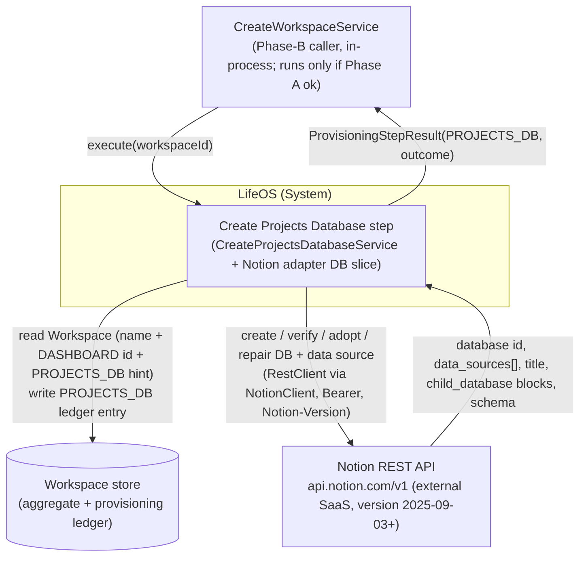
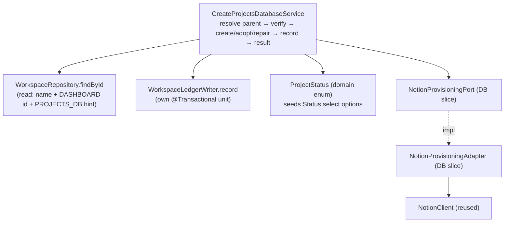
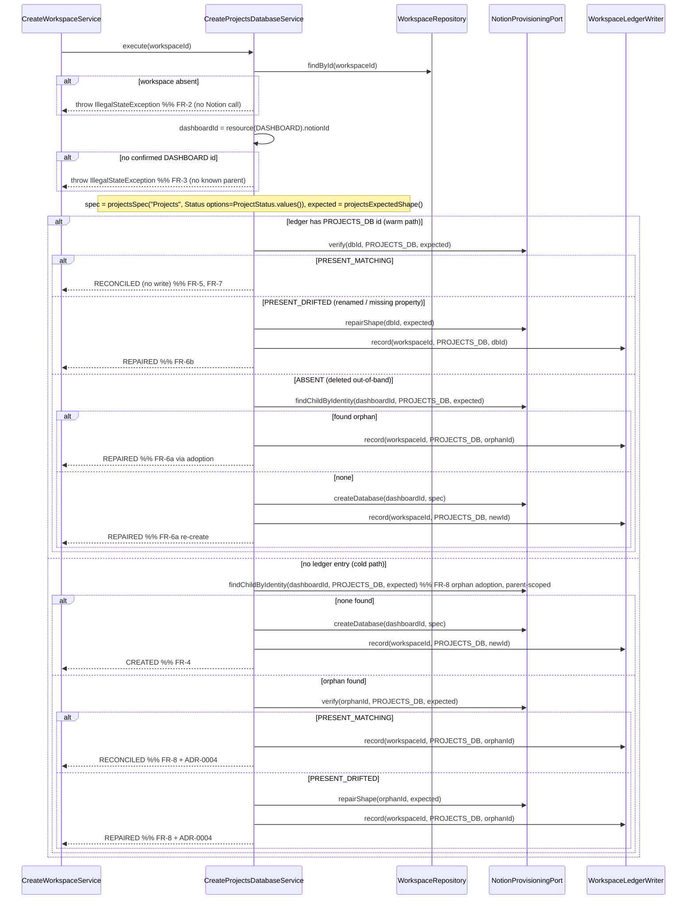

# 02 — Architecture: Create Projects Database (Phase B — first child database)

Status: **FINAL — open questions resolved (2026-08-05), ready for SME.** All three open questions have recorded human decisions (`02-open-questions.md`): OQ-A → **extend the `Project` domain now** (add `ProjectStatus` enum + nullable `dueDate`; this feature now carries a domain change); OQ-B → **defer relations** to the Create Relations phase (no relation columns here); OQ-C → keep the title constant `"Projects"` (final), populate `docs/productivity/*` as a tracked follow-up. All architectural decisions this step needs are made here (ADR-0005..0008).

Owner (Architect stage): pipeline automation
Input: `docs/pipeline/create-projects-database/01-spec.md`
Grounding: the completed **Create Dashboard** design (`docs/pipeline/create-dashboard/02-architecture.md`, `adr/ADR-0001..0004`) and its shipped code (`NotionClient`, `NotionProvisioningAdapter` page slice, `PageShape`, `CreateDashboardService`), existing code under `backend/src/main/java/com/lifeos/`, `CLAUDE.md`, and the official Notion API + Spring Framework references cited inline.

> **Scope.** This document designs **one provisioning step** — `CreateProjectsDatabaseService` (Phase B, resource `PROJECTS_DB`) and the **database slice** of `NotionProvisioningAdapter` it exercises (`createDatabase`, `verify`, `findChildByIdentity`, `repairShape`) — **plus a bounded `Project` domain change** now in-scope per OQ-A (§5.6): `Project` gains a `ProjectStatus` enum and a nullable `dueDate`, which back the Notion `Status`/`Due Date` columns. It is the **first database** created under a Dashboard page and therefore fixes the reusable pattern the six sibling database steps (Tasks, Knowledge, Habits, Journal, Resources, People) will mirror. It does **not** redesign the orchestrator, the page slice (Create Dashboard), relations/rollups/formulas, sample data, or persistence — those are fixed contracts. Where this step's needs exceed the existing `NotionProvisioningPort` **database** shape, that is recorded as a **finding for the SME** (§8) and, where a decision is non-obvious, an **ADR** — never a silent redesign.

## Load-bearing decisions inherited (not re-litigated)

- **Strict verify-before-trust idempotency** — live Notion is the source of truth; the ledger is a hint (Create Workspace ADR-0002; Create Dashboard §4).
- **No transaction across Notion calls; the per-step ledger write is a dedicated `@Transactional` collaborator** — `WorkspaceLedgerWriter.record(workspaceId, type, notionId)` (Create Workspace ADR-0001).
- **`NotionProvisioningPort` lives in `application.port`**; the application core depends only on the port interface (Create Workspace ADR-0004).
- **Notion transport is a Spring `RestClient` wrapped by `NotionClient`** — pinned `Notion-Version`, `Bearer` token from `NotionProperties`, `429`/`529` `Retry-After` clamp, encoded URI-variable ids (Create Dashboard ADR-0001). This step **reuses `NotionClient` unchanged**.
- **Deterministic identity; `> 1` match ⇒ `FAILED`** (Create Dashboard ADR-0002).
- **Outcome semantics**: adopted-and-matching → `RECONCILED`, adopted-but-drifted → `REPAIRED`, never `CREATED`; `REPAIRED` ⇔ a Notion write happened, `RECONCILED` ⇔ none (Create Dashboard ADR-0004). This step reuses that table verbatim (§4.2).
- **Self-validating, immutable domain via static factory; reference-by-UUID** (`CLAUDE.md`) — the `Project` change in §5.6 obeys this.

## Decisions this branch makes for the first time (each an ADR)

- **ADR-0005** — Database provisioning uses the Notion **data-source model** (API version `2025-09-03`+): `POST /v1/databases` with `initial_data_source.properties`; the schema lives on the **data source**, not the database; the ledger stores the **database id** and the adapter dereferences it to the data source for schema reads/writes.
- **ADR-0006** — §3 property → Notion property-type mapping; **Status is a `select`** whose **options are seeded from the `ProjectStatus` domain enum** (single source of truth), not a `status` property — justified from the Notion property docs and reconciled after OQ-A.
- **ADR-0007** — A **typed database schema value type**: refine `DatabaseSpec`/`ExpectedShape` to carry property `name → type` (+ select `options`), required to *create* the schema and to *add a missing property* on repair.
- **ADR-0008** — Database **identity, verification & non-destructive drift repair**: identity via **parent-page child enumeration** (`GET /v1/blocks/{dashboardId}/children`, filter `child_database`), *not* `/v1/search`; verify compares title + required property **names** (not types/options); repair only **adds** missing properties (never deletes or retypes); `> 1` match ⇒ `FAILED`.

---

## 0. Ubiquitous language delta for this step

| Term | Meaning in this step |
|---|---|
| **Projects database** | The single Notion **database** (ledger type `PROJECTS_DB`) created as a child of the Workspace's Dashboard page, holding the property schema that represents the `Project` aggregate. |
| **Dashboard (parent)** | The already-provisioned root page whose confirmed Notion id (ledger `DASHBOARD`) is this step's **parent** and identity scope. A precondition, never mutated here. |
| **Data source** | Under Notion-Version `2025-09-03`+, a database is a container of one-or-more **data sources**; the **schema (`properties`) lives on the data source**, not the database ([Upgrade guide 2025-09-03](https://developers.notion.com/docs/upgrade-guide-2025-09-03)). This step creates a single-source database and treats `data_sources[0]` as *the* schema. |
| **`ProjectStatus`** | New `domain/project` enum — the closed lifecycle set `PLANNED, ACTIVE, ON_HOLD, DONE` (§5.6). It is the single source of truth for the Notion `Status` select column's options (ADR-0006). |
| **Orphan** | A Projects database that exists as a child of the Dashboard but has no `PROJECTS_DB` ledger entry (created-but-ledger-write-failed, FR-8). |
| **Adoption** | Recording an orphan's database id into the ledger instead of creating a duplicate. |
| **Drift** | A live database whose title differs from the marker, or whose data source is missing one or more required §3 property names (FR-6b). |

---

## 1. Context (C4 L1)



- **Caller** — only `CreateWorkspaceService`, via `CreateProjectsDatabaseUseCase.execute(UUID)`; it is one of seven Phase-B steps and runs only when `phaseAOk` (Dashboard succeeded) (`CreateWorkspaceService.java` l.54).
- **Notion REST API** — reached only through `NotionProvisioningPort`; all transport and JSON stay inside the adapter (ADR-0005 reuses ADR-0001 transport).
- **Store** — the same `Workspace` aggregate + ledger; this step **reads** name + the `DASHBOARD` id (its parent) + any `PROJECTS_DB` hint, and **writes** exactly one `PROJECTS_DB` entry.
- **Domain (`Project`)** — extended in this branch (§5.6) but **not** exercised at runtime by this step; the step provisions the container, no rows.

## 2. Containers (C4 L2)

```mermaid
graph TB
    subgraph Boot["LifeOS Spring Boot process"]
        Orc["CreateWorkspaceService (orchestrator)"]
        subgraph AppCore["application"]
            Svc["CreateProjectsDatabaseService"]
            Port["NotionProvisioningPort (application.port)"]
            Writer["WorkspaceLedgerWriter (@Transactional)"]
            Repo["WorkspaceRepository (port)"]
        end
        subgraph Dom["domain.project"]
            Proj["Project (+ status, dueDate) / ProjectStatus enum"]
        end
        subgraph Infra["infrastructure"]
            Adp["NotionProvisioningAdapter<br/>(DB slice: createDatabase/verify/findChildByIdentity/repairShape)"]
            Client["NotionClient (reused, unchanged)"]
            Persist["JpaWorkspaceRepository"]
        end
    end
    NotionAPI["Notion REST API"]
    DB[("Postgres")]

    Orc --> Svc
    Svc -->|createDatabase / verify / findChildByIdentity / repairShape| Port
    Svc -->|record| Writer
    Svc -->|findById read| Repo
    Svc -.reads ProjectStatus.values() for Status options.-> Proj
    Repo -.impl.-> Persist
    Writer --> Persist
    Port -.implemented by.-> Adp
    Adp --> Client
    Client -->|HTTPS + Bearer + Notion-Version| NotionAPI
    Persist --> DB
```

Dependency direction respects hexagonal layering (`CLAUDE.md`; `spring-boot-conventions`): `CreateProjectsDatabaseService` depends only on ports/collaborators + the `domain` (for `ProjectStatus`), never on the adapter. All Notion transport is behind the port and inside the (unchanged) `NotionClient`.

## 3. Components (C4 L3)



**Responsibilities**

- **`CreateProjectsDatabaseService`** — owns the verify/create/adopt/repair/record *sequence* for `PROJECTS_DB`. Pure orchestration over ports; no Notion knowledge, no HTTP, no data-source concept. Reads the `Workspace` (name → title marker; `DASHBOARD` id → parent + identity scope; `PROJECTS_DB` id → warm-path hint), builds the fixed schema (§3, `projectsSpec()`) with the `Status` options taken from `ProjectStatus.values()`, decides the outcome, writes via `WorkspaceLedgerWriter`, returns `ProvisioningStepResult`. Throws (never swallows) on any Notion or lookup failure (FR-2/FR-3/FR-11/FR-12).
- **`ProjectStatus` (domain enum)** — the closed lifecycle set; framework-free (§5.6). Single source of truth for the `Status` column's option labels.
- **`NotionProvisioningAdapter` (DB slice)** — implements the four database port methods against Notion's data-source model. Translates `DatabaseSpec`/`ExpectedShape` into `POST /v1/databases`, `GET /v1/databases/{id}`, `GET/PATCH /v1/data_sources/{id}`, and `GET /v1/blocks/{parent}/children`; maps JSON/status into `VerificationResult`/ids/`NotionApiException`. Only this class knows the data-source concept and endpoints (ADR-0005). The relation/rollup/formula/sample methods keep throwing `UnsupportedOperationException` (scope guard).
- **`NotionClient`** — **reused unchanged** from Create Dashboard: base URL, `Authorization`/`Notion-Version` headers, error translation (token never echoed), `429`/`529` `Retry-After` clamp, finite timeouts via `NotionClientConfiguration`. Supports `post`/`get`/`patch` with encoded URI variables — sufficient for every call this step makes.
- **`WorkspaceLedgerWriter`** / **`WorkspaceRepository`** — unchanged collaborators (write / read). The service gains a `WorkspaceRepository` read dependency exactly as `CreateDashboardService` did.

---

## 4. High-level design (HLD)

### 4.1 The step algorithm (verify-before-trust for a child database)



Where `findChildByIdentity` finds **> 1** child database matching the Projects marker under the Dashboard, the adapter fails loudly (`NotionApiException` → step `FAILED`) rather than adopt or repair an arbitrary match (FR-9; ADR-0008).

Notes:
- **Live Notion is consulted on every path** before any `RECONCILED` (FR-7). The ledger id only chooses which *verification* call runs first, never the outcome by itself.
- **Adoption runs on both the cold path (FR-8) and the ABSENT warm path (FR-6a).** A ledger id that no longer resolves is treated the same as no ledger id: enumerate the Dashboard's children before re-creating, so a delete/re-create race converges to one database (FR-13).
- **The Notion write happens before the ledger write; the ledger write is its own transaction** (Create Workspace ADR-0001). If `createDatabase` succeeds but `record` throws, the database is left in place and the *next* run's FR-8 adoption reconciles the ledger to it (FR-12 second clause). No compensating Notion rollback is attempted — Notion is not transactional (NFR-2).
- **The service never sees the data-source concept.** It holds the **database id** (the parent-scoped identity). The adapter dereferences database → data source internally for every schema read/write (ADR-0005).

### 4.2 Outcome decision table (reuses Create Dashboard ADR-0004 verbatim)

| Ledger `PROJECTS_DB` id | Live Notion state | Notion write this run | Outcome |
|---|---|---|---|
| absent | no child database under Dashboard matches | `createDatabase` | `CREATED` |
| absent | orphan child db, title + required names match | none | `RECONCILED` |
| absent | orphan child db, drifted (renamed / missing prop) | `repairShape` | `REPAIRED` |
| present | database ok (title + required names present) | none | `RECONCILED` |
| present | database drifted (renamed / missing prop) | `repairShape` | `REPAIRED` |
| present | database gone, orphan found | none | `REPAIRED` |
| present | database gone, none found | `createDatabase` | `REPAIRED` |
| any | `findChildByIdentity` returns `> 1` match | none | `FAILED` (loud, human-resolved) |

`CREATED` is reserved for the single case where this step made a new database *and* had no prior record. Adoption is never `CREATED`. `REPAIRED` ⇔ Notion was mutated this run; `RECONCILED` ⇔ it was not.

### 4.3 Error strategy

- Any Notion transport failure (timeout, 5xx, 401/403 auth, unexpected body, exhausted `429`/`529` backoff, **or `> 1` ambiguous identity match**) surfaces from the adapter as a `NotionApiException` (unchecked, adapter-owned, reused from Create Dashboard). `CreateProjectsDatabaseService` does **not** catch it — it propagates to the orchestrator's `runStep`, which records `FAILED` with the message (`CreateWorkspaceService.java` l.88–94). The step never fabricates a `FAILED` result itself (FR-11).
- **Workspace-not-found** and **missing-Dashboard-precondition** are `IllegalStateException` thrown **before any Notion call** (FR-2/FR-3), matching `WorkspaceLedgerWriter`'s existing "Workspace not found" convention.
- The token never appears in an exception message, log line, or `detail` (NFR-6): `NotionClient` builds messages from status code + Notion error `code`/`message` only (already enforced).

### 4.4 Transaction boundary

Unchanged from Create Dashboard/Create Workspace ADR-0001: the only transactional unit is `WorkspaceLedgerWriter.record(...)`, invoked across the proxied bean boundary. `CreateProjectsDatabaseService.execute` carries **no** `@Transactional` — a transaction spanning several Notion HTTP calls would hold a DB connection across slow remote work and roll back durable progress on a mid-run failure (Spring Framework Reference — [Declarative transaction management](https://docs.spring.io/spring-framework/reference/data-access/transaction/declarative.html)). The `findById` read runs in the repository's own read transaction. The `Project` domain change (§5.6) adds no new transactional path.

---

## 5. Low-level design (LLD)

Seam-level only; `[NEW]` = new type, `[REFINE]` = additive change to an existing (currently stub-only) database type, `[DOMAIN]` = the OQ-A domain change. **No page-slice type changes** (`PageShape`, `createRootPage`, `verifyPage`, `repairPage`, `findRootByIdentity` are untouched). The `CreateProjectsDatabaseUseCase.execute(UUID)` signature is unchanged.

### 5.1 `CreateProjectsDatabaseService` [REFINE] — `application.usecase.project`

Currently injects `NotionProvisioningPort` + `WorkspaceLedgerWriter` and throws `UnsupportedOperationException`. It must additionally read the `Workspace` (name → title; `DASHBOARD` id → parent; `PROJECTS_DB` id → hint), so it gains a `WorkspaceRepository` **read** dependency (write stays in `WorkspaceLedgerWriter`), exactly mirroring `CreateDashboardService`:

```java
@Service
@RequiredArgsConstructor
public class CreateProjectsDatabaseService implements CreateProjectsDatabaseUseCase {
    private final NotionProvisioningPort notion;
    private final WorkspaceRepository workspaceRepository;   // [NEW dependency] read-only: name + DASHBOARD id + PROJECTS_DB hint
    private final WorkspaceLedgerWriter ledger;              // existing: the only transactional write path

    @Override
    public ProvisioningStepResult execute(UUID workspaceId) {
        Workspace ws = workspaceRepository.findById(workspaceId)
            .orElseThrow(() -> new IllegalStateException("Workspace not found: " + workspaceId));            // FR-2
        String dashboardId = ws.resource(DASHBOARD).map(ProvisionedResource::notionId)
            .orElseThrow(() -> new IllegalStateException("No confirmed Dashboard for workspace " + workspaceId)); // FR-3
        DatabaseSpec spec       = projectsSpec();          // §3 fixed schema (title + typed properties + Status options), ADR-0006/0007
        ExpectedShape expected  = projectsExpectedShape(); // same title + required property names, ADR-0007
        Optional<String> ledgerId = ws.resource(PROJECTS_DB).map(ProvisionedResource::notionId);
        // ... algorithm of §4.1, returning ProvisioningStepResult(PROJECTS_DB, outcome, detail)
    }
}
```

- **Title marker** (`projectsSpec().title()`): a fixed constant `"Projects"` (ADR-0008 rationale; OQ-C resolved as final — unlike the Dashboard title it need not carry the workspace name, because identity is already scoped by the unique Dashboard parent). The same string feeds create, verify, and identity so they can never diverge (single source of truth).
- **`Status` options** are built from `ProjectStatus.values()` mapped to display labels (§5.6), so the domain enum governs the select options (ADR-0006). `projectsSpec()`/`projectsExpectedShape()` are the one place the schema is authored.
- The stub `throw new UnsupportedOperationException(...)` is removed **only when** the adapter's four database methods are genuinely implemented (NFR-4 cutover) — implemented in the **same** Implementer pass, gated by §7 tests (`CLAUDE.md` "no silent no-op").
- No new `ProvisioningOutcome` values; the four used are `CREATED`/`RECONCILED`/`REPAIRED` plus propagated failure (FR-11).

### 5.2 Port surface for databases — refined (additive to the DB slice only; ADR-0007/0008)

The existing database methods are insufficient in two concrete ways, so they are refined (a finding the Create Dashboard architecture explicitly anticipated — §8):

```java
// application.port — DB slice; page-slice methods unchanged
String            createDatabase(String parentPageId, DatabaseSpec spec);                              // param renamed for clarity; DatabaseSpec now typed
VerificationResult verify(String databaseId, ProvisionedResourceType type, ExpectedShape expected);    // first arg = the database's OWN id (from ledger)
Optional<String>  findChildByIdentity(String parentPageId, ProvisionedResourceType type, ExpectedShape expected); // [REFINE] +ExpectedShape (carries the title marker)
void              repairShape(String databaseId, ExpectedShape expected);                              // behaviour defined (§5.4); signature unchanged
```

- **`findChildByIdentity` gains `ExpectedShape`** so the adapter knows the title marker to match on — the title's single source of truth is the service, not a type→title map hidden in the adapter (mirrors how `createRootPage` took `PageShape` for the Dashboard). Without this the adapter would have to re-derive the title, splitting the source of truth (ADR-0008).
- **`verify`'s first argument is the database's own id** (from the ledger), not the parent — analogous to `verifyPage(pageId, …)`. `type` is retained for logging/symmetry across the seven databases; the title + schema come from `ExpectedShape`.
- **`createDatabase`'s first argument is the parent page id** (the Dashboard). Renamed `rootPageId → parentPageId` for honesty; no behavioural overload.

### 5.3 Typed schema value types [NEW]/[REFINE] — `application.port` (ADR-0007)

`DatabaseSpec(String, List<String>)` and `ExpectedShape(String, List<String>)` carry only property **names** — insufficient to *create* a schema (Notion needs a type per property, plus select options) or to *add a missing property* on repair. They are refined to carry `name → type (+ options)`:

```java
public enum NotionPropertyType { TITLE, RICH_TEXT, SELECT, DATE }   // minimal closed set (extend additively per future DB)

public record PropertyDefinition(String name, NotionPropertyType type, List<String> options) {   // [NEW]
    public PropertyDefinition {                                      // options non-empty only for SELECT; empty otherwise
        if (name == null || name.isBlank()) throw new IllegalArgumentException("property name must not be null or blank");
        if (type == null) throw new IllegalArgumentException("property type must not be null");
        options = options == null ? List.of() : List.copyOf(options);
        if (type != NotionPropertyType.SELECT && !options.isEmpty())
            throw new IllegalArgumentException("options are only valid for SELECT properties");
    }
    public static PropertyDefinition of(String name, NotionPropertyType type) { return new PropertyDefinition(name, type, List.of()); }
}

public record DatabaseSpec(String title, List<PropertyDefinition> properties) { /* non-blank title; non-empty; exactly one TITLE */ }
public record ExpectedShape(String title, List<PropertyDefinition> requiredProperties) { /* non-blank title; non-empty */ }
```

- Both records are **only** consumed by the (currently stub) database port methods; the Dashboard page slice uses `PageShape` and is unaffected. The one caller ripple is the in-memory fake port in `CreateDashboardServiceIT` (stub-implements these DB methods) — updating those stub signatures is a contained, no-behaviour change (finding §8.5).
- Enum `NotionPropertyType` is intentionally the minimal closed set this step needs; sibling databases add values additively (e.g. `NUMBER`, `CHECKBOX`) without signature change (YAGNI).
- The fixed Projects schema (§3), authored once in the service:

| §3 property | `NotionPropertyType` | Notion config (ADR-0006) |
|---|---|---|
| **Name** | `TITLE` | `"Name": { "type": "title", "title": {} }` — the database's single title property |
| **Description** | `RICH_TEXT` | `"Description": { "type": "rich_text", "rich_text": {} }` |
| **Status** | `SELECT` | `"Status": { "type": "select", "select": { "options": [ {"name":"Planned"}, {"name":"Active"}, {"name":"On hold"}, {"name":"Done"} ] } }` — **options seeded from `ProjectStatus.values()`** (§5.6; ADR-0006). Each option is `{ "name": "<label>" }` (Notion assigns `id`/`color`) ([Property object](https://developers.notion.com/reference/property-object); [Create a database](https://developers.notion.com/reference/create-a-database)). |
| **Due Date** | `DATE` | `"Due Date": { "type": "date", "date": {} }` |

`ExpectedShape.requiredProperties` uses the same list; **verify checks the property names present (ADR-0008), not the select options or date config** — so a user who adds their own Status options never triggers spurious repair, and the enum-seeded options are applied at creation only.

### 5.4 Adapter DB slice — `NotionProvisioningAdapter` [REFINE] — `infrastructure.adapter.notion`

Only the four database methods become real this pass; every relation/rollup/formula/sample method keeps throwing `UnsupportedOperationException`. `NotionClient` is reused unchanged. Endpoint mapping (official Notion API reference, version `2025-09-03`; ADR-0005/0006/0008):

| Adapter method | Notion call(s) | Notes |
|---|---|---|
| `createDatabase(parentPageId, spec)` | `POST /v1/databases` with `parent = { type: "page_id", page_id: parentPageId }`, `title = [{text:{content: spec.title}}]`, `initial_data_source = { properties: <schema> }` | Under `2025-09-03` the initial schema goes under `initial_data_source.properties`; `title`/`parent` are database-level ([Create a database](https://developers.notion.com/reference/create-a-database); [Upgrade guide 2025-09-03](https://developers.notion.com/docs/upgrade-guide-2025-09-03)). The adapter maps each `PropertyDefinition` to its config JSON, emitting `select.options` from `PropertyDefinition.options`. Response carries the new database `id` **and** its `data_sources[]`. **Returns the database id** (the ledger identity). |
| `verify(databaseId, type, expected)` | `GET /v1/databases/{databaseId}` then `GET /v1/data_sources/{dsId}` | `404`/`object_not_found` or `archived`/`in_trash == true` → `ABSENT`; database `title != expected.title` → `PRESENT_DRIFTED`; else resolve `data_sources[0].id`, retrieve its `properties`, and if any `expected.requiredProperties` **name** is absent → `PRESENT_DRIFTED`; else `PRESENT_MATCHING` ([Retrieve a database](https://developers.notion.com/reference/retrieve-a-database) returns the `data_sources` array; schema on the data source per the upgrade guide). Options/types are not compared. |
| `findChildByIdentity(parentPageId, type, expected)` | `GET /v1/blocks/{parentPageId}/children` (paginated) | Filter to blocks of type `child_database` whose `child_database.title == expected.title`; the block `id` **is** the database id ([Retrieve block children](https://developers.notion.com/reference/get-block-children)). `0` → `empty`, `1` → that id, **`> 1` → `NotionApiException`** (FR-9). Parent-scoped and index-consistent — see ADR-0008. |
| `repairShape(databaseId, expected)` | `GET /v1/databases/{databaseId}`; if title drift → `PATCH /v1/databases/{databaseId}` `{ title }`; then resolve `data_sources[0].id`, `GET /v1/data_sources/{dsId}`, and for **each missing required property** → `PATCH /v1/data_sources/{dsId}` `{ properties: { "<name>": { <type config> } } }` | Adds only; **never** sets a property to `null` and never changes an existing property's type, so no data is destroyed ([Update a data source](https://developers.notion.com/reference/update-a-data-source): "Properties set to null will be removed" — deliberately avoided). A re-added `Status` carries the enum-seeded options. Title lives on the database; schema on the data source (ADR-0005/0008). |

Rate-limit/timeout/token handling is entirely `NotionClient`'s (reused): `429`/`529` honour the clamped integer `Retry-After`; Notion documents ~3 requests/second/connection ([Request limits](https://developers.notion.com/reference/request-limits)). A single successful run makes a bounded handful of calls (cold-create: 1 children-list + 1 create; warm-match: 1 database-get + 1 data-source-get; warm-repair: + 1–N small PATCHes) — well within budget (NFR-9).

### 5.5 Package structure (package-by-feature — `spring-boot-conventions`)

```
com.lifeos
 ├─ domain.project/          Project [DOMAIN: +ProjectStatus status, +LocalDate dueDate], ProjectStatus [NEW enum]
 ├─ application
 │   ├─ port/                 NotionProvisioningPort [REFINE: DB-slice params],
 │   │                        DatabaseSpec/ExpectedShape [REFINE: typed], PropertyDefinition [NEW], NotionPropertyType [NEW],
 │   │                        PageShape/ParentConstraint/VerificationResult (unchanged, pages)
 │   └─ usecase.project/      CreateProjectsDatabaseService [REFINE], CreateProjectsDatabaseUseCase (unchanged)
 └─ infrastructure.adapter.notion/
        NotionProvisioningAdapter [REFINE — DB slice], NotionClient (unchanged), NotionProperties (unchanged),
        dto/ [NEW: NotionDatabaseResponse (id + data_sources), NotionDataSourceResponse (properties), NotionBlockChildrenResponse (child_database)]
```

### 5.6 Domain change — `Project` gains `status` + `dueDate` [DOMAIN] — `domain/project` (OQ-A resolved)

Per the human decision on OQ-A, the `Project` aggregate is extended now so the Notion `Status`/`Due Date` columns have a backing domain source of truth. The change obeys `CLAUDE.md`: no primitive obsession (a domain enum, not a `String`), self-validating via the static factory, immutable (`@Value`), reference-by-UUID preserved.

**New enum `ProjectStatus` [NEW]** — a pure, framework-free domain enum (no Spring, no infrastructure imports):

```java
package com.lifeos.domain.project;

public enum ProjectStatus {
    PLANNED("Planned"),      // defined, not yet started
    ACTIVE("Active"),        // in progress — the working state
    ON_HOLD("On hold"),      // paused (blocked / deferred), not abandoned
    DONE("Done");            // goal achieved / complete

    private final String displayName;
    ProjectStatus(String displayName) { this.displayName = displayName; }
    public String displayName() { return displayName; }   // the label used for the Notion select option
}
```

- **Value-set rationale.** PARA defines a project as "a series of tasks linked to a goal, with a deadline," that is "complete when the goal is achieved" (Tiago Forte, "The PARA Method," fortelabs.com/blog/para/ — external, non-authoritative for engineering claims but the product source cited by the spec §3; there is no in-repo `docs/productivity/PARA.md` content, see OQ-C). That definition implies at minimum a **not-started → in-progress → complete** lifecycle; `ON_HOLD` is added as the one common real-world state that is neither active nor done (a paused project), rounding the set to a small, closed, mutually-exclusive four. The set is deliberately minimal (YAGNI) and can grow additively (e.g. `CANCELLED`) without breaking the Notion mapping — a new value simply seeds a new select option (ADR-0006).
- **`displayName()`** is the single mapping from an enum value to the Notion select option label (`ON_HOLD → "On hold"`), consumed by `projectsSpec()` (§5.1/§5.3). The enum, not the adapter, owns the option vocabulary (ADR-0006 single-source-of-truth).

**`Project` [DOMAIN]** — add two fields and thread them through the factory and the (private, all-args) reconstitution builder:

```java
@Value
@Builder(access = AccessLevel.PRIVATE)
public class Project {
    UUID id;
    String name;
    String description;
    ProjectStatus status;   // [NEW] non-null invariant (defaults to PLANNED at create)
    LocalDate dueDate;      // [NEW] nullable — a project may have no deadline yet
    UUID areaId;
    UUID workspaceId;
    UUID goalId;

    public static Project create(String name, String description, ProjectStatus status, LocalDate dueDate,
                                 UUID areaId, UUID workspaceId, UUID goalId) {
        if (name == null || name.isBlank()) throw new IllegalArgumentException("Project name must not be null or blank");
        if (workspaceId == null) throw new IllegalArgumentException("Project workspaceId must not be null");
        return Project.builder()
                .id(UUID.randomUUID())
                .name(name).description(description)
                .status(status == null ? ProjectStatus.PLANNED : status)   // invariant: never null; new project defaults to PLANNED
                .dueDate(dueDate)                                          // nullable passthrough
                .areaId(areaId).workspaceId(workspaceId).goalId(goalId)
                .build();
    }
}
```

- **Invariants (factory-enforced, `CLAUDE.md`):** `name` non-blank and `workspaceId` non-null (unchanged); **`status` never null** — a new project defaults to `PLANNED` (a project always has a lifecycle state); `dueDate` is intentionally nullable (a project may not have a deadline set yet — the spec's own wording). The application layer never mints an invalid `Project`.
- **Reconstitution.** `Project` currently exposes only the private all-args `@Builder` (there is no `ProjectRepository` yet). The two new fields flow through that all-args builder automatically, so repository reconstitution of already-valid state (when persistence is added) carries `status`/`dueDate` without re-running create-time defaulting — consistent with `CLAUDE.md`'s "all-args builder reserved for reconstitution." If a `Project.reconstitute(...)` static factory is later introduced for symmetry with `Workspace.reconstitute`, it must accept both new fields.
- **Caller ripple.** `Project.create(...)` gains two parameters. Existing call sites (if any — none in production today; the future "Populate Sample Data" phase and tests) pass `status`/`dueDate` (or `null` to accept the `PLANNED` default). `ProjectProgressService` is a separate domain service and is **not** redesigned here; if it later keys off status that is a follow-up, out of this step's scope.
- **Runtime independence from this step.** This step provisions the database schema and writes **no** `Project` rows — the domain change does not gate schema creation, but it is **in-scope for this feature** (OQ-A) and must be built and unit-tested in the same Implementer pass (§7, §8.9).

---

## 6. Cross-cutting concerns

- **Security / token (NFR-6).** Reuses the single process-level token via `NotionProperties`; read only inside `NotionClient`, injected into the `Authorization` header, never logged, never placed in `detail`/exception messages. This step introduces **no** new secret or token scope.
- **API version pinning (ADR-0005).** The **entire** database slice depends on Notion-Version `2025-09-03`+ semantics (data sources, `initial_data_source`, `/v1/data_sources`, and the `search` object-filter change). The project already pins `>= 2025-09-03` (the Dashboard uses the Move-page endpoint, available since `2025-09-03`). `NotionProperties.version` remains the single pin; an upgrade is a deliberate config change. If the pin were ever set below `2025-09-03`, the create body/schema-endpoint shape would be wrong — a startup/config concern flagged for the SME (§8.6).
- **Idempotency (NFR-1/FR-13).** Realised by §4.1: every path verifies live Notion; adoption via child enumeration runs before any create on both cold and ABSENT paths; the ledger write is an upsert (`Workspace.record` replaces the `PROJECTS_DB` entry). Because `findChildByIdentity` reads the parent's **block children** (immediately consistent), a just-created-then-crashed database is found on the very next run (unlike search's index lag) — the strongest possible convergence guarantee under Notion's non-transactional API.
- **Validation.** `DatabaseSpec`/`ExpectedShape`/`PropertyDefinition` validate in compact constructors (non-blank names, non-null types, exactly one `TITLE`, options only for `SELECT`); `Project`/`ProjectStatus` validate in the domain factory (§5.6) — malformed schema or domain state fails fast at construction, not mid-Notion-call.
- **Observability (NFR-5).** `CreateProjectsDatabaseService` logs, per run: `workspaceId`, `dashboardId` (parent), prior `PROJECTS_DB` ledger id (or "none"), the `VerificationResult`, the database id acted on, and the final outcome. No token, no raw Notion bodies.
- **Testability (NFR-3).** Service = pure port orchestration → Mockito unit tests; adapter = transport → `MockRestServiceServer` contract tests; wiring → in-memory fake port + Testcontainers Postgres; the `Project`/`ProjectStatus` change = plain domain unit tests. No live Notion in any tier (reuses Create Dashboard ADR-0003).

---

## 7. Testing strategy (reuses ADR-0003 tiers)

- **`CreateProjectsDatabaseServiceTest` — plain Mockito unit** (highest value). Mocks `NotionProvisioningPort`, `WorkspaceRepository`, `WorkspaceLedgerWriter`. One test per §4.2 row plus preconditions/failures:
  - `throwsWhenWorkspaceNotFound` — no port interaction (FR-2).
  - `throwsWhenNoDashboardLedgerEntry` — `IllegalStateException`, no Notion call (FR-3).
  - `createsWhenColdAndNoOrphan` → `findChildByIdentity` empty → `createDatabase` once → `record(PROJECTS_DB,newId)` → `CREATED` (FR-4). Assert the `DatabaseSpec` passed carries the four §3 properties and Status options = `ProjectStatus` display names.
  - `adoptsWhenColdAndOrphanMatches` → `findChildByIdentity` present → `verify` `PRESENT_MATCHING` → `record`, no create → `RECONCILED` (FR-8 + ADR-0004).
  - `adoptsAndRepairsWhenColdAndOrphanDrifted` → `verify` `PRESENT_DRIFTED` → `repairShape` + `record` → `REPAIRED`.
  - `reconcilesWhenWarmAndMatching` → `verify` `PRESENT_MATCHING` → **no** write, **no** `record` → `RECONCILED` (FR-5/FR-7).
  - `repairsWhenWarmAndDrifted` → `verify` `PRESENT_DRIFTED` → `repairShape` + `record` → `REPAIRED` (FR-6b).
  - `repairsWhenWarmAndDeleted_readopts` / `_reCreates` → `verify` `ABSENT` → adopt-or-create → `REPAIRED` (FR-6a).
  - `propagatesNotionFailureWithoutWritingLedger` → port throws `NotionApiException` → propagates, `verifyNoInteractions(ledger)` (FR-12).
  - `neverInvokesRelationRollupFormulaOrSampleMethods` → `verifyNoInteractions` on those port methods (FR-14).
- **`NotionProvisioningAdapterDatabaseTest` — `MockRestServiceServer`** bound to the adapter's `RestClient.Builder`. Assert request path/verb, `Authorization: Bearer`/`Notion-Version` headers, request JSON, and response decoding:
  - `createDatabase_postsDatabaseWithInitialDataSource_returnsDatabaseId` — assert `initial_data_source.properties` includes `select.options` for Status.
  - `verify_returnsAbsentOn404` / `_returnsAbsentWhenArchived` / `_returnsDriftedOnTitleMismatch` / `_returnsDriftedWhenRequiredPropertyMissing` (asserts the data-source `GET` + name check) / `_returnsMatching` / `_ignoresExtraUserOptionsAndProperties`.
  - `findChildByIdentity_listsChildBlocks_filtersChildDatabaseByTitle` / `_returnsEmptyWhenNone` / `_throwsOnMoreThanOneMatch` (FR-9) / `_paginatesChildren`.
  - `repairShape_patchesDatabaseTitle` / `_addsMissingPropertyOnDataSource_neverSendsNull` (assert no `null` in body → non-destructive).
  - Reuses `NotionClient`'s existing `429`/token-leak coverage.
- **`ProjectTest` / `ProjectStatusTest` — plain domain unit** (the OQ-A change):
  - `create_defaultsStatusToPlannedWhenNull`, `create_keepsProvidedStatus`, `create_allowsNullDueDate`, `create_rejectsBlankName`, `create_rejectsNullWorkspaceId`, `create_generatesId`, `create_isImmutable`.
  - `projectStatus_displayNames` — asserts the four labels the Notion select is seeded with.
- **`CreateProjectsDatabaseServiceIT` — optional `@SpringBootTest`** with an in-memory fake `NotionProvisioningPort` (`@TestConfiguration`) + Testcontainers Postgres: proves orchestrator → service → `WorkspaceLedgerWriter` → JPA is wired, that the step is blocked/skipped when Phase A failed, and that three consecutive runs converge to a single `PROJECTS_DB` ledger row (FR-13) with **zero** Notion calls.

---

## 8. Findings for the SME (must be addressed in the tech spec)

1. **`DatabaseSpec` and `ExpectedShape` become typed** (§5.3): `record DatabaseSpec(String title, List<PropertyDefinition> properties)`, `record ExpectedShape(String title, List<PropertyDefinition> requiredProperties)`, plus `PropertyDefinition(String name, NotionPropertyType type, List<String> options)` and enum `NotionPropertyType { TITLE, RICH_TEXT, SELECT, DATE }` in `application.port`. Required to create the schema (incl. enum-seeded Status options) and to add a missing property on repair (ADR-0007). Compact-constructor validation: non-blank names, non-null types, exactly one `TITLE`, `options` only for `SELECT`.
2. **`findChildByIdentity` gains an `ExpectedShape` parameter** (§5.2) so the title marker's single source of truth stays in the service (ADR-0008).
3. **`verify`'s first argument is the database's own id** (from the ledger), and **`createDatabase`'s first argument is the parent page id** (renamed `rootPageId → parentPageId`) — clarification/refinement, additive to the DB slice (§5.2).
4. **`CreateProjectsDatabaseService` gains a `WorkspaceRepository` read dependency** (name + `DASHBOARD` id + `PROJECTS_DB` hint); the write stays in `WorkspaceLedgerWriter`. Constructor becomes 3-arg (mirrors `CreateDashboardService`). The service authors the fixed §3 schema (`projectsSpec()`/`projectsExpectedShape()`) with title constant `"Projects"` and Status options from `ProjectStatus.values()`.
5. **Update the fake port in `CreateDashboardServiceIT`** to the refined DB-method signatures (they are stub throws there — a compile-only ripple, no behaviour change). Also update the `never()` assertions in `CreateDashboardServiceTest` for `findChildByIdentity`/`createDatabase` if their arity changes.
6. **Confirm `NotionProperties.version` is pinned `>= 2025-09-03`** (data-source era). The whole DB slice assumes it. Fail-fast at startup is already in place (`@Validated @NotBlank`); the SME should document the minimum version explicitly and add a boot-time guard if a stronger check is warranted.
7. **New adapter DTOs** for the data-source model: `NotionDatabaseResponse` (`id`, `title`, `archived`/`in_trash`, `data_sources[]`), `NotionDataSourceResponse` (`properties` map), `NotionBlockChildrenResponse` (`results[]` of `child_database` with `id` + `title`, plus `has_more`/`next_cursor`). All `@JsonIgnoreProperties(ignoreUnknown=true)`, mirroring the existing page DTOs.
8. **Adapter remains a partial slice** — only the four database methods become real; relation/rollup/formula/sample keep throwing `UnsupportedOperationException`. The NFR-4 cutover (removing the service stub throw) happens in the **same** pass, gated by §7 tests.
9. **[DOMAIN — OQ-A] Extend `Project`** (§5.6): new framework-free enum `ProjectStatus { PLANNED, ACTIVE, ON_HOLD, DONE }` (with `displayName()`), and `Project` gains `ProjectStatus status` (non-null, defaults `PLANNED`) + `LocalDate dueDate` (nullable). Update `Project.create(...)` (two new params) and thread both fields through the private all-args builder (reconstitution seam); preserve `@Value` immutability and reference-by-UUID. This lands **with this feature** in the same Implementer pass, unit-tested (§7). It is independent of the Notion schema at runtime (no rows written) but is the source of truth for the Status select options. `ProjectProgressService` is not redesigned here.

---

## 9. Traceability (FR/NFR → component)

| Req | Satisfied by |
|---|---|
| FR-1 | `CreateProjectsDatabaseUseCase.execute(UUID)` unchanged; §5.1 |
| FR-2 | `WorkspaceRepository.findById` → `IllegalStateException` before any Notion call; §5.1, test `throwsWhenWorkspaceNotFound` |
| FR-3 | `resource(DASHBOARD)` empty → `IllegalStateException`; §5.1, test `throwsWhenNoDashboardLedgerEntry` |
| FR-4 | Cold path `findChildByIdentity` empty → `createDatabase` → `record` → `CREATED` (§4.1/§4.2) |
| FR-5 | Warm `verify` `PRESENT_MATCHING` → `RECONCILED`, no write (§4.1) |
| FR-6a | Warm `ABSENT` → adopt-or-`createDatabase` → `REPAIRED` |
| FR-6b | Warm `PRESENT_DRIFTED` → `repairShape` (title and/or add missing prop, non-destructive) → `REPAIRED` (§5.4) |
| FR-7 | `verify`/`findChildByIdentity` on every path before any `RECONCILED` (§4.1; ADR-0008) |
| FR-8 | Cold `findChildByIdentity` (parent-scoped child enumeration) → adopt; ADR-0008 + ADR-0004 |
| FR-9 | `> 1` child_database match → `NotionApiException` → `FAILED` (§4.3; ADR-0008) |
| FR-10 | `WorkspaceLedgerWriter.record(workspaceId, PROJECTS_DB, id)` — its own tx (§4.4) |
| FR-11 | Returns `ProvisioningStepResult(PROJECTS_DB, …)`; failures propagate for the orchestrator to map (§4.3) |
| FR-12 | Notion-before-ledger ordering + own-tx write + next-run adoption; test `propagatesNotionFailureWithoutWritingLedger` |
| FR-13 | Adoption-before-create on cold & ABSENT paths; upsert `record`; index-consistent child enumeration; IT convergence test (§7) |
| FR-14 | Only the four DB methods invoked; `verifyNoInteractions` on relation/rollup/formula/sample; schema contains no relation property (§3, §7) |
| §3 Status/Due Date columns + domain backing (OQ-A) | Notion columns §5.3 (ADR-0006); domain fields `Project.status`/`dueDate` + `ProjectStatus` enum §5.6; tests `ProjectTest`/`ProjectStatusTest` (§7) |
| NFR-1 | Strict per-path live verification (§4.1; inherited ADR-0002) |
| NFR-2 | Notion-before-ledger + no rollback; next-run reconcile (§4.1) |
| NFR-3 | Mockito service tests + `MockRestServiceServer` adapter tests + fake-port IT + domain unit tests (§7; ADR-0003) |
| NFR-4 | Stub throw removed only at adapter cutover, gated by tests (§5.1, §8.8) |
| NFR-5 | Structured per-run logging (§6) |
| NFR-6 | Token in `NotionProperties`, header-only, never logged (§6; reused `NotionClient`) |
| NFR-7 | No shared mutable state; only `PROJECTS_DB` ledger entry written (§4.4, §6) |
| NFR-8 | Upsert `record` → exactly one `PROJECTS_DB` entry (`Workspace.record` semantics; §6) |
| NFR-9 | Bounded call count per run (§5.4) |
| NFR-10 | `429`/`529` `Retry-After` clamp in reused `NotionClient` (§5.4; ADR-0001) |

---

## 10. Definition-of-done status

Every FR/NFR is traceable (§9). Every first-time decision has an ADR (0005–0008; ADR-0006 reconciled after OQ-A). Findings for the SME are enumerated (§8), including the OQ-A domain change (§8.9). **All three open questions are resolved and baked into this design** (`02-open-questions.md`): OQ-A extend the domain now (`ProjectStatus` + `dueDate`, §5.6; Status stays `select`, options seeded from the enum, ADR-0006); OQ-B defer relations (no relation columns, FR-14); OQ-C keep `"Projects"` as the final title, populate `docs/productivity/*` as a tracked follow-up (§11). This design is ready for the SME.

## 11. Tracked follow-ups (out of this step's scope)

1. **Populate `docs/productivity/PARA.md` & `GTD.md`** so future database specs cite in-repo authoritative source material instead of the external PARA URL used for §3 / the `ProjectStatus` rationale (OQ-C; non-blocking, documentation quality).
2. **Areas / Goals databases + Projects relations** — deferred to the **Create Relations** phase (OQ-B). If those databases are later provisioned, a Projects↔Area / Projects↔Goal relation column is added *there*, never in this step. `Project.areaId`/`goalId` already model the links by UUID.
3. **`Project` persistence + `Project`↔Notion row sync** — a `ProjectRepository` and mapping of `status`/`dueDate` onto Notion rows belong to later persistence / "Populate Sample Data" work; this step writes no rows. If grouped status semantics are ever required, migrating the Notion `Status` column from `select` to `status` is a separate, flagged change (ADR-0006).
</content>
