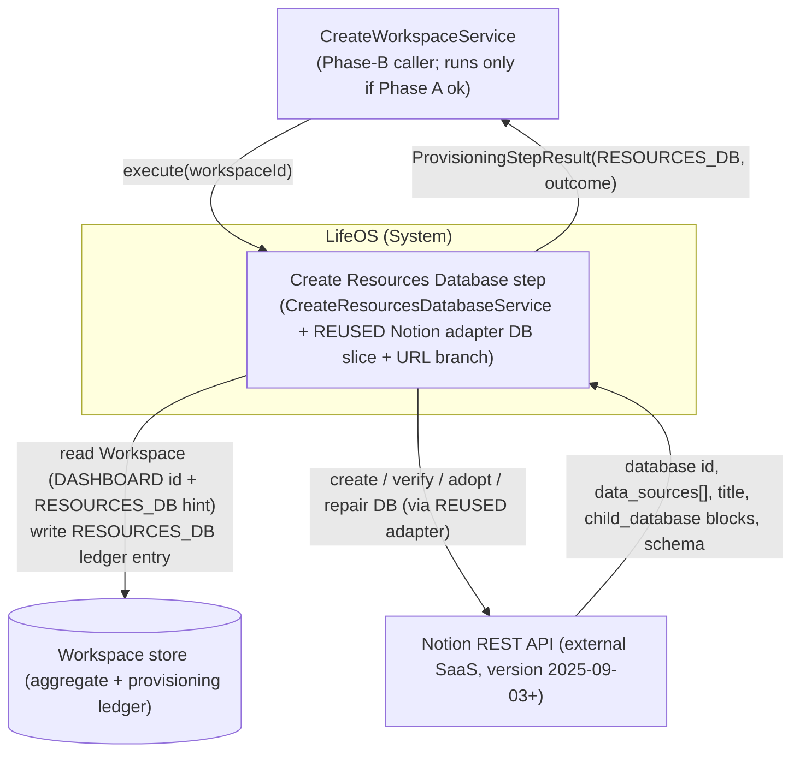
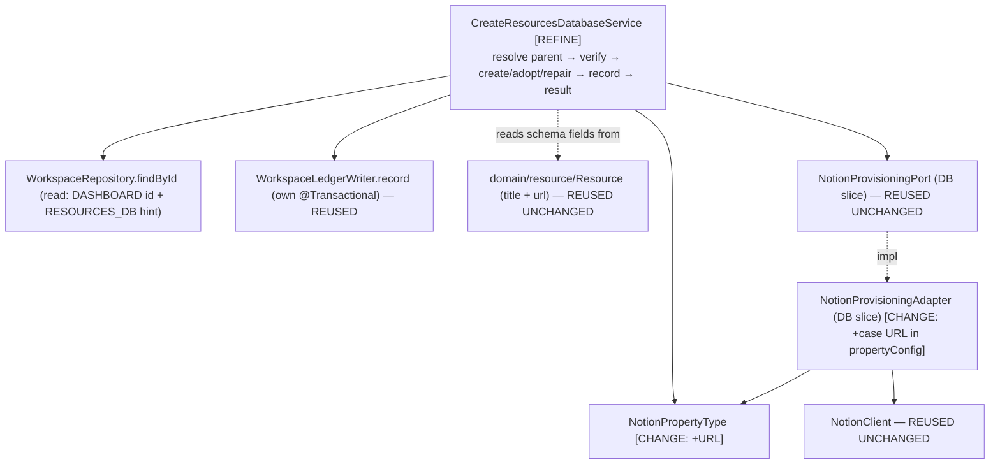
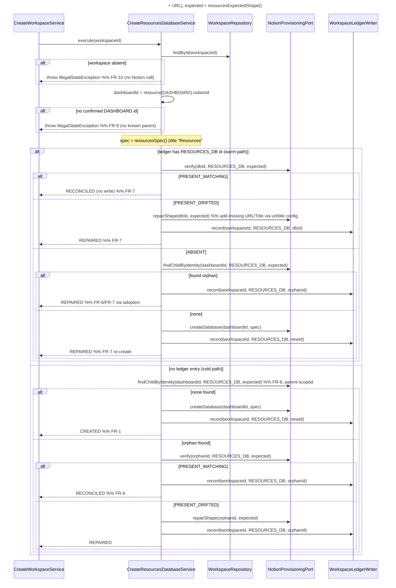

# 02 — Architecture: Create Resources Database (Phase B — child database, with a bounded port+adapter extension)

Status: **FINAL — no open questions (see `02-open-questions.md`), ready for SME.**

Owner (Architect stage): pipeline automation
Input: `docs/pipeline/create-resources-database/01-spec.md`
Grounding: the shipped **Create Tasks Database** design (`../create-tasks-database/02-architecture.md`, `adr/ADR-0009`) and the **Create Projects Database** design it inherits from (`../create-projects-database/adr/ADR-0005..0008`) — the pattern this step mirrors — plus the **shipped code** (`CreateTasksDatabaseService` as the reference service, the `NotionProvisioningAdapter` DB slice, `NotionClient`, the typed `DatabaseSpec`/`ExpectedShape`/`PropertyDefinition`/`NotionPropertyType`, `WorkspaceLedgerWriter`). Existing `domain/resource/Resource.java`, `CLAUDE.md`.

> **Scope.** This document designs the **small delta** to provision the **Resources** database (ledger type `RESOURCES_DB`) as a sibling of the already-shipped Projects/Tasks/Knowledge/Habits/Journal steps, mirroring `CreateTasksDatabaseService`. The whole idempotent verify → create/adopt/repair → ledger machinery (adapter DB slice, typed schema value types, port method signatures, transaction boundary, outcome table) is **reused unchanged**. Unlike the Tasks pass, this step carries **one bounded, in-scope port+adapter extension**: a new `NotionPropertyType.URL` member and the matching `case URL` branch in the adapter's `propertyConfig`, so the Resources schema can declare a first-class Notion `url` column for `Resource.url`. This is the same shape of extension previously done for `DATE`; it is recorded in **ADR-0013**. This document does not restate what ADR-0005..0009 already settled.

## Reused UNCHANGED (do NOT touch — for SME/Implementer)

Everything below is already implemented, proven by the Projects/Tasks steps, and requires **zero** modification for Resources:

| Reused artifact | Status | Reference |
|---|---|---|
| **Identity/verify/repair algorithm** — parent-page child enumeration, name-only `verify`, non-destructive add-only `repairShape`, `> 1` match ⇒ `FAILED` | Shipped, unchanged | ADR-0008 |
| `NotionProvisioningAdapter` DB slice control flow — `createDatabase` / `verify` / `findChildByIdentity` / `repairShape` | Shipped, generic over `ProvisionedResourceType` + `DatabaseSpec`/`ExpectedShape` | ADR-0005, ADR-0008; `NotionProvisioningAdapter.java` l.124–209 |
| `NotionClient` (transport: Bearer, `Notion-Version` pin `2025-09-03`, `429`/`529` `Retry-After` clamp, token never logged) | Shipped, unchanged | Create Dashboard ADR-0001 |
| `NotionProvisioningPort` (application.port) — DB-slice method signatures | Shipped, unchanged | Projects §5.2 |
| `DatabaseSpec` / `ExpectedShape` / `PropertyDefinition` record types (their compact-constructor invariants) | Shipped, typed, sufficient as-is — **no invariant weakened** by adding a URL member (ADR-0013 §Consequences) | ADR-0007 |
| `WorkspaceLedgerWriter.record(workspaceId, type, notionId)` (its own `@Transactional`) | Shipped, unchanged | Create Workspace ADR-0001 |
| `WorkspaceRepository.findById`, `Workspace.resource(type)`, `ProvisioningStepResult`, `ProvisioningOutcome`, `VerificationResult` | Shipped, unchanged | — |
| `ProvisionedResourceType.RESOURCES_DB` | Already defined | `domain/workspace/ProvisionedResourceType.java` l.5 |
| `domain/resource/Resource` (`title` + `url` already present) | Complete; **no domain change** (unlike Projects/Journal OQ-A) | spec §7; `Resource.java` l.12–13 |
| The `TITLE` / `RICH_TEXT` / `SELECT` / `DATE` branches of `propertyConfig` and every existing caller (Projects/Tasks/Knowledge/Habits/Journal) | Shipped, unchanged — additive-only enum growth (NFR-5) | `NotionProvisioningAdapter.java` l.262–270 |

## CHANGED this branch (the entire delta — for SME/Implementer)

Exactly three artifacts change; nothing else. The change set is deliberately narrow.

| Changed artifact | Change | Grounding |
|---|---|---|
| `application/port/NotionPropertyType` | Add a `URL` member: `{TITLE, RICH_TEXT, SELECT, DATE, URL}` | spec FR-4; **ADR-0013** |
| `infrastructure/adapter/notion/NotionProvisioningAdapter.propertyConfig` | Add `case URL -> Map.of("type", "url", "url", Map.of())` to the `switch` (emits `{"type":"url","url":{}}`) — applies on both `createDatabase` (l.126–137) and `repairShape` add-missing (l.199–208) because both call the same `propertyConfig` helper | spec FR-5, AC-13; **ADR-0013** |
| `application/usecase/resource/CreateResourcesDatabaseService` | Replace the stub `UnsupportedOperationException` with the real §3 algorithm (verbatim mirror of `CreateTasksDatabaseService`), and author `resourcesSpec()`/`resourcesExpectedShape()` (title `"Resources"`; `Title`←`Resource.title`, `URL`←`Resource.url`) | spec FR-1..FR-13; §4.1 below |

**The adapter switch is exhaustive over the enum**, so adding `URL` forces the new `case` at compile time — the Implementer cannot forget the branch (a `switch` over an enum with no `default` fails to compile if a constant is unhandled — *JLS §14.11.2*). No new port method, no new value type, no domain change.

## Decisions reused (not re-litigated)

- **ADR-0005** — Notion data-source model (`POST /v1/databases` with `initial_data_source.properties`; ledger stores the database id, adapter dereferences to the data source). → `../create-projects-database/adr/ADR-0005-notion-database-datasource-model.md`
- **ADR-0007** — typed `DatabaseSpec`/`ExpectedShape`/`PropertyDefinition`/`NotionPropertyType`. → `../create-projects-database/adr/ADR-0007-typed-database-schema-value-type.md`
- **ADR-0008** — database identity (parent-page child enumeration, `> 1` match ⇒ `FAILED`), **name-only verify**, non-destructive add-only repair. → `../create-projects-database/adr/ADR-0008-database-identity-verification-nondestructive-repair.md`
- Inherited from Create Workspace/Dashboard: verify-before-trust idempotency; no transaction across Notion calls (ledger write is the sole `@Transactional` unit); outcome semantics (`CREATED` only on first-time create with no prior record; `REPAIRED` ⇔ a Notion write happened, `RECONCILED` ⇔ none).

## New decision this branch makes

- **ADR-0013** — `Resource.url` → Notion **`url`** property type (config `{"type":"url","url":{}}`), rejecting `rich_text`. Adds `NotionPropertyType.URL` + the adapter `case URL`. Follows the `DATE`-precedent for introducing a first-class primitive Notion type rather than approximating it with `rich_text`/`select` (ADR-0006 §Consequences; ADR-0012 `timestamp→date`). → `adr/ADR-0013-url-property-type.md`

---

## 0. Ubiquitous-language delta

| Term | Meaning in this step |
|---|---|
| **Resources database** | The single Notion database (ledger type `RESOURCES_DB`) created as a child of the workspace's Dashboard page, holding the two-property schema that represents the `Resource` aggregate. |
| **URL property** | The Notion `url`-typed column named `"URL"`, sourced from `Resource.url` (nullable). A first-class Notion property type distinct from `rich_text` (ADR-0013). |

*Orphan*, *Adoption*, *Drift*, *Data source* carry the exact meanings fixed by the Projects design; not restated.

## 1. Context (C4 L1)

Identical shape to Tasks, with `TASKS_DB` → `RESOURCES_DB`.



Resources runs **independently of** the other Phase-B database steps — no ordering dependency (spec §2, FR-12; `CreateWorkspaceService.java` l.59). It reads only the `DASHBOARD` id (its parent) + any `RESOURCES_DB` hint, and writes exactly one `RESOURCES_DB` entry (failure isolation, NFR-1).

## 2. Containers (C4 L2)

Unchanged from every prior Phase-B step: a single Spring Boot application (`com.lifeos`) with the domain/application/infrastructure layers; the Notion REST API as the sole external system; the workspace store (aggregate + provisioning ledger). This step introduces **no new container, datastore, or external dependency** — the `url` property is carried on the same Notion API and the same `NotionClient` transport. Not restated further.

## 3. Components (C4 L3)

Structurally identical to Tasks §2; the beans that change are `CreateResourcesDatabaseService` (real algorithm + Resources schema) and — for the first time in this database-step family — the reused `NotionProvisioningAdapter` (one new `case`) and the `NotionPropertyType` port enum (one new member).



- **`CreateResourcesDatabaseService` [REFINE]** — the primary new logic. A verbatim mirror of `CreateTasksDatabaseService`: same warm/cold path, same outcome mapping, `TASKS_DB` → `RESOURCES_DB`, title `"Resources"`, and a `resourcesSpec()`/`resourcesExpectedShape()` that authors the §4.2 two-property schema.
- **`NotionPropertyType` [CHANGE]** — gains `URL` (additive; existing members unmoved).
- **`NotionProvisioningAdapter.propertyConfig` [CHANGE]** — gains `case URL` emitting `{"type":"url","url":{}}`; every other adapter method and branch is untouched.
- Every other component is reused unchanged (see tables above).

## 4. High-level design — the step algorithm

**Reuses the Create Tasks Database algorithm verbatim** (`../create-tasks-database/02-architecture.md` §3, itself the Projects algorithm) with `TASKS_DB → RESOURCES_DB`, `dashboardId` as parent, title `"Resources"`. The `URL` property does **not** alter control flow — it is data inside `spec`/`expected`, consumed only by the reused adapter. Reproduced here for the SME because the *behavior* is the deliverable:



Where `findChildByIdentity` returns **> 1** matching child database, the adapter throws (→ step `FAILED`) — FR-11, ADR-0008. Notion write precedes the ledger write; the ledger write is its own transaction; a crash between them is reconciled by the next run's cold-path adoption (NFR-1). The service never sees the data-source concept (ADR-0005).

### Outcome decision table

Reused **verbatim** from Tasks §3 / Projects §4.2 (which reuses Create Dashboard ADR-0004), substituting `RESOURCES_DB`. `CREATED` only on first-time create with no prior ledger record; adoption is never `CREATED`; `REPAIRED` ⇔ Notion mutated this run, `RECONCILED` ⇔ not; `> 1` identity match ⇒ `FAILED`. Not restated here.

### Error strategy & transaction boundary

Unchanged from Tasks §3. Workspace-not-found (FR-10) and missing-Dashboard (FR-9) throw `IllegalStateException` **before any Notion call**. Notion transport failures surface as the adapter's `NotionApiException` and propagate uncaught to the orchestrator's `runStep`, which maps them to `FAILED` (FR-13) — the step never fabricates a `FAILED` result, and `detail` never carries the token (NFR-2, AC-12). `execute` carries **no** `@Transactional`; the sole transactional unit is `WorkspaceLedgerWriter.record`.

---

## 5. Low-level design (the entire delta)

`[REFINE]` / `[CHANGE]` mark the three touched artifacts. **No new port method, no new value type, no domain change.** The `CreateResourcesDatabaseUseCase.execute(UUID)` signature is unchanged and already wired into `CreateWorkspaceService` (spec FR-12).

### 5.1 `NotionPropertyType` [CHANGE] — `application.port`

```java
public enum NotionPropertyType { TITLE, RICH_TEXT, SELECT, DATE, URL }   // + URL (additive)
```

- Additive-only: existing constants keep their identity and ordinal-agnostic usage; every existing caller compiles and behaves unchanged (NFR-5). `PropertyDefinition`'s invariant "`options` are only valid for `SELECT`" is untouched — a `URL` property carries no options (spec FR-4; ADR-0013 §Consequences).

### 5.2 `NotionProvisioningAdapter.propertyConfig` [CHANGE] — `infrastructure.adapter.notion`

Add one branch to the existing exhaustive `switch` (l.262–270):

```java
case URL -> Map.of("type", "url", "url", Map.of());   // {"type":"url","url":{}}  — ADR-0013, AC-13
```

- Emits exactly `{"type":"url","url":{}}` — no `options`, no extra keys (spec AC-13). Grounded in the Notion **Property object** reference: a `url` property's configuration is the empty object `"url": {}` and `url` is a distinct type from `rich_text` (ADR-0013 citations).
- **One helper, two call sites.** `propertyConfig` is called by both `createDatabase` (l.129) and `repairShape`'s add-missing loop (l.202), so the same `url` config is emitted on **creation** and on **add-missing repair** with no second edit (spec FR-5).
- The `switch` has no `default`; adding the enum constant without this branch is a **compile error** (*JLS §14.11.2*), so the branch cannot be silently omitted.

### 5.3 `CreateResourcesDatabaseService` [REFINE] — `application.usecase.resource`

Currently injects `NotionProvisioningPort` + `WorkspaceLedgerWriter` and throws `UnsupportedOperationException` (`CreateResourcesDatabaseService.java` l.20). It must:

1. **Gain a `WorkspaceRepository` read dependency** — constructor becomes 3-arg, mirroring `CreateTasksDatabaseService` (read: `DASHBOARD` id → parent; `RESOURCES_DB` id → warm-path hint). Write stays in `WorkspaceLedgerWriter`.
2. **Implement the §4 algorithm** by mirroring `CreateTasksDatabaseService`'s `executeWarmPath` / `executeColdPath` exactly, with `TASKS_DB → RESOURCES_DB` and title constant `"Resources"`.
3. **Author the fixed Resources schema** in a `resourcesSpec()` / `resourcesExpectedShape()` pair — the one place novel to this step. Two properties only; **no `select`, no `date`, no relation** (spec FR-3, §8).

Seam-level shape (mirror of the shipped Tasks service; not full code):

```java
@Slf4j @Service @RequiredArgsConstructor
public class CreateResourcesDatabaseService implements CreateResourcesDatabaseUseCase {
    private static final String TITLE = "Resources";            // fixed identity marker (spec FR-1)

    private final NotionProvisioningPort notion;
    private final WorkspaceRepository workspaceRepository;       // [NEW dependency] read-only
    private final WorkspaceLedgerWriter ledger;                 // existing: sole transactional write

    @Override public ProvisioningStepResult execute(UUID workspaceId) {
        Workspace ws = workspaceRepository.findById(workspaceId)
            .orElseThrow(() -> new IllegalStateException("Workspace not found: " + workspaceId));       // FR-10
        String dashboardId = ws.resource(DASHBOARD).map(ProvisionedResource::notionId)
            .orElseThrow(() -> new IllegalStateException("No confirmed Dashboard for workspace " + workspaceId)); // FR-9
        DatabaseSpec spec      = resourcesSpec();                // §4.2 schema; RESOURCES_DB; title "Resources"
        ExpectedShape expected = resourcesExpectedShape();
        Optional<String> ledgerId = ws.resource(RESOURCES_DB).map(ProvisionedResource::notionId);
        // warm path if ledgerId present, else cold path — identical branching to CreateTasksDatabaseService
    }

    static DatabaseSpec resourcesSpec() {
        return new DatabaseSpec(TITLE, List.of(
            PropertyDefinition.of("Title", NotionPropertyType.TITLE),   // ← Resource.title
            PropertyDefinition.of("URL",   NotionPropertyType.URL)));   // ← Resource.url  (ADR-0013)
    }
    static ExpectedShape resourcesExpectedShape() { return new ExpectedShape(TITLE, resourcesSpec().properties()); }
}
```

- Both properties use the no-options `PropertyDefinition.of(name, type)` factory — neither is a `SELECT`, so there is no enum-seeding step (unlike Tasks' `Status`); ADR-0009's label concern does not arise for Resources.
- The stub `throw new UnsupportedOperationException(...)` is removed **only** as this real implementation lands (NFR-4; `CLAUDE.md` "no silent no-op"). The adapter is already real (with the §5.2 `URL` branch), so no adapter-cutover gating is needed.
- Outcome values used: `CREATED` / `RECONCILED` / `REPAIRED` + propagated failure (FR-13). No new `ProvisioningOutcome` (NFR-4).

### 5.4 Resources §3 schema (title + required properties)

Grounded in the existing `Resource` aggregate (`domain/resource/Resource.java`); every field already exists (spec §7 — **no domain change**).

| §3 property | Field grounding | `NotionPropertyType` | Notion config |
|---|---|---|---|
| **Title** (db title property) | `Resource.title` (`Resource.java` l.12, non-blank via `create`) | `TITLE` | `{ "type": "title", "title": {} }` |
| **URL** | `Resource.url` (`Resource.java` l.13, **nullable**) | `URL` **[new type]** | `{ "type": "url", "url": {} }` — ADR-0013 |

- **Title property name is `"Title"`** (matching `Resource.title`), consistent with `Task.title`'s `"Title"` column. It is the single `TITLE`-typed property satisfying `DatabaseSpec`'s "exactly one TITLE" invariant.
- **`verify` compares property *names* only** (ADR-0008): the `URL` column is verified by **existence of the name `"URL"`**, not by its Notion type. A user who out-of-band retypes the `URL` column to `rich_text` (or vice versa) is **not** detected as drift and is **not** repaired. This is an **accepted consequence**, identical to how Projects/Tasks accept that a retyped `Status`/`Due Date` column is not healed (ADR-0008 §Consequences; ADR-0013 §Consequences). Creation and add-missing repair both emit the correct `url` config, so the type is only ever *established*, never *reconciled*.
- **Excluded** (spec §8): the `Resource.knowledgeId → Knowledge` relation (deferred to Phase C — Create Relations; requires both databases to exist), and any rollup/formula/row. `Resource.workspaceId` is expressed structurally (child of the Dashboard), not as a column.

### 5.5 Package structure

```
com.lifeos
 ├─ domain.resource/            Resource                         (UNCHANGED — title + url already present)
 ├─ application
 │   ├─ port/                   NotionProvisioningPort, DatabaseSpec, ExpectedShape,
 │   │                          PropertyDefinition                (UNCHANGED — reused)
 │   │                          NotionPropertyType                [CHANGE — +URL]
 │   └─ usecase.resource/       CreateResourcesDatabaseService    [REFINE — real impl + Resources schema],
 │                              CreateResourcesDatabaseUseCase    (UNCHANGED)
 └─ infrastructure.adapter.notion/  NotionProvisioningAdapter     [CHANGE — +case URL in propertyConfig],
                                    NotionClient                  (UNCHANGED — reused)
```

---

## 6. Cross-cutting concerns

All inherited from the Projects/Tasks design and reused unchanged; only the Resources-specific notes:

- **Idempotency (NFR-1).** Realised by §4 (identical to Tasks): live verify on every path; child-enumeration adoption before any create on both cold and ABSENT paths; upsert `record` (`Workspace.record` replaces the `RESOURCES_DB` entry). Parent-scoped child enumeration is immediately consistent, so a create-then-crash converges on the next run (ADR-0008). Re-runs converge on `RECONCILED` with no writes (AC-10).
- **Persistence / fetch.** No JPA change; the step reads one `Workspace` aggregate (`WorkspaceRepository.findById`) and writes one ledger entry via the reused `WorkspaceLedgerWriter`. The `RESOURCES_DB` slot in `ProvisionedResourceType` already exists.
- **Security / token (NFR-2, AC-12).** Reuses the single process-level token via `NotionClient`; no new secret or scope. Token never logged or placed in `detail`; `NotionApiException` messages reference only ids/counts (adapter l.118–119, 179–180).
- **Observability.** Log per run: `workspaceId`, `dashboardId`, prior `RESOURCES_DB` ledger id (or "none"), the `VerificationResult`, the database id acted on, the final outcome — matching the Tasks service's `log.info` lines (l.56–57, 64, 87). No token, no raw Notion bodies.
- **Validation.** `DatabaseSpec`/`ExpectedShape`/`PropertyDefinition` validate in their (existing) compact constructors; a `URL` `PropertyDefinition` carries no options, satisfying the "options only for SELECT" invariant. Malformed schema fails at construction, not mid-Notion-call.
- **Testability (NFR-6).** `CreateResourcesDatabaseServiceTest` — plain Mockito over `NotionProvisioningPort` + `WorkspaceRepository` + `WorkspaceLedgerWriter`, one test per outcome-table row plus FR-9/FR-10 preconditions and a failure-propagation test (FR-13). Assert `resourcesSpec()` carries exactly the two §5.4 properties (`Title`:TITLE, `URL`:URL). **New adapter contract test** required for the `URL` branch (spec AC-13, NFR-6): assert `propertyConfig(URL)` (directly or via a captured `createDatabase`/`repairShape` call against a stub HTTP layer) emits exactly `{"type":"url","url":{}}` — no `options`, no extra keys. This is the one place a new adapter test is added versus the Tasks pass, because the adapter itself changed.

---

## 7. Traceability (FR/NFR → component)

| Req | Satisfied by |
|---|---|
| FR-1 | Cold path `findChildByIdentity` empty → `createDatabase("Resources")` → `record(RESOURCES_DB)` → `CREATED`; §4, §5.3 |
| FR-2 | `resourcesSpec()` `Title` (TITLE ← `Resource.title`); §5.4 |
| FR-3 | `resourcesSpec()` `URL` (URL ← `Resource.url`); no select/date; §5.4, ADR-0013 |
| FR-4 | `NotionPropertyType` gains `URL`; §5.1, ADR-0013 |
| FR-5 | `propertyConfig` `case URL` → `{"type":"url","url":{}}` on create + add-missing repair; §5.2, ADR-0013 |
| FR-6 | Cold `findChildByIdentity` (parent-scoped) → adopt (`RECONCILED`/`REPAIRED`); §4, ADR-0008 |
| FR-7 | Warm `verify`: `PRESENT_MATCHING`→`RECONCILED`, `PRESENT_DRIFTED`→`repairShape`→`REPAIRED`, `ABSENT`→adopt/recreate→`REPAIRED`; §4 |
| FR-8 | `WorkspaceLedgerWriter.record(workspaceId, RESOURCES_DB, id)` on every create/adopt/repair — own tx (reused); §4 |
| FR-9 | `resource(DASHBOARD)` empty → `IllegalStateException` before any Notion call; §5.3 |
| FR-10 | `WorkspaceRepository.findById` empty → `IllegalStateException` before any Notion call; §5.3 |
| FR-11 | `> 1` "Resources" child → `NotionApiException` → orchestrator `FAILED`; ADR-0008 |
| FR-12 | `CreateResourcesDatabaseUseCase.execute(UUID)` unchanged; already wired in `CreateWorkspaceService` l.59; §5 |
| FR-13 | Unexpected exceptions propagate to `runStep` → `FAILED` with detail; no silent success; §4 error strategy |
| §3 schema + domain backing | `resourcesSpec()`/`resourcesExpectedShape()` (§5.3/§5.4); `Resource` unchanged (spec §7); ADR-0013 |
| NFR-1 | Strict per-path live verification + adoption-before-create + upsert `record`; §4, §6 (inherited ADR-0008) |
| NFR-2 | Token in `NotionClient` header only, never logged/in `detail`; §6 (reused) |
| NFR-3 | `repairShape` add-only, non-destructive (never `null`, never retype); ADR-0008 |
| NFR-4 | Only existing `ProvisioningOutcome` values; stub `UnsupportedOperationException` removed only as real impl lands; §5.3 |
| NFR-5 | `URL` added additively; TITLE/RICH_TEXT/SELECT/DATE branches + all existing callers unchanged; §5.1/§5.2 |
| NFR-6 | Mockito service tests + adapter contract test for the `URL` JSON shape (AC-13); §6 |

---

## 8. Definition-of-done status

Every FR/NFR is traceable (§7). The step reuses ADR-0005..0009 unchanged (by reference, not duplication) and makes exactly **one** new decision, recorded as **ADR-0013** (the `url` property type + the bounded port/adapter extension). No domain change is required (spec §7). No open questions remain (`02-open-questions.md` — the `url`-vs-`rich_text` choice is resolved in ADR-0013, following the `DATE` precedent). Ready for the SME.

## 9. Findings for the SME

1. **`CreateResourcesDatabaseService` gains a `WorkspaceRepository` read dependency** — constructor becomes 3-arg, mirroring `CreateTasksDatabaseService`. Read: `DASHBOARD` id (parent) + `RESOURCES_DB` hint; write stays in `WorkspaceLedgerWriter`.
2. **Implement the §4 algorithm as a verbatim mirror of `CreateTasksDatabaseService`** (`executeWarmPath`/`executeColdPath`), substituting `TASKS_DB → RESOURCES_DB` and title constant `"Resources"`, using `resourcesSpec()`/`resourcesExpectedShape()`.
3. **Author `resourcesSpec()`** with exactly two properties: `PropertyDefinition.of("Title", TITLE)` (← `Resource.title`) and `PropertyDefinition.of("URL", URL)` (← `Resource.url`). No `SELECT`, no `DATE`, no relation (spec FR-3, §8).
4. **Add `NotionPropertyType.URL`** (`{TITLE, RICH_TEXT, SELECT, DATE, URL}`) — additive; do not reorder existing constants (ADR-0013, spec NFR-5).
5. **Add `case URL -> Map.of("type", "url", "url", Map.of())`** to `NotionProvisioningAdapter.propertyConfig`. It is picked up by both `createDatabase` and `repairShape` automatically (one helper). Do not touch the TITLE/RICH_TEXT/SELECT/DATE branches (ADR-0013, spec FR-5).
6. **Remove the stub `UnsupportedOperationException`** in `CreateResourcesDatabaseService` only as the real implementation lands (NFR-4).
7. **No changes to** the port method signatures, `DatabaseSpec`/`ExpectedShape`/`PropertyDefinition`, `NotionClient`, or `domain/resource/`. If any is found insufficient, raise an Architect-level finding (`findings.yml`, `raised_by: spring-sme`, `suspected_layer: architecture`) — do not redesign silently.
8. **Tests:** `CreateResourcesDatabaseServiceTest` (Mockito, one per outcome-table row + FR-9/FR-10 + failure-propagation), asserting `resourcesSpec()`'s two properties. **Plus** a new adapter contract test asserting `propertyConfig(URL)` emits exactly `{"type":"url","url":{}}` (spec AC-13, NFR-6) — the one new adapter test, because the adapter changed.
</content>
</invoke>
