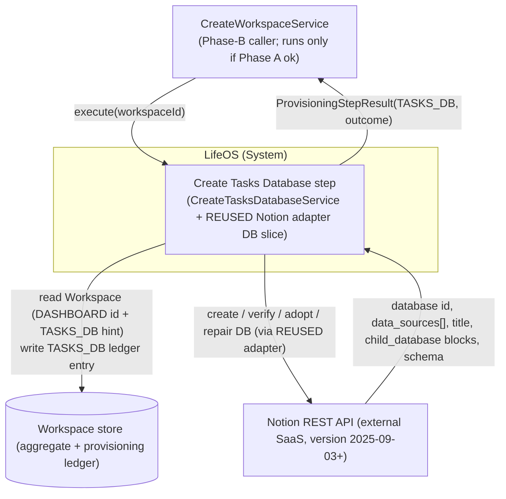
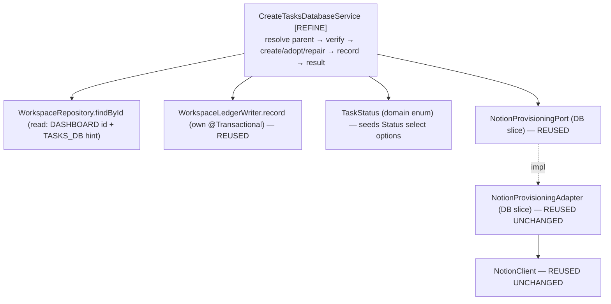
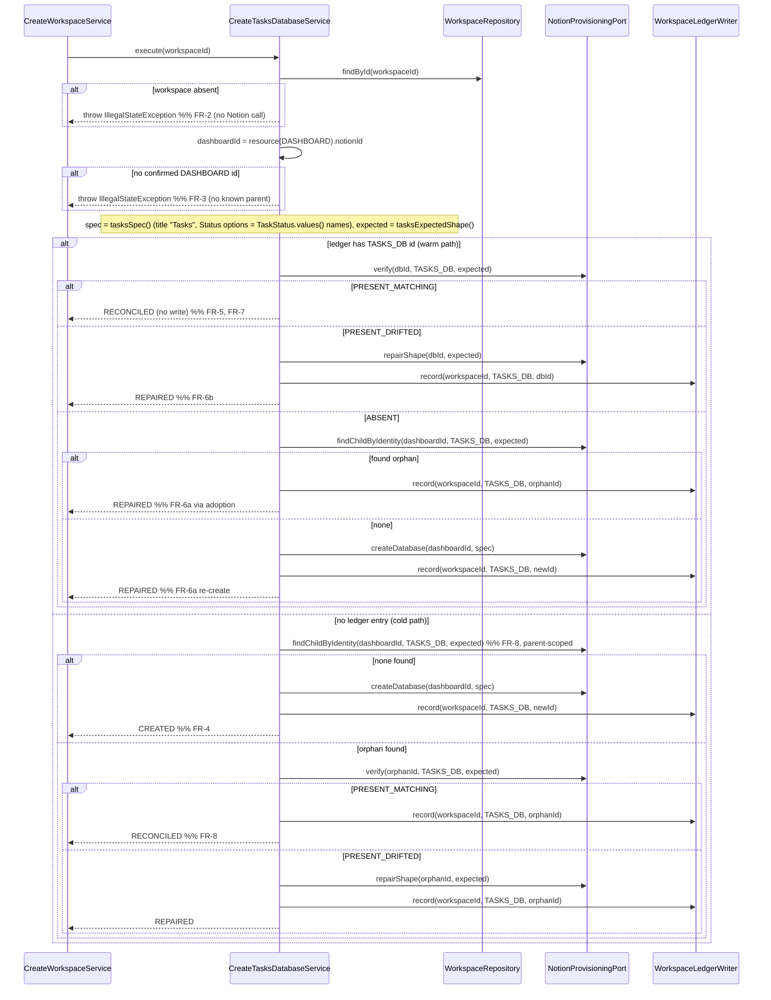

# 02 — Architecture: Create Tasks Database (Phase B — second child database)

Status: **FINAL — no open questions (see `02-open-questions.md`), ready for SME.**

Owner (Architect stage): pipeline automation
Input: `docs/pipeline/create-tasks-database/01-spec.md`
Grounding: the completed **Create Projects Database** design (`../create-projects-database/02-architecture.md`, `adr/ADR-0005..0008`) — the pattern this step mirrors — and its **shipped code** (`CreateProjectsDatabaseService`, the `NotionProvisioningAdapter` DB slice, `NotionClient`, the typed `DatabaseSpec`/`ExpectedShape`/`PropertyDefinition`/`NotionPropertyType`, `WorkspaceLedgerWriter`). Existing `domain/task/{Task,TaskStatus}.java`, `CLAUDE.md`.

> **Scope.** This document designs the **small delta** to provision the **Tasks** database (ledger type `TASKS_DB`) as a sibling of the already-shipped Projects step. It is a pattern-application pass, **not** a new design. The whole idempotent verify → create/adopt/repair → ledger machinery — the adapter DB slice, the typed schema value types, the port, the transaction boundary, the outcome table — is **reused unchanged**; the only novelty is a Tasks-specific `DatabaseSpec`/`ExpectedShape` and the one label decision in **ADR-0009**. This is deliberately much shorter than the Projects architecture: it does not restate what ADR-0005..0008 already settled.

## Reused UNCHANGED (do NOT touch — for SME/Implementer)

Everything below is already implemented, proven by the Projects step, and requires **zero** modification for Tasks:

| Reused artifact | Status | Reference |
|---|---|---|
| `NotionProvisioningAdapter` DB slice — `createDatabase` / `verify` / `findChildByIdentity` / `repairShape` | Shipped, generic over `ProvisionedResourceType` + `DatabaseSpec`/`ExpectedShape` | ADR-0005, ADR-0008; Projects §5.4 |
| `NotionClient` (transport: Bearer, `Notion-Version` pin, `429`/`529` `Retry-After` clamp, token never logged) | Shipped, unchanged | Create Dashboard ADR-0001 |
| `NotionProvisioningPort` (application.port) — DB-slice method signatures | Shipped, unchanged | Projects §5.2 |
| `DatabaseSpec` / `ExpectedShape` / `PropertyDefinition` / `NotionPropertyType {TITLE, RICH_TEXT, SELECT, DATE}` | Shipped, typed, sufficient as-is | ADR-0007 |
| `WorkspaceLedgerWriter.record(workspaceId, type, notionId)` (its own `@Transactional`) | Shipped, unchanged | Create Workspace ADR-0001 |
| `WorkspaceRepository.findById`, `Workspace.resource(type)`, `ProvisioningStepResult`, `ProvisioningOutcome`, `VerificationResult` | Shipped, unchanged | — |
| `ProvisionedResourceType.TASKS_DB` | Already defined | `domain/workspace/ProvisionedResourceType.java` l.5 |
| `domain/task/{Task,TaskStatus}` | Complete; **no domain change** (unlike Projects/OQ-A) | spec §7 |

**No adapter change, no port change, no domain change.** The adapter is generic; passing it a `TASKS_DB` type with a Tasks `DatabaseSpec`/`ExpectedShape` is all that is required. If the Implementer finds any of the above insufficient, that is an Architect-level finding — not a redesign to improvise.

## Decisions reused (not re-litigated)

- **ADR-0005** — Notion data-source model (`POST /v1/databases` with `initial_data_source.properties`; ledger stores the database id, adapter dereferences to the data source). → `../create-projects-database/adr/ADR-0005-notion-database-datasource-model.md`
- **ADR-0006** — Status is a `select` (fully API-manageable under strict idempotency), **options seeded from the domain enum**, verify is **name-only**. → `../create-projects-database/adr/ADR-0006-property-type-mapping-status-as-select.md`
- **ADR-0007** — typed `DatabaseSpec`/`ExpectedShape`/`PropertyDefinition`/`NotionPropertyType`. → `../create-projects-database/adr/ADR-0007-typed-database-schema-value-type.md`
- **ADR-0008** — database identity (parent-page child enumeration, `> 1` match ⇒ `FAILED`), name-only verify, non-destructive add-only repair. → `../create-projects-database/adr/ADR-0008-database-identity-verification-nondestructive-repair.md`
- Inherited from Create Workspace/Dashboard: verify-before-trust idempotency; no transaction across Notion calls (ledger write is the sole `@Transactional` unit); outcome semantics (`CREATED` only on first-time create with no prior record; `REPAIRED` ⇔ a Notion write happened, `RECONCILED` ⇔ none).

## New decision this branch makes

- **ADR-0009** — Tasks `Status` select-option **labels** seeded **verbatim from `TaskStatus.name()`** (no `displayName()`, no domain change), because `TaskStatus` — unlike `ProjectStatus` — has no label method and the spec forbids touching `domain/task/`. Immaterial to correctness (verify is name-only, ADR-0008). → `adr/ADR-0009-taskstatus-select-option-labels.md`

---

## 0. Ubiquitous-language delta

| Term | Meaning in this step |
|---|---|
| **Tasks database** | The single Notion database (ledger type `TASKS_DB`) created as a child of the workspace's Dashboard page, holding the schema that represents the `Task` aggregate. |
| **`TaskStatus`** | Existing closed domain enum `{TODO, IN_PROGRESS, BLOCKED, COMPLETED, CANCELLED}` (`domain/task/TaskStatus.java`) — the single source of truth for the `Status` select options (ADR-0006; labels per ADR-0009). |

*Orphan*, *Adoption*, *Drift*, *Data source* carry the exact meanings fixed by the Projects design; not restated.

## 1. Context (C4 L1)

Identical shape to Projects, with `PROJECTS_DB` → `TASKS_DB`.



Tasks runs **independently of** Projects — sibling Phase-B steps, no ordering dependency (spec §2; `CreateWorkspaceService.java` l.54–61). It reads only the `DASHBOARD` id (its parent) + any `TASKS_DB` hint, and writes exactly one `TASKS_DB` entry (NFR-7 failure isolation).

## 2. Components (C4 L3)

Structurally identical to Projects §3; the only bean that changes is `CreateTasksDatabaseService`, which gains a `WorkspaceRepository` read dependency and depends on `TaskStatus` (in place of `ProjectStatus`).



- **`CreateTasksDatabaseService` [REFINE]** — the only new logic. A verbatim mirror of `CreateProjectsDatabaseService`: same warm/cold path, same outcome mapping, `PROJECTS_DB` → `TASKS_DB`, title `"Tasks"`, and a `tasksSpec()`/`tasksExpectedShape()` that authors the §3 schema with `Status` options from `TaskStatus.values()` (ADR-0009).
- Every other component is reused unchanged (see table above).

## 3. High-level design — the step algorithm

**Reuses the Create Projects Database algorithm verbatim** (`../create-projects-database/02-architecture.md` §4.1) with `PROJECTS_DB → TASKS_DB`, `dashboardId` as parent, title `"Tasks"`. Reproduced here for the SME because the *behavior* is the deliverable:



Where `findChildByIdentity` returns **> 1** matching child database, the adapter throws (→ step `FAILED`) — FR-9, ADR-0008. Notion write precedes the ledger write; the ledger write is its own transaction; a crash between them is reconciled by the next run's FR-8 adoption (FR-12, NFR-2). The service never sees the data-source concept (ADR-0005).

### Outcome decision table

Reused **verbatim** from Projects §4.2 (which reuses Create Dashboard ADR-0004), substituting `TASKS_DB`. `CREATED` only on first-time create with no prior ledger record; adoption is never `CREATED`; `REPAIRED` ⇔ Notion mutated this run, `RECONCILED` ⇔ not; `> 1` identity match ⇒ `FAILED`. Not restated here.

### Error strategy & transaction boundary

Unchanged from Projects §4.3/§4.4. Workspace-not-found (FR-2) and missing-Dashboard (FR-3) throw `IllegalStateException` **before any Notion call**. Notion transport failures surface as the adapter's `NotionApiException` and propagate uncaught to the orchestrator's `runStep`, which maps them to `FAILED` (FR-11) — the step never fabricates a `FAILED` result. `execute` carries **no** `@Transactional`; the sole transactional unit is `WorkspaceLedgerWriter.record`. Token never appears in logs/`detail`/exceptions (NFR-6; enforced by the reused `NotionClient`).

---

## 4. Low-level design (the entire delta)

`[REFINE]` = the one class that changes. **No new port/adapter/domain/value types.** The `CreateTasksDatabaseUseCase.execute(UUID)` signature is unchanged.

### 4.1 `CreateTasksDatabaseService` [REFINE] — `application.usecase.task`

Currently injects `NotionProvisioningPort` + `WorkspaceLedgerWriter` and throws `UnsupportedOperationException` (`CreateTasksDatabaseService.java` l.20). It must:

1. **Gain a `WorkspaceRepository` read dependency** — constructor becomes 3-arg, mirroring `CreateProjectsDatabaseService` (read: `DASHBOARD` id → parent; `TASKS_DB` id → warm-path hint). Write stays in `WorkspaceLedgerWriter`.
2. **Implement the §3 algorithm** by mirroring `CreateProjectsDatabaseService`'s `executeWarmPath` / `executeColdPath` exactly, with `PROJECTS_DB → TASKS_DB`.
3. **Author the fixed Tasks schema** in a `tasksSpec()` / `tasksExpectedShape()` pair — the one place novel to this step.

Seam-level shape (mirror of the shipped Projects service; not full code):

```java
@Slf4j @Service @RequiredArgsConstructor
public class CreateTasksDatabaseService implements CreateTasksDatabaseUseCase {
    private static final String TITLE = "Tasks";                 // fixed identity marker (spec FR-4)

    private final NotionProvisioningPort notion;
    private final WorkspaceRepository workspaceRepository;        // [NEW dependency] read-only
    private final WorkspaceLedgerWriter ledger;                  // existing: sole transactional write

    @Override public ProvisioningStepResult execute(UUID workspaceId) {
        Workspace ws = workspaceRepository.findById(workspaceId)
            .orElseThrow(() -> new IllegalStateException("Workspace not found: " + workspaceId));      // FR-2
        String dashboardId = ws.resource(DASHBOARD).map(ProvisionedResource::notionId)
            .orElseThrow(() -> new IllegalStateException("No confirmed Dashboard for workspace " + workspaceId)); // FR-3
        DatabaseSpec spec       = tasksSpec();                    // §3 schema; TASKS_DB; title "Tasks"
        ExpectedShape expected  = tasksExpectedShape();
        Optional<String> ledgerId = ws.resource(TASKS_DB).map(ProvisionedResource::notionId);
        // warm path if ledgerId present, else cold path — identical branching to CreateProjectsDatabaseService
    }

    static DatabaseSpec tasksSpec() {
        List<String> statusOptions = Arrays.stream(TaskStatus.values()).map(Enum::name).toList();  // ADR-0009: name() verbatim
        return new DatabaseSpec(TITLE, List.of(
            PropertyDefinition.of("Title", NotionPropertyType.TITLE),
            PropertyDefinition.of("Description", NotionPropertyType.RICH_TEXT),
            new PropertyDefinition("Status", NotionPropertyType.SELECT, statusOptions),
            PropertyDefinition.of("Due Date", NotionPropertyType.DATE)));
    }
    static ExpectedShape tasksExpectedShape() { return new ExpectedShape(TITLE, tasksSpec().properties()); }
}
```

- The stub `throw new UnsupportedOperationException(...)` is removed **only** as this real implementation lands (NFR-4; `CLAUDE.md` "no silent no-op"). The adapter is already real, so no adapter-cutover gating is needed — unlike the Projects pass.
- Outcome values used: `CREATED` / `RECONCILED` / `REPAIRED` + propagated failure (FR-11). No new `ProvisioningOutcome`.

### 4.2 Tasks §3 schema (title + required properties)

Grounded in the complete `Task` aggregate (`domain/task/Task.java`); every field already exists (spec §7 — **no domain change**). Property types follow ADR-0006's mapping exactly.

| §3 property | Field grounding | `NotionPropertyType` | Notion config |
|---|---|---|---|
| **Title** (db title property) | `Task.title` (`Task.java` l.14, non-blank via `create`) | `TITLE` | `{ "type": "title", "title": {} }` |
| **Description** | `Task.description` (l.15) | `RICH_TEXT` | `{ "type": "rich_text", "rich_text": {} }` |
| **Status** | `Task.status` / `TaskStatus` (l.16) | `SELECT` | `{ "type": "select", "select": { "options": [ {"name":"TODO"}, {"name":"IN_PROGRESS"}, {"name":"BLOCKED"}, {"name":"COMPLETED"}, {"name":"CANCELLED"} ] } }` — seeded from `TaskStatus.values()`, labels per **ADR-0009** |
| **Due Date** | `Task.dueDate` `LocalDate` (l.17) | `DATE` | `{ "type": "date", "date": {} }` |

- **Note the title property name is `"Title"`** (matching `Task.title`), where Projects used `"Name"` (matching `Project.name`) — each database names its title property after its aggregate's own field. No structural difference; both are the single `TITLE`-typed property.
- **`verify` compares property *names* only** (ADR-0008): a user adding/renaming Status options or extra columns never triggers repair; the enum-seeded options apply at **creation** only. So ADR-0009's label choice can never cause spurious drift.
- **Excluded** (spec §8, FR-14): the `Task.projectId → Projects` relation (deferred to Phase C — Create Relations; requires both databases to exist), and any rollup/formula/row. `Task.workspaceId` is expressed structurally (child of the Dashboard), not as a column.

### 4.3 Package structure

```
com.lifeos
 ├─ domain.task/               Task, TaskStatus            (UNCHANGED — no domain change)
 ├─ application
 │   ├─ port/                  NotionProvisioningPort, DatabaseSpec, ExpectedShape,
 │   │                         PropertyDefinition, NotionPropertyType   (ALL UNCHANGED — reused)
 │   └─ usecase.task/          CreateTasksDatabaseService  [REFINE — the only code change],
 │                             CreateTasksDatabaseUseCase  (UNCHANGED)
 └─ infrastructure.adapter.notion/   NotionProvisioningAdapter, NotionClient  (UNCHANGED — reused)
```

---

## 5. Cross-cutting concerns

All inherited from the Projects design and reused unchanged; only the Tasks-specific notes:

- **Idempotency (NFR-1/FR-13).** Realised by §3 (identical to Projects): live verify on every path; child-enumeration adoption before any create on both cold and ABSENT paths; upsert `record` (`Workspace.record` replaces the `TASKS_DB` entry). Parent-scoped child enumeration is immediately consistent, so a create-then-crash converges on the next run (ADR-0008).
- **Failure isolation (NFR-7).** The step reads only `DASHBOARD` and writes only `TASKS_DB`; no shared mutable state; a Tasks failure leaves Projects (and vice versa) free to run (orchestrator `phaseBOk` aggregation). It never reads or writes any other `*_DB` entry (FR-14).
- **Security / token (NFR-6).** Reuses the single process-level token via `NotionClient`; no new secret or scope. Token never logged or placed in `detail`.
- **Observability (NFR-5).** Log per run: `workspaceId`, `dashboardId`, prior `TASKS_DB` ledger id (or "none"), the `VerificationResult`, the database id acted on, the final outcome — matching the Projects service's `log.info` lines. No token, no raw Notion bodies.
- **Validation.** `DatabaseSpec`/`ExpectedShape`/`PropertyDefinition` validate in their (existing) compact constructors; `Task`/`TaskStatus` validate in the domain factory. Malformed schema fails at construction, not mid-Notion-call.
- **Testability (NFR-3).** `CreateTasksDatabaseServiceTest` — plain Mockito over `NotionProvisioningPort` + `WorkspaceRepository` + `WorkspaceLedgerWriter`, one test per outcome-table row plus FR-2/FR-3 preconditions and `propagatesNotionFailureWithoutWritingLedger` (FR-12) / `neverInvokesRelationRollupFormulaOrSample` (FR-14). Assert `tasksSpec()` carries the four §3 properties and Status options = `TaskStatus` names (ADR-0009). **No new adapter tests** — the adapter is unchanged and already covered by `NotionProvisioningAdapterDatabaseTest`. Reuses ADR-0003 tiers.

---

## 6. Traceability (FR/NFR → component)

| Req | Satisfied by |
|---|---|
| FR-1 | `CreateTasksDatabaseUseCase.execute(UUID)` unchanged; §4.1 |
| FR-2 | `WorkspaceRepository.findById` → `IllegalStateException` before any Notion call; §4.1 |
| FR-3 | `resource(DASHBOARD)` empty → `IllegalStateException`; §4.1 |
| FR-4 | Cold path `findChildByIdentity` empty → `createDatabase("Tasks")` → `record(TASKS_DB)` → `CREATED`; §3 |
| FR-5 | Warm `verify` `PRESENT_MATCHING` → `RECONCILED`, no write; §3 |
| FR-6a | Warm `ABSENT` → adopt-or-`createDatabase` → `REPAIRED`; §3 |
| FR-6b | Warm `PRESENT_DRIFTED` → `repairShape` (add-only, non-destructive) → `REPAIRED`; ADR-0008 |
| FR-7 | `verify`/`findChildByIdentity` before any `RECONCILED`; §3, ADR-0008 |
| FR-8 | Cold `findChildByIdentity` (parent-scoped) → adopt; ADR-0008 |
| FR-9 | `> 1` match → `NotionApiException` → `FAILED`; ADR-0008 |
| FR-10 | `WorkspaceLedgerWriter.record(workspaceId, TASKS_DB, id)` — own tx (reused) |
| FR-11 | Returns `ProvisioningStepResult(TASKS_DB, …)`; failures propagate; §3 error strategy |
| FR-12 | Notion-before-ledger + own-tx write + next-run adoption; test `propagatesNotionFailureWithoutWritingLedger` |
| FR-13 | Adoption-before-create on cold & ABSENT paths; upsert `record`; index-consistent enumeration |
| FR-14 | Only the four DB methods invoked; relation/rollup/formula/sample untouched; schema has no relation property; §4.2 |
| §3 schema + domain backing | `tasksSpec()`/`tasksExpectedShape()` (§4.1/§4.2); `Task`/`TaskStatus` unchanged (spec §7); ADR-0006, ADR-0009 |
| NFR-1 | Strict per-path live verification; §3 (inherited ADR-0008) |
| NFR-2 | Notion-before-ledger + no rollback; next-run reconcile; §3 |
| NFR-3 | Mockito service tests; adapter reused/already covered; §5 |
| NFR-4 | Stub `UnsupportedOperationException` removed only as the real impl lands; §4.1 |
| NFR-5 | Structured per-run logging; §5 |
| NFR-6 | Token in `NotionClient` header only, never logged; §5 (reused) |
| NFR-7 | No shared mutable state; only `TASKS_DB` written; §5 |
| NFR-8 | Upsert `record` → exactly one `TASKS_DB` entry (`Workspace.record` semantics) |
| NFR-9 | Bounded call count per run (reused adapter; Projects §5.4) |
| NFR-10 | `429`/`529` `Retry-After` clamp in reused `NotionClient` |

---

## 7. Definition-of-done status

Every FR/NFR is traceable (§6). The step reuses ADR-0005..0008 unchanged (by reference, not duplication) and makes exactly **one** new decision, recorded as **ADR-0009** (Status label source). No domain change is required (spec §7). No open questions remain (`02-open-questions.md`). Ready for the SME.

## 8. Findings for the SME

1. **`CreateTasksDatabaseService` gains a `WorkspaceRepository` read dependency** — constructor becomes 3-arg, mirroring `CreateProjectsDatabaseService`. Read: `DASHBOARD` id (parent) + `TASKS_DB` hint; write stays in `WorkspaceLedgerWriter`.
2. **Implement the §3 algorithm as a verbatim mirror of `CreateProjectsDatabaseService`** (`executeWarmPath`/`executeColdPath`), substituting `PROJECTS_DB → TASKS_DB` and using `tasksSpec()`/`tasksExpectedShape()` with title constant `"Tasks"`.
3. **Author `tasksSpec()`** with the §4.2 schema; Status options from `TaskStatus.values()` mapped via `Enum::name` (**ADR-0009** — no `TaskStatus` change). Title property named `"Title"` (matches `Task.title`).
4. **Remove the stub `UnsupportedOperationException`** only as the real implementation lands (NFR-4). No adapter cutover to coordinate — the adapter DB slice is already real.
5. **No changes to** the port, the typed schema value types, the adapter, `NotionClient`, or `domain/task/`. If any is found insufficient, raise an Architect-level finding (`findings.yml`, `raised_by: spring-sme`, `suspected_layer: architecture`) — do not redesign silently.
6. **Tests:** `CreateTasksDatabaseServiceTest` (Mockito, one per outcome-table row + FR-2/FR-3 + FR-12 + FR-14), asserting the `tasksSpec()` properties and `TaskStatus`-name Status options. No new adapter tests (unchanged, already covered).
