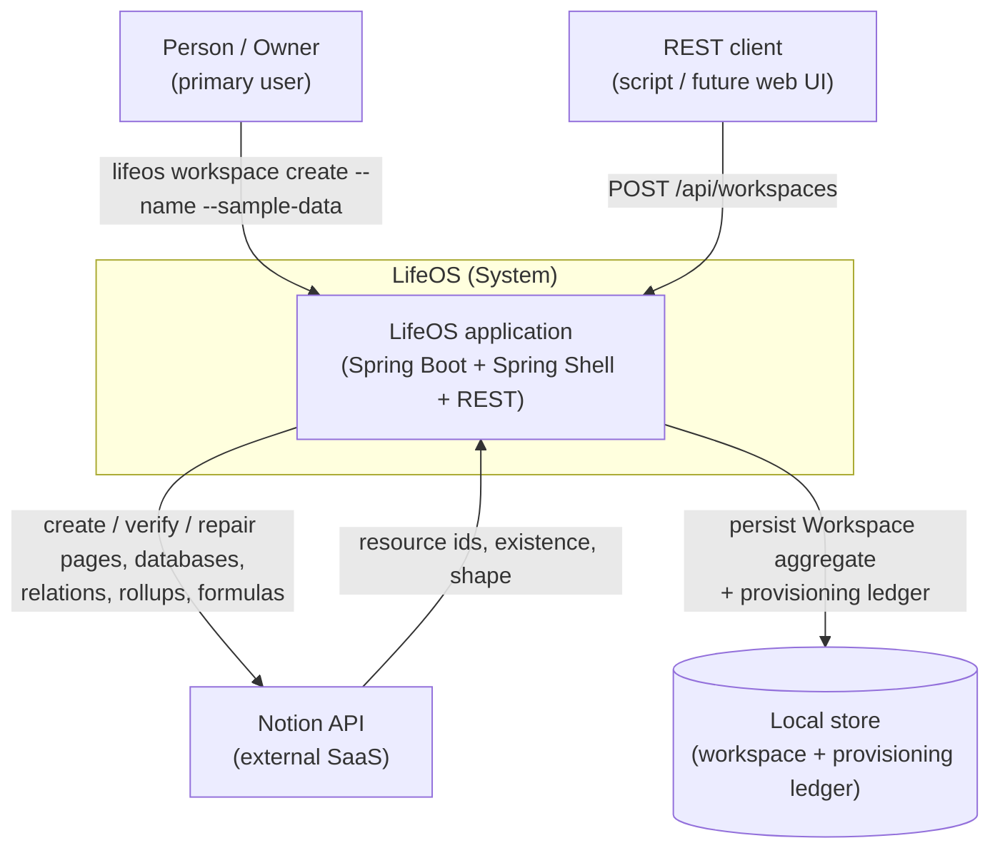
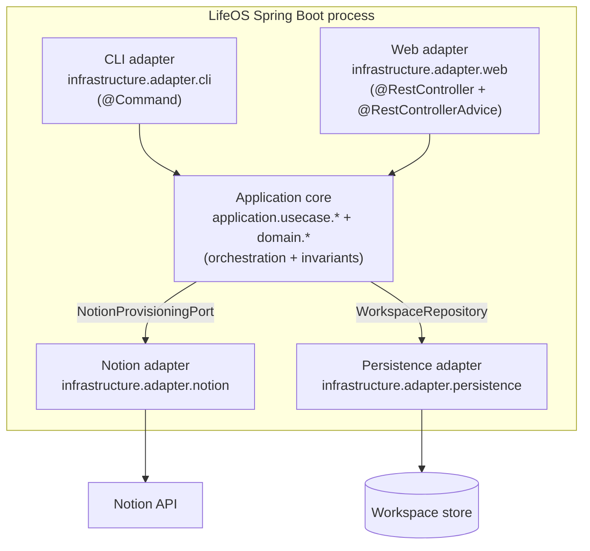
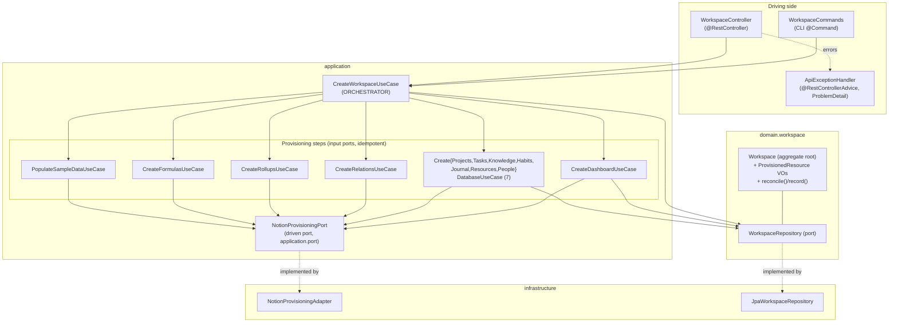
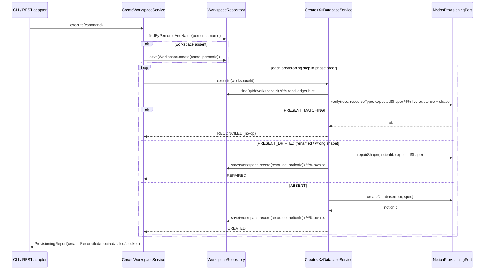

# 02 — Architecture: Create Workspace

Status: Final (open questions resolved) — ready for SME review
Owner (Architect stage): pipeline automation
Input: `docs/pipeline/create-workspace/01-spec.md`
Grounding: `CLAUDE.md`, `docs/architecture/02-Architecture.md`, `03-Domain-Model.md`, `04-Bounded-Contexts.md`, existing code under `backend/src/main/java/com/lifeos/`.

> This design **extends** the existing skeletal `CreateWorkspaceUseCase` / `Workspace` / `WorkspaceRepository` / `CreateWorkspaceCommand`; it does not replace them (spec §7 constraint). Every non-obvious choice is captured as an ADR under `adr/`. All spec open questions have been resolved by the stakeholder and are recorded in `02-open-questions.md`; this document reflects those decisions.

**Resolved decisions baked into this design**
- **Seven databases in v0** — Projects, Tasks, Knowledge, Habits, Journal, Resources, People. **Goals and Reviews databases are deferred** (tracked future work: `CreateGoalsDatabaseUseCase`, `CreateReviewsDatabaseUseCase`).
- **Many workspaces per Person.**
- **Idempotency key = `(personId, name)`** → `WorkspaceRepository.findByPersonIdAndName`.
- **Two triggers in v0** — Spring Shell CLI **and** a REST endpoint (`infrastructure.adapter.web`) with RFC 9457 `ProblemDetail` error handling.
- **Sample-data on re-run = skip/reconcile** (idempotent; never duplicate or reset).
- **Strict idempotency** — live Notion is the source of truth; reconciliation detects and repairs out-of-band edits (re-create/rename back); verify-before-trust closes the dual-write window.
- **Notion token = single process-level secret** (env/config) for single-tenant v0; per-Person token storage is a future improvement.

---

## 0. Ubiquitous language for this feature

| Term | Meaning in this feature |
|---|---|
| **Workspace** | Aggregate root; a named container owned by one Person (a Person may own several). Also holds the **provisioning ledger**. |
| **Provisioned Resource** | A single Notion artifact the system created (Dashboard, a database, a relation set, rollups, formulas, sample data) recorded with its external Notion id and status. Value object inside the Workspace aggregate. |
| **Provisioning Step** | An idempotent unit of work that provisions one Provisioned Resource (e.g. "create Tasks database"). Realised as an application use case. |
| **Reconciliation** | Convergence of actual state (live Notion, verified) toward the expected target state — creating what is missing and repairing what drifted. |
| **Provisioning Report** | Per-run outcome record (created / reconciled / repaired / failed / blocked per step) returned to the caller (FR-12). |

---

## 1. Context (C4 L1)



- **Primary user (Person aggregate)** — invokes Create Workspace through the CLI or the REST endpoint. Single-tenant/local use for v0 (NFR-6; spec §5).
- **Notion API** — the only provisioning target for v0 (`[ASSUMPTION]`, `01-Vision.md`). Reached only through a driven port so a second adapter can be added later.
- **Local store** — persists the `Workspace` aggregate and its provisioning ledger so re-runs can reconcile (FR-10/FR-11). `[ASSUMPTION]` relational store via Spring Data JPA; the persistence technology is not fixed by the spec.

## 2. Containers (C4 L2)



Dependency direction respects hexagonal layering (`CLAUDE.md`): `cli`/`web` `→ application → domain`; adapters implement ports and are pointed *into* by the core. The application core depends only on **ports** (interfaces), never on concrete adapters (`spring-boot-conventions`). Both driving adapters (CLI, REST) call the same `CreateWorkspaceUseCase` — no logic is duplicated (ADR-0008).

## 3. Components (C4 L3)



**Responsibilities**

- **`WorkspaceCommands` (CLI)** — parses `--name`, `--sample-data`, builds `CreateWorkspaceCommand`, invokes the orchestrator, renders the `ProvisioningReport`, and returns a non-zero result when the report is failed (FR-12/FR-14). No business logic (`spring-boot-conventions`).
- **`WorkspaceController` (REST)** — `POST /api/workspaces`, accepts a request record, maps to `CreateWorkspaceCommand`, returns `201`/`200` with a `ProvisioningReport` response DTO, or a `ProblemDetail` on failure via the advice (ADR-0008). No business logic; entities never cross the boundary (`spring-boot-conventions`).
- **`ApiExceptionHandler`** — single `@RestControllerAdvice` mapping validation/domain/provisioning failures to RFC 9457 `ProblemDetail` (`application/problem+json`) — the standard error body in Spring Framework 6+ (RFC 9457; `spring-boot-conventions`).
- **`CreateWorkspaceUseCase` / `...Service` (orchestrator)** — the only component that knows the provisioning *sequence*. Load-or-creates the `Workspace` by `(personId, name)` (FR-4), drives each step in dependency order, aggregates outcomes into a `ProvisioningReport`, and blocks dependents of a failed step (ADR-0006). It does **not** call Notion directly and is **not** wrapped in one big transaction (ADR-0001).
- **Provisioning steps** — one idempotent use case per Provisioned Resource. Each step: (1) **verifies** existence and shape against live Notion (source of truth), consulting the ledger only as a hint (ADR-0002); (2) creates what is missing and **repairs** what drifted (re-create deleted, rename back); (3) records the confirmed id in the Workspace ledger in its own short transaction; (4) returns a `ProvisioningStepResult`. Each is independently re-runnable (NFR-1).
- **`NotionProvisioningPort`** — driven port (in `application.port`, ADR-0004) exposing existence + **shape verification** and create/repair operations. Implemented by `NotionProvisioningAdapter`.
- **`Workspace` aggregate** — owns invariants and the provisioning ledger (ADR-0003). Framework-free (NFR-3).
- **`WorkspaceRepository`** — domain port; implemented by `JpaWorkspaceRepository`, mapping the immutable domain `Workspace` to/from a JPA entity (keeps the domain free of JPA annotations, `spring-data-jpa`).

---

## 4. High-level design (HLD)

### 4.1 Module boundaries & data flow

1. A driving adapter (CLI or REST) builds a validated `CreateWorkspaceCommand(name, personId, sampleData)`.
2. Orchestrator loads-or-creates the `Workspace` by the idempotency key **`(personId, name)`**, persisting a new aggregate if absent (FR-4). A Person may own multiple workspaces distinguished by `name`.
3. Orchestrator runs steps in this dependency order (a DAG flattened into phases):
   - **Phase A** – Dashboard (root page) [FR-5]
   - **Phase B** – the **seven** databases, each a child of the root page [FR-6]
   - **Phase C** – relations (needs all related DBs) [FR-7]
   - **Phase D** – rollups (needs relations) [FR-8]
   - **Phase E** – formulas (needs relations/rollups) [FR-9]
   - **Phase F** – sample data, only if `sampleData` **and** phases A–E fully succeeded; idempotent — skips if sample data already present (FR-13, OQ-5)
4. Each step reconciles (create-if-missing, repair-if-drifted), updates the ledger, returns its result.
5. Orchestrator assembles and returns the `ProvisioningReport`.

> **Deferred (tracked future work):** Goals and Reviews databases are **not** provisioned in v0. When their `CreateGoalsDatabaseUseCase` / `CreateReviewsDatabaseUseCase` are built, they slot into Phase B and their relations/rollups/formulas extend Phases C–E with no change to the orchestration model.

### 4.2 Sequence (happy path + strict reconciliation)



### 4.3 Transaction boundaries (ADR-0001)

The orchestrator method is **not** a single transaction. Spring guidance is that transactions belong on the service layer and must not span external calls that cannot be rolled back (`spring-data-jpa` skill; Spring Framework Reference — Declarative transaction management, docs.spring.io). Wrapping all provisioning calls in one DB transaction would (a) hold a connection open across many slow remote calls and (b) roll back the ledger on a mid-run Notion failure, destroying the very progress FR-11 requires. Instead: **each ledger write is its own short `@Transactional` unit at the service layer**, and durable partial progress + strict reconciliation on re-run substitute for cross-step atomicity.

### 4.4 Error strategy (ADR-0006)

- A step that fails (including a stub throwing `UnsupportedOperationException`, FR-14) is recorded `FAILED` with the exception message — never swallowed (`CLAUDE.md` "no silent no-op").
- Steps depending on a failed step are recorded `BLOCKED` (not attempted, not silently skipped).
- Independent steps continue so the report is complete.
- After the run, if any step is `FAILED`/`BLOCKED`, the operation signals failure. The CLI renders a non-zero result; the REST adapter returns a `ProblemDetail` (RFC 9457) via `ApiExceptionHandler`. This reconciles FR-12 (full report) with FR-14 (overall explicit failure).
- Because progress is durable, a later re-run resumes and reconciles (FR-11).

### 4.5 Strict idempotency & reconciliation (ADR-0002)

- **Live Notion is the source of truth for existence and shape.** The local ledger is a hint/cache only. FR-10 requires verifying existing structures against the expected target state; the resolved decision is that verification is **strict**.
- **Verify-before-trust.** Before treating any resource as present, the step verifies it in Notion (existence + shape: title, parent, key properties). It does not trust a ledger id without confirming the resource still exists and matches.
- **Repair out-of-band edits.** If a user manually deleted a provisioned resource, the step re-creates it; if it was renamed or its shape drifted from the expected target, the step repairs it (rename back / add missing properties) and records `REPAIRED`.
- **Dual-write window closed as far as feasible.** Because existence is confirmed against Notion (not merely the ledger), a Notion-create-succeeded-but-ledger-write-failed case is detected on the next run: the resource is found in Notion by deterministic identity (root page + type + title) and the ledger is reconciled to it rather than a duplicate being created.

---

## 5. Low-level design (LLD)

Signatures below are seam-level (interfaces/records), not implementations. `[EXTEND]` marks a change to existing code; `[NEW]` marks a new type.

### 5.1 Domain (`com.lifeos.domain.workspace`) — framework-free

```java
// [EXTEND] Workspace: add owner + provisioning ledger; keep @Value immutability.
// create(...) mints identity and enforces invariants; all-args builder is for repo reconstitution only (CLAUDE.md).
public final class Workspace {
    UUID id;
    UUID personId;                       // [NEW] owner reference by UUID (never object graph)
    String name;
    List<ProvisionedResource> resources; // [NEW] the ledger (immutable copy)

    static Workspace create(String name, UUID personId);               // enforces name non-blank, personId non-null
    Optional<ProvisionedResource> resource(ProvisionedResourceType t); // ledger lookup
    Workspace record(ProvisionedResourceType t, String notionId);      // returns new state with resource recorded
}

// [NEW] value object — one ledger entry
public record ProvisionedResource(
    ProvisionedResourceType type,   // DASHBOARD, PROJECTS_DB, TASKS_DB, KNOWLEDGE_DB, HABITS_DB,
                                    // JOURNAL_DB, RESOURCES_DB, PEOPLE_DB, RELATIONS, ROLLUPS, FORMULAS, SAMPLE_DATA
    String notionId,
    Instant provisionedAt) {}

public enum ProvisionedResourceType { /* closed set — no primitive obsession (CLAUDE.md); GOALS_DB/REVIEWS_DB deferred */ }

// [EXTEND] domain port — many workspaces per Person; identity key is (personId, name)
public interface WorkspaceRepository {
    Workspace save(Workspace workspace);
    Optional<Workspace> findById(UUID id);
    Optional<Workspace> findByPersonIdAndName(UUID personId, String name);   // [NEW] idempotency lookup (OQ-3)
}
```

### 5.2 Application — DTOs (`com.lifeos.application.dto.workspace`)

```java
// [EXTEND] add personId non-null (FR-3) and sampleData flag (FR-13) via compact-constructor validation
public record CreateWorkspaceCommand(String name, UUID personId, boolean sampleData) {
    public CreateWorkspaceCommand {
        if (name == null || name.isBlank()) throw new IllegalArgumentException("name must not be null or blank");
        if (personId == null)               throw new IllegalArgumentException("personId must not be null");
    }
}

// [NEW] per-step outcome
public enum ProvisioningOutcome { CREATED, RECONCILED, REPAIRED, FAILED, BLOCKED }
public record ProvisioningStepResult(ProvisionedResourceType type, ProvisioningOutcome outcome, String detail) {}

// [NEW] FR-12 report (return value of the orchestrator)
public record ProvisioningReport(UUID workspaceId, List<ProvisioningStepResult> steps) {
    public boolean failed() { /* any FAILED or BLOCKED */ }
}
```

### 5.3 Application — input ports (use cases)

```java
// [EXTEND] orchestrator now returns a report instead of void (FR-12)
public interface CreateWorkspaceUseCase { ProvisioningReport execute(CreateWorkspaceCommand command); }

// [EXTEND] per-resource step contract: return a result rather than void, so the orchestrator can report (ADR-0005/0007)
public interface CreateDashboardUseCase         { ProvisioningStepResult execute(UUID workspaceId); }
public interface CreateProjectsDatabaseUseCase  { ProvisioningStepResult execute(UUID workspaceId); }
public interface CreateTasksDatabaseUseCase     { ProvisioningStepResult execute(UUID workspaceId); }
public interface CreateKnowledgeDatabaseUseCase { ProvisioningStepResult execute(UUID workspaceId); }
public interface CreateHabitsDatabaseUseCase    { ProvisioningStepResult execute(UUID workspaceId); }
public interface CreateJournalDatabaseUseCase   { ProvisioningStepResult execute(UUID workspaceId); }
public interface CreateResourcesDatabaseUseCase { ProvisioningStepResult execute(UUID workspaceId); }
public interface CreatePeopleDatabaseUseCase    { ProvisioningStepResult execute(UUID workspaceId); }
public interface CreateRelationsUseCase         { ProvisioningStepResult execute(UUID workspaceId); } // [NEW]
public interface CreateRollupsUseCase           { ProvisioningStepResult execute(UUID workspaceId); } // [NEW]
public interface CreateFormulasUseCase          { ProvisioningStepResult execute(UUID workspaceId); } // [NEW]
public interface PopulateSampleDataUseCase      { ProvisioningStepResult execute(UUID workspaceId); } // [NEW]

// DEFERRED (do not build in v0; tracked future work):
//   CreateGoalsDatabaseUseCase, CreateReviewsDatabaseUseCase
```

Each `...Service` is `@Service @RequiredArgsConstructor`, depends on `NotionProvisioningPort` + `WorkspaceRepository`, carries `@Transactional` **only around its ledger write** (concrete class, per Spring guidance that interface-level `@Transactional` may be silently ignored — Spring Framework Reference — Declarative transaction management), and throws `UnsupportedOperationException` until its Notion adapter exists (`CLAUDE.md`).

### 5.4 Application — driven port (`com.lifeos.application.port`) [NEW]

```java
public interface NotionProvisioningPort {
    // Strict verification (OQ-6): existence AND shape, live against Notion
    VerificationResult verify(String rootPageId, ProvisionedResourceType type, ExpectedShape expected);
    Optional<String> findChildByIdentity(String rootPageId, ProvisionedResourceType type); // deterministic identity match

    // Create / repair
    String createRootPage(String workspaceName);
    String createDatabase(String rootPageId, DatabaseSpec spec);
    void   repairShape(String notionId, ExpectedShape expected);   // rename back / add missing properties
    void   ensureRelation(RelationSpec spec);
    void   ensureRollup(RollupSpec spec);
    void   ensureFormula(FormulaSpec spec);

    // Sample data (idempotent, OQ-5)
    boolean hasSampleRecords(String databaseId);
    void    insertSampleRecords(String databaseId, List<RecordSpec> records);
}

// VerificationResult ∈ { PRESENT_MATCHING, PRESENT_DRIFTED, ABSENT }
```

`DatabaseSpec`/`RelationSpec`/`ExpectedShape`/… are application-layer value objects describing *intent*; Notion SDK/JSON specifics live entirely in the adapter (spec §8 out of scope).

### 5.5 Infrastructure

- `infrastructure.adapter.notion.NotionProvisioningAdapter implements NotionProvisioningPort` — owns Notion SDK/HTTP, the single process-level integration token read from config/secret (OQ-7), rate-limit/backoff (NFR-2; Notion ~3 req/s `[ASSUMPTION — verify at implementation]`), and the live existence/shape verification that makes idempotency strict.
- `infrastructure.adapter.persistence.JpaWorkspaceRepository implements WorkspaceRepository` — maps immutable domain `Workspace` ↔ `WorkspaceJpaEntity` (+ `ProvisionedResourceJpaEntity`); `findByPersonIdAndName` derived query. Reads `@Transactional(readOnly=true)`, writes `@Transactional` (`spring-data-jpa`). Domain classes carry **no** JPA annotations (NFR-3). A unique constraint on `(person_id, name)` enforces the identity key at the store.
- `infrastructure.adapter.cli.WorkspaceCommands` — `@Command`-annotated Spring Shell component (Spring Shell Reference — Command Registration, docs.spring.io) mapping `workspace create` to the orchestrator.
- `infrastructure.adapter.web.WorkspaceController` — `@RestController` `POST /api/workspaces`; request/response records with Jakarta Bean Validation via `@Valid`; delegates to the orchestrator (ADR-0008).
- `infrastructure.adapter.web.ApiExceptionHandler` — `@RestControllerAdvice` returning `ProblemDetail` (`application/problem+json`, RFC 9457) for validation, domain, and provisioning-failure exceptions (`spring-boot-conventions`).

### 5.6 Package structure (package-by-feature, `spring-boot-conventions`)

```
com.lifeos
 ├─ domain.workspace/            Workspace, ProvisionedResource, ProvisionedResourceType, WorkspaceRepository
 ├─ application
 │   ├─ dto.workspace/           CreateWorkspaceCommand, ProvisioningReport, ProvisioningStepResult, ProvisioningOutcome
 │   ├─ port/                    NotionProvisioningPort (+ *Spec / ExpectedShape / VerificationResult)   [NEW]
 │   └─ usecase.{workspace,project,task,knowledge,habit,journal,resource,person}/
 │                               (goal, review packages added later — deferred)
 └─ infrastructure.adapter.{cli,web,notion,persistence}/
```

---

## 6. Cross-cutting concerns

- **Security (NFR-6, OQ-7)** — v0 single-owner; the Notion integration token is a **single process-level secret** read from environment/config, never hardcoded (`spring-boot-conventions`; secrets from env/secret manager). Per-Person token storage/scoping is deferred future work. No cross-Person data path exists because every step is keyed to one `Workspace`/`personId`. The REST endpoint's authn/authz is out of scope for single-tenant v0 (spec §8); the controller still validates input and emits RFC 9457 errors.
- **Validation** — command validated in its compact constructor (FR-2/FR-3) before any adapter is touched; REST request records add Jakarta Bean Validation (`@Valid`); domain invariants enforced in `Workspace.create` (`CLAUDE.md` self-validating entities).
- **Persistence / fetch** — the ledger is small and loaded whole with the aggregate; associations LAZY by default, the ledger fetched via `@EntityGraph`/fetch-join to avoid N+1 (`spring-data-jpa`). Optimistic `@Version` on the workspace JPA entity guards concurrent re-runs; a unique `(person_id, name)` constraint backs the identity key (`spring-data-jpa`).
- **Observability (NFR-5)** — each step logs outcome; the `ProvisioningReport` is the structured, returned equivalent for the caller.
- **Idempotency (NFR-1)** — enforced strictly per step against live Notion (ADR-0002); the orchestrator adds no non-idempotent state of its own.

---

## 7. Traceability (FR/NFR → component)

| Req | Satisfied by |
|---|---|
| FR-1 | `CreateWorkspaceCommand(name, personId, …)`; `WorkspaceCommands`; `WorkspaceController` |
| FR-2 | `CreateWorkspaceCommand` compact constructor (name) |
| FR-3 | `CreateWorkspaceCommand` compact constructor (personId) `[EXTEND]` |
| FR-4 | `CreateWorkspaceService` load-or-create by `(personId, name)`; `Workspace.create(name, personId)`; `WorkspaceRepository.save` |
| FR-5 | `CreateDashboardUseCase` (Phase A) |
| FR-6 | `Create{7}DatabaseUseCase` (Phase B) — Goals/Reviews deferred |
| FR-7 | `CreateRelationsUseCase` (Phase C) |
| FR-8 | `CreateRollupsUseCase` (Phase D) |
| FR-9 | `CreateFormulasUseCase` (Phase E) |
| FR-10 | ADR-0002 strict reconciliation; `Workspace` ledger; `NotionProvisioningPort.verify/findChildByIdentity/repairShape` |
| FR-11 | ADR-0001 per-step transactions + reconciliation on re-run |
| FR-12 | `ProvisioningReport` / `ProvisioningStepResult`; CLI rendering; REST response + `ProblemDetail` |
| FR-13 | `PopulateSampleDataUseCase` (Phase F), gated on A–E; idempotent via `hasSampleRecords` (OQ-5) |
| FR-14 | ADR-0006 error strategy; stub `UnsupportedOperationException` recorded `FAILED` |
| NFR-1 | Per-step strict idempotency (ADR-0002) |
| NFR-2 | `NotionProvisioningAdapter` retry/backoff; durable partial progress (ADR-0001) |
| NFR-3 | Framework-free `domain.workspace`; JPA mapping in adapter |
| NFR-4 | ADR-0006; no silent no-op |
| NFR-5 | Per-step logging + `ProvisioningReport` |
| NFR-6 | Single process-level token secret; single `personId` scoping (OQ-7) |
| NFR-7 | No SLA; single-run completion under non-rate-limited conditions |
| NFR-8 | N/A v0 |

---

## 8. Findings for the SME (non-blocking, but must be addressed in the tech spec)

1. **`CreateProjectsDatabaseUseCase` is a silent no-op** — a concrete class with an empty `execute` body (no interface, no `@Service` stub exception). This violates `CLAUDE.md` "no silent no-op" and FR-14. Refactor to the `interface + @Service implements` pattern that throws `UnsupportedOperationException` until its adapter exists, matching `CreateTasksDatabaseService`.
2. **Per-step `execute` returns `void` today** — must change to return `ProvisioningStepResult` (ADR-0007). All existing stubs (Tasks, Knowledge, Dashboard) need the signature update.
3. **`CreateDashboardUseCase.execute(UUID)`** already matches the step contract; keep, add the return type.
4. **Goals & Reviews databases are deferred** — do **not** create `CreateGoalsDatabaseUseCase` / `CreateReviewsDatabaseUseCase` in v0. Record them as tracked future work; the domain enum reserves `GOALS_DB`/`REVIEWS_DB` slots but Phase B provisions only the seven.
5. **Relations/Rollups/Formulas/SampleData use cases do not exist** — new stubs required (Phases C–F), each throwing `UnsupportedOperationException` until its adapter exists.
6. **REST adapter is new** — `WorkspaceController` + `ApiExceptionHandler` must be specified with request/response records, `@Valid`, and RFC 9457 `ProblemDetail` mapping (ADR-0008).
7. **Persistence identity constraint** — a unique `(person_id, name)` constraint and `@Version` optimistic lock must be in the JPA schema/migration.

## 9. Post-audit refinements (2026-08-04)

After implementation, the Auditor (`05-audit-report.md`) surfaced findings that refine — without contradicting — this design. All were remediated (build green, 82 tests); the load-bearing decisions (ADR-0001..0008) stand. The design-level deltas:

- **Ledger transaction boundary is a dedicated collaborator, not a per-step method (refines ADR-0001 / LLD §5.3).** The transactional read-modify-write of the `Workspace` ledger now lives in a single `@Component WorkspaceLedgerWriter` with `@Transactional record(workspaceId, type, notionId)`. Each step service depends on it and invokes it across a proxied bean boundary — Spring does not intercept self-invoked `@Transactional` methods, so the previous per-service `recordLedger` would have run without a transaction once wired. The orchestrator remains non-transactional (ADR-0001 unchanged); only the location of the per-step tx moved.
- **Aggregate construction is closed (refines LLD §5.1 / CLAUDE.md self-validating entities).** Domain builders are private; `Workspace.reconstitute(id, personId, name, resources)` is the sole repository rehydration path, so the application layer cannot mint invalid state or IDs through a public builder.
- **REST error model is sanitized (refines ADR-0008 / §5.5).** `ApiExceptionHandler` never returns internal exception text to clients: provisioning-failure responses carry only per-step `{type, outcome}` (+ `workspaceId`), a fallback `Exception` handler returns a generic 500, and `DataIntegrityViolationException` (the `(personId, name)` find-or-create race) maps to 409 — all logged server-side. This also realizes the server-side-logging half of NFR-5 for the REST path.
- **Persistence hardening (refines §5.5).** The `Workspace` ledger is reconciled in place (no `clear()`+re-add under `orphanRemoval`), and `ProvisionedResourceJpaEntity` uses a `SEQUENCE` generator (batch-insert friendly) with a matching Flyway sequence.
- **`Email` value object (refines domain modelling).** `Person.email` is now an `Email` VO (format-validating), removing a primitive-obsession gap noted for the wider domain — outside the Create Workspace runtime path but aligned with the model's conventions.
- **Deferred:** REST authn/authz (owner derived from principal rather than request body) remains out of v0 scope — see `02-open-questions.md` deferred item 2.
